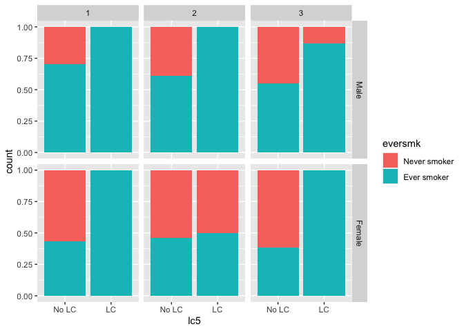
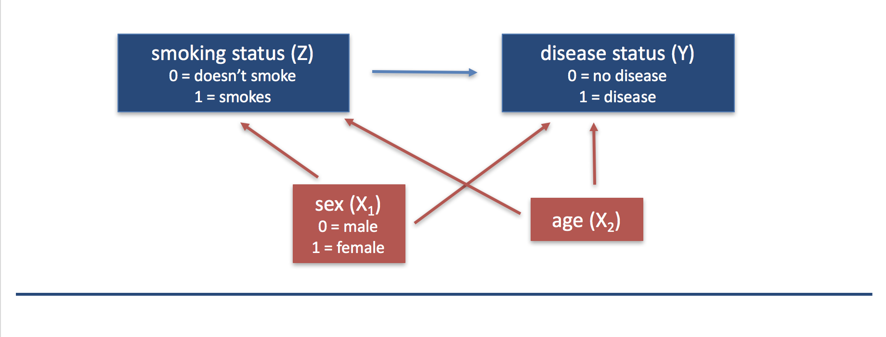

## Overview of objectives for today:

1. Submission process for assignment-0-1 to make sure everyone can turn in their work
2. Review of class materials from Monday
3. New materials on considering "otherwise similar" individuals in our question of interest
4. Discussion of assignment-1-1 and time to start on it


## Submitting assignments through GitHub and the RStudio interface

When you are ready to submit your assignment, do ALL of the following:

* First, knit your .Rmd file to see if it will compile.  If it doesn't knit, you can still follow the steps below to submit your assignment, but please try to resolve the knitting issues before you submit.  You can reach out to use at phbiostats@jhu.edu for help!
* Next you need to **commit** the changes you've made to the document.  Click the colorful Git button at the top of the RStudio window and select "Commit" from the menu.
* In the window that opens, **stage** your changes by clicking the check box next to the `Asst0-1.Rmd` file.
* In the "Commit message" box, type a short description of what changes you've made, something like: `Completed assignment`
* Click the "Commit" button on the bottom right.
* You'll see a window that will tell you about the changes that you've made.  Click "Close" to close the window.  You've successfully committed! You can close this commit window now.
* After committing, you must **push** your changes to the repository on Github.  Do this by clicking the colorful Git button again and select "Push Branch".  
* Again, you'll see a window open that tells you your changes have been pushed!
* If you want, you can look at your repository on [Github.com](https://github.com/) and should be able to see your changes there!  
* You've successfully submitted your assignment :)


## Module 1: Smoking and the risk of disease


What is the risk of smoking-caused disease, like lung cancer (LC) and coronary heart disease (CHD), the contribution of smoking to this risk, and the possible modification of this risk by sex and socio-economic status (SES)?

**Questions of interest:**

* *Question 1.1:* How does the risk of disease compare for smokers and otherwise similar non-smokers?

* *Queston 1.2:* Does the contribution of smoking to the risk of disease vary by sex or socio-economic status (SES)?

**To address each question we want to construct:**

* A data display (graph or table)
* A statistical analysis (with interpretation)

We will answer these questions using data from the National Medical Expenditures Survey (NMES).

## Overall data analysis philosophy

We follow the overall data analysis philosophy outlined in the R for Data Science book mentioned in the course syllabus (available for free online [here](https://r4ds.hadley.nz/). Here's a visual representation of this philosophy from the book:


I strongly encourage those who are just starting out with learning R to review the "Whole game" section of this online book. There are lots of amazing tips and tricks to help get you started on the right path.

## NMES data

Let's take a look at the NMES data.  This data is stored in the file `nmesUNPROC.csv` in the same `module_1` folder that includes this .Rmd file.

Recall from last time that we will be using the `read_csv` function to read in our data set. First we need to load the `tidyverse` library:

``` r
library(tidyverse)
```

```
## ── Attaching core tidyverse packages ──────────────────────── tidyverse 2.0.0 ──
## ✔ dplyr     1.1.4     ✔ readr     2.1.5
## ✔ forcats   1.0.0     ✔ stringr   1.5.1
## ✔ ggplot2   3.5.1     ✔ tibble    3.2.1
## ✔ lubridate 1.9.3     ✔ tidyr     1.3.1
## ✔ purrr     1.0.2     
## ── Conflicts ────────────────────────────────────────── tidyverse_conflicts() ──
## ✖ dplyr::filter() masks stats::filter()
## ✖ dplyr::lag()    masks stats::lag()
## ℹ Use the conflicted package (<http://conflicted.r-lib.org/>) to force all conflicts to become errors
```

Now we can read the data into R:

``` r
nmes_data <- read_csv("nmesUNPROC.csv")
```

```
## Rows: 4078 Columns: 16
## ── Column specification ────────────────────────────────────────────────────────
## Delimiter: ","
## dbl (16): id, totalexp, lc5, chd5, eversmk, current, former, packyears, year...
## 
## ℹ Use `spec()` to retrieve the full column specification for this data.
## ℹ Specify the column types or set `show_col_types = FALSE` to quiet this message.
```

Since the the default working directory (where R looks for files) is the project directory, we need to tell R where to find this data file.  In the path above, you can see that we tell R to look in the `module_1` folder and then give it the file name.

Again, as a reminder from last time, here is a codebook for the variables in the NMES data set:

* `age`: age in years
* `female`: 1=female, 0=male
* `eversmk`: 1=has ever been a smoker, 0=has never been a smoker
* `current`: 1=current smoker, 0=not current smoker (but formerly smoked), NA if eversmk=0
* `former`: 1=former smoker, 0=not former smoker
* `packyears`: reported packs per year of smoking (0 if eversmk = No)
* `yearsince`: years since quitting smoking (0 if eversmk = No)
* `totalexp`: self-reported total medical expenditures for 1987
* `lc5`: 1=lung cancer, laryngeal cancer or COPD, 0=none of these
* `chd5`: 1=coronary heart disease, stroke, and other cancers (oral, esophageal, stomach, kidney and bladder), 0=none of these
* `beltuse`: 1=rare, 2=some, 3=always/almost always
* `educate`: 1=college graduatee, 2=some college, 3=HS grad, 4=other
* `marital`: 1=married, 2=widowed, 3=divorced, 4=separated, 5=never married
* `poor`: 1=poor, 0=not poor

We can peek at the data itself in a couple of ways:

* The `glimpse()` function shows us the first few values of each variable:

``` r
glimpse(nmes_data)
```

```
## Rows: 4,078
## Columns: 16
## $ id        <dbl> 20449, 15534, 9503, 15024, 17817, 31716, 679, 32819, 33173, …
## $ totalexp  <dbl> 25951.58, 378.33, 51.18, 1899.20, 153.50, 270.00, 142.00, 89…
## $ lc5       <dbl> 1, 0, 0, 0, 0, 0, 0, 0, 0, 0, 0, 0, 0, 0, 0, 0, 0, 0, 0, 0, …
## $ chd5      <dbl> 0, 0, 0, 0, 0, 0, 0, 0, 0, 0, 1, 0, 0, 0, 0, 0, 0, 0, 0, 0, …
## $ eversmk   <dbl> 0, 1, 1, 0, 1, 0, 0, 1, 0, 0, 1, 0, 0, 0, 0, 0, 0, 0, 1, 0, …
## $ current   <dbl> NA, 1, 0, NA, 1, NA, NA, 0, NA, NA, 0, NA, NA, NA, NA, NA, N…
## $ former    <dbl> 0, 0, 1, 0, 0, 0, 0, 1, 0, 0, 1, 0, 0, 0, 0, 0, 0, 0, 1, 0, …
## $ packyears <dbl> 0.0, 3.0, 40.0, 0.0, 86.0, 0.0, 0.0, 0.9, 0.0, 0.0, 26.0, 0.…
## $ yearsince <dbl> 0, 0, 9, 0, 0, 0, 0, 32, 0, 0, 9, 0, 0, 0, 0, 0, 0, 0, 45, 0…
## $ bmi       <dbl> 23.96408, 26.68133, 22.32027, 25.06986, 20.23634, 22.19736, …
## $ beltuse   <dbl> 2, 3, 3, 3, 3, 2, 3, 3, 3, 3, 3, 3, 1, 3, 3, 3, 3, 3, 3, 3, …
## $ educate   <dbl> 4, 1, 4, 4, 1, 1, 1, 1, 1, 4, 3, 4, 4, 4, 4, 1, 3, 3, 4, 4, …
## $ marital   <dbl> 1, 5, 1, 2, 1, 5, 1, 1, 1, 1, 2, 1, 2, 1, 2, 2, 2, 2, 1, 2, …
## $ poor      <dbl> 1, 0, 0, 0, 0, 0, 0, 0, 0, 1, 0, 1, 0, 1, 0, 0, 0, 0, 1, 0, …
## $ age       <dbl> 78, 30, 72, 64, 59, 25, 58, 56, 26, 81, 79, 79, 76, 73, 64, …
## $ female    <dbl> 1, 1, 1, 1, 1, 0, 1, 1, 1, 1, 1, 1, 1, 1, 1, 1, 1, 1, 1, 1, …
```

* The `head()` functions shows us the first few rows of the dataset:

``` r
head(nmes_data)
```

```
## # A tibble: 6 × 16
##      id totalexp   lc5  chd5 eversmk current former packyears yearsince   bmi
##   <dbl>    <dbl> <dbl> <dbl>   <dbl>   <dbl>  <dbl>     <dbl>     <dbl> <dbl>
## 1 20449  25952.      1     0       0      NA      0         0         0  24.0
## 2 15534    378.      0     0       1       1      0         3         0  26.7
## 3  9503     51.2     0     0       1       0      1        40         9  22.3
## 4 15024   1899.      0     0       0      NA      0         0         0  25.1
## 5 17817    154.      0     0       1       1      0        86         0  20.2
## 6 31716    270       0     0       0      NA      0         0         0  22.2
## # ℹ 6 more variables: beltuse <dbl>, educate <dbl>, marital <dbl>, poor <dbl>,
## #   age <dbl>, female <dbl>
```

Notice that this display is optimized to fit our display screen, and we only see the variables that will nicely fit in the display.  This is because our data is stored as a `tibble`, which is a particular way to display a data set.  Change the dimensions of your console window and re-run this command to see what happens!  If we want to force R to show us all rows, we can force the width of what is displayed using the `print()` function:

``` r
head(nmes_data) %>%
  print(width = Inf)
```

```
## # A tibble: 6 × 16
##      id totalexp   lc5  chd5 eversmk current former packyears yearsince   bmi
##   <dbl>    <dbl> <dbl> <dbl>   <dbl>   <dbl>  <dbl>     <dbl>     <dbl> <dbl>
## 1 20449  25952.      1     0       0      NA      0         0         0  24.0
## 2 15534    378.      0     0       1       1      0         3         0  26.7
## 3  9503     51.2     0     0       1       0      1        40         9  22.3
## 4 15024   1899.      0     0       0      NA      0         0         0  25.1
## 5 17817    154.      0     0       1       1      0        86         0  20.2
## 6 31716    270       0     0       0      NA      0         0         0  22.2
##   beltuse educate marital  poor   age female
##     <dbl>   <dbl>   <dbl> <dbl> <dbl>  <dbl>
## 1       2       4       1     1    78      1
## 2       3       1       5     0    30      1
## 3       3       4       1     0    72      1
## 4       3       4       2     0    64      1
## 5       3       1       1     0    59      1
## 6       2       1       5     0    25      0
```

NOTE: In the R for Data Science book, you will also see the symbol `|>` used for the pipe, instead of `%>%`. For our purposes, these two pipes do the same thing and can be used interchangeably.


* If we just want a list of the names of the variables in the data set, we can use the `names()` function:

``` r
names(nmes_data)
```

```
##  [1] "id"        "totalexp"  "lc5"       "chd5"      "eversmk"   "current"  
##  [7] "former"    "packyears" "yearsince" "bmi"       "beltuse"   "educate"  
## [13] "marital"   "poor"      "age"       "female"
```

## Question 1.1: How does the risk of disease compare for smokers and otherwise similar non-smokers?

To answer this question, we might start by making some displays of our data. 

**First, suppose we simply wanted to compare the risk of disease between smokers and non-smokers.**  We could display this comparison in either a table or a graph.

### Bar graphs

We saw a variety of bar graphs on Monday. 

We started with univariate (one-variable) data displays, of counts and proportions. Why were these not useful for answering our question?


``` r
ggplot(data = nmes_data) + 
  geom_bar(mapping = aes(x = eversmk))
```

<!-- -->


``` r
ggplot(data = nmes_data) + 
  geom_bar(mapping = aes(x = eversmk, y = stat(prop)))
```

```
## Warning: `stat(prop)` was deprecated in ggplot2 3.4.0.
## ℹ Please use `after_stat(prop)` instead.
## This warning is displayed once every 8 hours.
## Call `lifecycle::last_lifecycle_warnings()` to see where this warning was
## generated.
```

<!-- -->


``` r
ggplot(data = nmes_data) + 
  geom_bar(mapping = aes(x = lc5))
```

<!-- -->


``` r
ggplot(data = nmes_data) + 
  geom_bar(mapping = aes(x = lc5, y = stat(prop)))
```

<!-- -->

OK, so we want to make visualizations with both the variables together. And especially when we have more than one variable, we want to improve the clarity around what it is we are displaying.

To do this, we introduced the idea of "recoding" -- making the data more human-readable by replacing meaningless numeric values with nice, informative text values.

We did this by using the `mutate` function to turn these two numeric variables into factor variables with meaningful labels:


``` r
nmes_data <- nmes_data %>%
  mutate(eversmk = factor(eversmk, levels = c("0", "1"), labels = c("Never smoker", "Ever smoker")),
         lc5 = factor(lc5, levels = c("0", "1"), labels = c("No LC", "LC"))
         )
```

**Question:** What is the `<-` doing in the code above? Why is this helpful for what we are trying to do with the `mutate` function?


We saw that we can include both variables together in the same graph by mapping the second variable to `fill` in our graph. Which one of these was more useful for answering our question of interest?


``` r
ggplot(data = nmes_data) + 
  geom_bar(mapping = aes(x = lc5, fill = eversmk), position = "fill")
```

<!-- -->


``` r
ggplot(data = nmes_data) + 
  geom_bar(mapping = aes(x = eversmk, fill = lc5), position = "fill")
```

<!-- -->

Now, how would you say that this risk of disease compares for smokers and non-smokers?

### Tables

To get proportions instead of counts in our tables (since we know that risk is a probability or proportion), we can `mutate` a count table to add a proportions column, defined as the value in the `n` column divided by the sum of the values in the `n` column.  Basically we are specifying a new column `prop = n/sum(n)`:

``` r
nmes_data %>%
  count(eversmk) %>%
  mutate(prop = n/sum(n))
```

```
## # A tibble: 2 × 3
##   eversmk          n  prop
##   <fct>        <int> <dbl>
## 1 Never smoker  2084 0.511
## 2 Ever smoker   1994 0.489
```

``` r
nmes_data %>%
  count(lc5, eversmk) %>%
  mutate(prop = n/sum(n))
```

```
## # A tibble: 4 × 4
##   lc5   eversmk          n     prop
##   <fct> <fct>        <int>    <dbl>
## 1 No LC Never smoker  2080 0.510   
## 2 No LC Ever smoker   1953 0.479   
## 3 LC    Never smoker     4 0.000981
## 4 LC    Ever smoker     41 0.0101
```

``` r
nmes_data %>%
  count(eversmk, lc5) %>%
  mutate(prop = n/sum(n))
```

```
## # A tibble: 4 × 4
##   eversmk      lc5       n     prop
##   <fct>        <fct> <int>    <dbl>
## 1 Never smoker No LC  2080 0.510   
## 2 Never smoker LC        4 0.000981
## 3 Ever smoker  No LC  1953 0.479   
## 4 Ever smoker  LC       41 0.0101
```


However, to calculate the *conditional* probability that we are interested in,  we really want a table where the proportions add up to 1 within the smoking groups, not across all four of the groups.  We can do this by using the `group_by()` option.  If we group by `lc5`, then our proportions add up to 1 within the LC groups.  If we group by `eversmk`, then our proportions add up to 1 within the smoking groups:

``` r
nmes_data %>%
  count(lc5, eversmk) %>%
  group_by(lc5) %>%
  mutate(prop = n/sum(n))
```

```
## # A tibble: 4 × 4
## # Groups:   lc5 [2]
##   lc5   eversmk          n   prop
##   <fct> <fct>        <int>  <dbl>
## 1 No LC Never smoker  2080 0.516 
## 2 No LC Ever smoker   1953 0.484 
## 3 LC    Never smoker     4 0.0889
## 4 LC    Ever smoker     41 0.911
```

``` r
nmes_data %>%
  count(lc5, eversmk) %>%
  group_by(eversmk) %>%
  mutate(prop = n/sum(n))
```

```
## # A tibble: 4 × 4
## # Groups:   eversmk [2]
##   lc5   eversmk          n    prop
##   <fct> <fct>        <int>   <dbl>
## 1 No LC Never smoker  2080 0.998  
## 2 No LC Ever smoker   1953 0.979  
## 3 LC    Never smoker     4 0.00192
## 4 LC    Ever smoker     41 0.0206
```

Which one of these is the one we want if our goal is to compare the risk of disease between smokers and non-smokers?

Reminder: we can make our tables prettier by using the `kable()` function from the `knitr` package.  Again we have already installed the `knitr` package in our shared workspace, so we only have to load it before we can use it:

``` r
library(knitr)

nmes_data %>%
  count(lc5, eversmk) %>%
  group_by(eversmk) %>%
  mutate(prop = n/sum(n)) %>%
  kable()
```


|lc5   |eversmk      |    n|      prop|
|:-----|:------------|----:|---------:|
|No LC |Never smoker | 2080| 0.9980806|
|No LC |Ever smoker  | 1953| 0.9794383|
|LC    |Never smoker |    4| 0.0019194|
|LC    |Ever smoker  |   41| 0.0205617|

``` r
nmes_data %>%
  count(lc5, eversmk) %>%
  group_by(eversmk) %>%
  mutate(prop = n/sum(n)) %>%
  kable(digits = 3)
```


|lc5   |eversmk      |    n|  prop|
|:-----|:------------|----:|-----:|
|No LC |Never smoker | 2080| 0.998|
|No LC |Ever smoker  | 1953| 0.979|
|LC    |Never smoker |    4| 0.002|
|LC    |Ever smoker  |   41| 0.021|

### Bar graphs from tables

Both these bar graphs and these tables can show the same information about the relationship between smoking and disease.  However you can have more control of what it is your bar graph if you first create a table with the values you want to graph and then graph from this table instead of the entire data set!


``` r
my_table <- nmes_data %>%
  count(lc5, eversmk) %>%
  group_by(eversmk) %>%
  mutate(prop = n/sum(n))

my_table
```

```
## # A tibble: 4 × 4
## # Groups:   eversmk [2]
##   lc5   eversmk          n    prop
##   <fct> <fct>        <int>   <dbl>
## 1 No LC Never smoker  2080 0.998  
## 2 No LC Ever smoker   1953 0.979  
## 3 LC    Never smoker     4 0.00192
## 4 LC    Ever smoker     41 0.0206
```

Now we've created a table that gives the proportion of those with and without lung cancer in each smoking category.  (Note the proportions add up to 1 within the smoking groups!)

We can now graph this by setting the `y` aesthetic to the `prop` variable in this table and choosing `stat = "identity"` within `geom_bar()` to say we are directly giving the `y` value to be plotted rather than having R calculate either the proportion or count for us.

``` r
ggplot(data = my_table) + 
  geom_bar(aes(x = eversmk, y = prop, fill = lc5), stat = "identity", position = "stack")
```

<!-- -->

Confirm that this matches our earlier bar graph using `geom_bar()`:

``` r
ggplot(data = nmes_data) + 
  geom_bar(mapping = aes(x = eversmk, fill = lc5), position = "fill")
```

<!-- -->

Working with a table, we can easily switch from a stacked bar graph to a side-by-side bar graph by changing `position = "stack"` to `position = "dodge"`):

``` r
ggplot(data = my_table) + 
  geom_bar(aes(x = eversmk, y = prop, fill = lc5), stat = "identity", position = "dodge")
```

<!-- -->

And there's other flexibility as well, which we will see as the course progresses.  In general, my recommendation for bar graphs is to first create a table with the values you want to graph and **then** create the graph.  This gives you much more control!

## Now about the "otherwise similar" part!

We have made some data displays that allow us to compare the risk of disease between smokers and non-smokers.  But we really want to compare the risk of disease between smokers and **otherwise similar** non-smokers.

What do we mean by this?

Think about it this way -- if our goal is to try to determine whether smoking *causes* disease, we need to think about what we mean by the word "cause."

In Public Health Biostatistics, we used the **counterfactual** definition of a "causal effect" of "treatment":

> A "causal effect" is the difference (or other comparison) between a population characteristic (e.g. mean, risk) having given the treatment to everyone and the same population characteristic absent the treatment

In our case, we have:

* Treatment = smoking
* Population characteristic = risk of disease
* We want to compare the risk of disease between two worlds where (1) everyone smokes and (2) no one smokes

If we could observe a world where everyone smokes **and** a world where no one smokes, we would observe the following data:


If we could observe each person both as a smoker and a non-smoker, we could directly see the effect of smoking on disease, because the only thing different between the two worlds would be whether the person smoked or not.

However, we can't observe each person as both a smoker and a non-smoker, so the data we really observe is this:


Here we still observe a difference in disease risk between the smokers and the non-smokers, but we can't be certain that the difference is due to smoking because there may be other differences between the smokers and non-smokers besides smoking status.  Perhaps, for example, most of the non-smokers are female while most of the smokers are male.  Or perhaps the smokers tend to be older than the non-smokers.  There is the potential that other variables could **confound** the relationship between smoking and disease.

> There is **confounding** in the effect of a treatment $Z$ (e.g. smoking) on an outcome variable $Y$ (e.g. disease status) if we fail to compare **otherwise similar** units and as a result attribute to $Z$ what is **actually caused by factors $X$** that differ between the $Z=0$ and $Z=1$ observations.

We often display this confounding using a directed acyclic graph (DAG):


This is why it's not enough just to compare the risk of disease between smokers and non-smokers.  We need to compare the risk of disease between smokers and **otherwise similar** non-smokers.  

So we will need to think about how we can incorporate this idea of **otherwise similar** into the tables and graphs we made above.

## Assignment 1-1

Create a data display (graph or table) with the NMES data to answer Question 1.1: How does the risk of disease compare for smokers and otherwise similar non-smokers?

* Submit your data display in R Markdown through Github by Sunday (January 28, 2024) at midnight. You can find a link to create this assignment in Github on Blackboard.
* Post a screenshot of your data display (just the graph or table) on Piazza in the "Assignment 1-1 Display" thread.  You are welcome to post this anonymously to your classmates. You can also include comments about what your chose to do or questions you had as you were making the display.  Comments like: "I wanted to do _______, but couldn't figure out how" can be especially helpful.
* You may work together on this assignment, but you must submit your own data display; please credit in your assignment anyone with whom you collaborated.
* Next week in class we will start with discussion/critiques of your displays and brainstorm as a class on ideas to improve these displays.  You are welcome to respond to your classmates posts on Piazza before then; just keep in mind we are working as a class to improve our work each week, so be **constructive** rather than **negative** in your responses.

A couple of hints to get you started:

* You can modify the graphs we made today to incorporate additional variables using the `facet_wrap()` and `facet_grid()` options.  Here are some examples:

``` r
ggplot(data = nmes_data) + 
  geom_bar(mapping = aes(x = lc5, fill = eversmk), position = "fill") +
  facet_wrap(~beltuse)
```

<!-- -->

``` r
ggplot(data = nmes_data) + 
  geom_bar(mapping = aes(x = lc5, fill = eversmk), position = "fill") +
  facet_grid(marital~beltuse)
```

<!-- -->

* You can modify the tables we made today to incorporate additional variables by adding more variables to the table. Here's an example:

``` r
nmes_data %>%
  count(beltuse, eversmk, lc5) %>%
  mutate(prop = n/sum(n))
```

```
## # A tibble: 11 × 5
##    beltuse eversmk      lc5       n     prop
##      <dbl> <fct>        <fct> <int>    <dbl>
##  1       1 Never smoker No LC   432 0.106   
##  2       1 Ever smoker  No LC   509 0.125   
##  3       1 Ever smoker  LC       16 0.00392 
##  4       2 Never smoker No LC   395 0.0969  
##  5       2 Never smoker LC        2 0.000490
##  6       2 Ever smoker  No LC   435 0.107   
##  7       2 Ever smoker  LC        6 0.00147 
##  8       3 Never smoker No LC  1253 0.307   
##  9       3 Never smoker LC        2 0.000490
## 10       3 Ever smoker  No LC  1009 0.247   
## 11       3 Ever smoker  LC       19 0.00466
```

``` r
nmes_data %>%
  count(beltuse, eversmk, lc5) %>%
  group_by(beltuse, eversmk) %>%
  mutate(prop = n/sum(n))
```

```
## # A tibble: 11 × 5
## # Groups:   beltuse, eversmk [6]
##    beltuse eversmk      lc5       n    prop
##      <dbl> <fct>        <fct> <int>   <dbl>
##  1       1 Never smoker No LC   432 1      
##  2       1 Ever smoker  No LC   509 0.970  
##  3       1 Ever smoker  LC       16 0.0305 
##  4       2 Never smoker No LC   395 0.995  
##  5       2 Never smoker LC        2 0.00504
##  6       2 Ever smoker  No LC   435 0.986  
##  7       2 Ever smoker  LC        6 0.0136 
##  8       3 Never smoker No LC  1253 0.998  
##  9       3 Never smoker LC        2 0.00159
## 10       3 Ever smoker  No LC  1009 0.982  
## 11       3 Ever smoker  LC       19 0.0185
```

* You can also subset the data if you want to make a graph or table on just a portion of the data.  Here's an example:

``` r
nmes_data_female <- nmes_data %>%
  filter(female == 1)

ggplot(data = nmes_data_female) + 
  geom_bar(mapping = aes(x = lc5, fill = eversmk), position = "fill")
```

<!-- -->

* You might find it helpful to recode the variables you are planning to use in your graph to designate groups with meaningful labels (Male, Female) rather than meaningless numbers (0, 1).  Reminder to look at how we did this for `eversmk` and `lc5` in the "Bar graphs" section of this document above.

As you are working on your assignment, if you are looking for additional ways to challenge yourself think about:

* How could I improve the clarity of what my figure or table is showing? Is it clear at a glance what the different variables displayed are?

* What extraneous information is being shown in the figure or table? How could I go about simplifying that?

* How could I improve the organization and readability of my code? There are some great tips on this in the (Workflow: code style)[https://r4ds.hadley.nz/workflow-style] section of the R for Data Science book if you are interested. (I am not always the best at following these myself!)
