## Preliminaries

First we load the packages that we will be using in this document.  It's good practices to load packages as the beginning so they are all in the same place.  If you decide later you need an additional package, add it to the top of the document!

``` r
library(tidyverse)  # core group of tidyverse packages
library(kableExtra)  # to make nice tables
```

## Module 1: Smoking and the risk of disease

Questions of interest:

* **Question 1.1: ** How does the risk of disease compare for smokers and otherwise similar non-smokers?

<center>
{width=500px}
</center>

* **Queston 1.2: ** Does the contribution of smoking to the risk of disease vary by sex or socio-economic status (SES)?

<center>
{width=500px}
</center>

To address each question we want:

* A data display (graph or table)
* A statistical analysis (with interprepration)

We will answer these questions using data from the National Medical Expenditures Survey (NMES)

## Discussion of NMES data displays for Question 1-1

In your small groups, take 25 minutes to discuss the following 7 displays.  For each display, answer the following questions:

* Does this display effectively answer our question on interest: *How does the risk of disease compare for smokers and otherwise similar non-smokers?*
     * Does it clearly show the risk of disease?
     * Does it allow you to easily compare smokers to non-smokers? Why or why not?
     * Does it account for "otherwise similar"? Why or why not? Is there a major variable that is not included in the plot that you think is important or which may be explaining some of the patterns you see in the display?
     * What would your answer to the question be based on this display?  Does this answer match your intuition?
* How can the display be improved to more clearly answer our question of interest?
* What is something that you like about the display?
* Look at the code used to create the display. Is it easy to read and understand? Is there extra code that is not used?
* Pick a couple of displays and add code to make the improvements you have in mind.

**If you have additional time,** scroll through the post of all student work and make note of anything that you especially like about what any of your peers has done: https://piazza.com/class/m5lijvm8x3960v/post/7

### Display 1

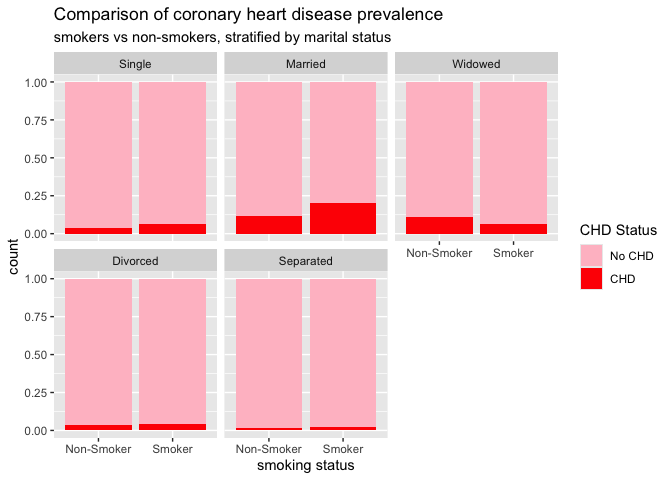<!-- -->


I personally would feel more comfortable first making a table of values, to be sure it is plotting what I expect. As it turns out, it looks identical in this case.


``` r
my_table <- nmes_data %>%
  count(smoking_status, marital_status, chd5) %>%
  group_by(smoking_status, marital_status) %>%
  mutate(prop = n/sum(n))

ggplot(data = my_table) + 
  geom_bar(aes(x = smoking_status, y = prop, fill = factor(chd5)), stat = "identity") +
  scale_fill_manual(values = c("0" = "pink", "1" = "red"),
                    name = "CHD Status",
                    labels = c("No CHD", "CHD")) +
  labs(
    title = "Comparison of coronary heart disease prevalence",
    subtitle = "smokers vs non-smokers, stratified by marital status",
    x = "smoking status",
    fill = "CHD status",
    y = "proportion"
  ) +
  facet_wrap(~marital_status)
```

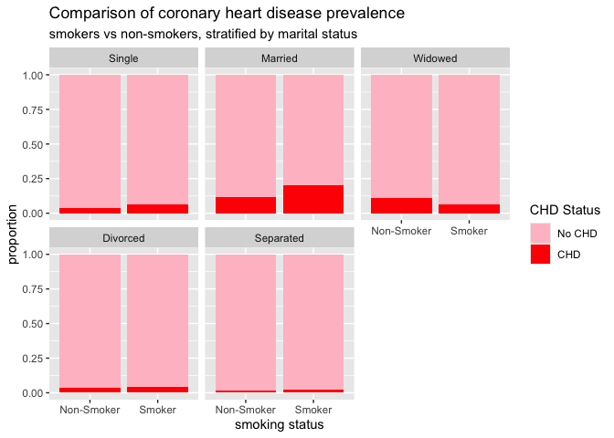<!-- -->


### Display 2

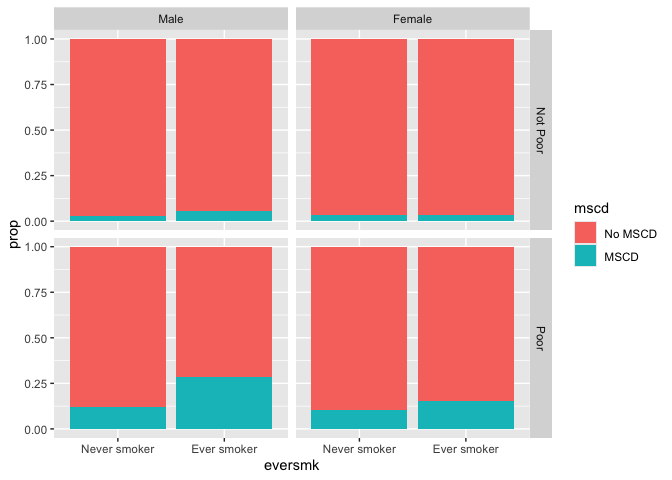<!-- -->


Here, I filtered to only show the MCSD rate (not the No MSCD rate), modified the axis labels, and removed the legend. I also added labels.


``` r
my_table %>% 
  filter(mscd == "MSCD") %>%
  ggplot() + 
  geom_bar(aes(x = eversmk, y = prop, fill = mscd), stat = "identity") +
  facet_grid(poor~female) +
  labs(
    title = "Rate of MSCD",
    subtitle = "Smokers vs non-smokers, stratified by sex and socio-economic status",
    x = "Smoking status",
    y = "Rate of MSCD") +
  guides(fill="none")
```

<!-- -->


### Display 3


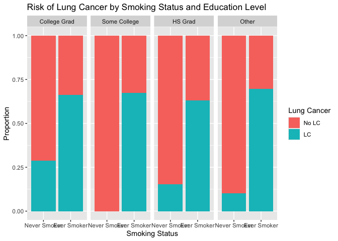<!-- -->


Here, I filtered to only show the MCSD rate (not the No MSCD rate), modified the axis labels, and removed the legend. I also angled the x-axis labels. 


``` r
my_table <- nmes_data %>%
  count(eversmk, educate, lc5) %>%
  group_by(eversmk, educate) %>%
  mutate(prop = n/sum(n))

my_table %>% 
  filter(lc5 == "LC") %>%
  ggplot() + 
  geom_bar(aes(x = eversmk, y = prop, fill = lc5), stat = "identity") +
  facet_grid(~educate) +
  labs(
    title = "Rate of lung cancer",
    subtitle = "Smokers vs non-smokers, stratified education status",
    x = "Smoking status",
    y = "Rate of lung cancer") +
  guides(fill="none") +
  theme(axis.text.x = element_text(angle = 22.5,
                                   hjust = 1,
                                   size = 9))
```

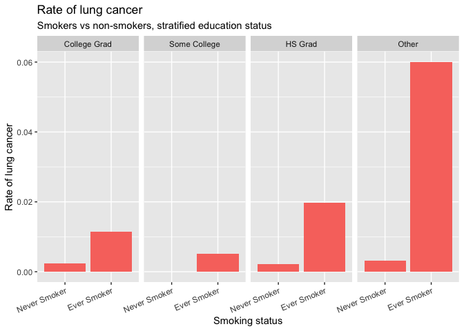<!-- -->


### Display 4

<table class="table" style="margin-left: auto; margin-right: auto;">
 <thead>
  <tr>
   <th style="text-align:left;"> Lung Cancer (LC) Status </th>
   <th style="text-align:left;"> Smoking Status </th>
   <th style="text-align:left;"> Gender </th>
   <th style="text-align:right;"> n </th>
   <th style="text-align:right;"> prop </th>
  </tr>
 </thead>
<tbody>
  <tr>
   <td style="text-align:left;"> No LC </td>
   <td style="text-align:left;"> Never smoker </td>
   <td style="text-align:left;"> Male </td>
   <td style="text-align:right;"> 618 </td>
   <td style="text-align:right;"> 0.997 </td>
  </tr>
  <tr>
   <td style="text-align:left;"> No LC </td>
   <td style="text-align:left;"> Never smoker </td>
   <td style="text-align:left;"> Female </td>
   <td style="text-align:right;"> 1462 </td>
   <td style="text-align:right;"> 0.999 </td>
  </tr>
  <tr>
   <td style="text-align:left;"> No LC </td>
   <td style="text-align:left;"> Ever smoker </td>
   <td style="text-align:left;"> Male </td>
   <td style="text-align:right;"> 933 </td>
   <td style="text-align:right;"> 0.969 </td>
  </tr>
  <tr>
   <td style="text-align:left;"> No LC </td>
   <td style="text-align:left;"> Ever smoker </td>
   <td style="text-align:left;"> Female </td>
   <td style="text-align:right;"> 1020 </td>
   <td style="text-align:right;"> 0.989 </td>
  </tr>
  <tr>
   <td style="text-align:left;"> LC </td>
   <td style="text-align:left;"> Never smoker </td>
   <td style="text-align:left;"> Male </td>
   <td style="text-align:right;"> 2 </td>
   <td style="text-align:right;"> 0.003 </td>
  </tr>
  <tr>
   <td style="text-align:left;"> LC </td>
   <td style="text-align:left;"> Never smoker </td>
   <td style="text-align:left;"> Female </td>
   <td style="text-align:right;"> 2 </td>
   <td style="text-align:right;"> 0.001 </td>
  </tr>
  <tr>
   <td style="text-align:left;"> LC </td>
   <td style="text-align:left;"> Ever smoker </td>
   <td style="text-align:left;"> Male </td>
   <td style="text-align:right;"> 30 </td>
   <td style="text-align:right;"> 0.031 </td>
  </tr>
  <tr>
   <td style="text-align:left;"> LC </td>
   <td style="text-align:left;"> Ever smoker </td>
   <td style="text-align:left;"> Female </td>
   <td style="text-align:right;"> 11 </td>
   <td style="text-align:right;"> 0.011 </td>
  </tr>
</tbody>
</table>


I filtered to only show the rate for the LC people, and grouped to compare ever smokers to never smokers more directly:


``` r
# Table stratified by gender
my_table <- nmes_data %>%
  count(lc5, eversmk, female) %>%
  group_by(eversmk, female) %>%
  mutate(prop = n/sum(n)) %>%
  filter(lc5 == "LC") %>%
  arrange(female, eversmk)%>%
  rename(
    "Smoking Status" = eversmk, 
    "Lung Cancer (LC) Status" = lc5,
    "Gender" = female
  )
my_table %>%
  kable(digits = 3) %>%
  kable_styling()
```

<table class="table" style="margin-left: auto; margin-right: auto;">
 <thead>
  <tr>
   <th style="text-align:left;"> Lung Cancer (LC) Status </th>
   <th style="text-align:left;"> Smoking Status </th>
   <th style="text-align:left;"> Gender </th>
   <th style="text-align:right;"> n </th>
   <th style="text-align:right;"> prop </th>
  </tr>
 </thead>
<tbody>
  <tr>
   <td style="text-align:left;"> LC </td>
   <td style="text-align:left;"> Never smoker </td>
   <td style="text-align:left;"> Male </td>
   <td style="text-align:right;"> 2 </td>
   <td style="text-align:right;"> 0.003 </td>
  </tr>
  <tr>
   <td style="text-align:left;"> LC </td>
   <td style="text-align:left;"> Ever smoker </td>
   <td style="text-align:left;"> Male </td>
   <td style="text-align:right;"> 30 </td>
   <td style="text-align:right;"> 0.031 </td>
  </tr>
  <tr>
   <td style="text-align:left;"> LC </td>
   <td style="text-align:left;"> Never smoker </td>
   <td style="text-align:left;"> Female </td>
   <td style="text-align:right;"> 2 </td>
   <td style="text-align:right;"> 0.001 </td>
  </tr>
  <tr>
   <td style="text-align:left;"> LC </td>
   <td style="text-align:left;"> Ever smoker </td>
   <td style="text-align:left;"> Female </td>
   <td style="text-align:right;"> 11 </td>
   <td style="text-align:right;"> 0.011 </td>
  </tr>
</tbody>
</table>


### Display 5


```
## # A tibble: 16 × 5
## # Groups:   eversmk [2]
##    eversmk      chd5   educate          n percent
##    <fct>        <fct>  <fct>        <int>   <dbl>
##  1 Never smoker No CHD College Grad   407    19.5
##  2 Never smoker No CHD Some College   393    18.9
##  3 Never smoker No CHD HS Grad        895    42.9
##  4 Never smoker No CHD Other          293    14.1
##  5 Never smoker CHD    College Grad    12     0.6
##  6 Never smoker CHD    Some College    13     0.6
##  7 Never smoker CHD    HS Grad         45     2.2
##  8 Never smoker CHD    Other           26     1.2
##  9 Ever smoker  No CHD College Grad   247    12.4
## 10 Ever smoker  No CHD Some College   362    18.2
## 11 Ever smoker  No CHD HS Grad       1035    51.9
## 12 Ever smoker  No CHD Other          214    10.7
## 13 Ever smoker  CHD    College Grad    14     0.7
## 14 Ever smoker  CHD    Some College    24     1.2
## 15 Ever smoker  CHD    HS Grad         79     4  
## 16 Ever smoker  CHD    Other           19     1
```


Similar to the above, I filtered to only the CHD group and rearranged to better compare ever to never smokers.


``` r
my_table <- nmes_data %>%
  count(eversmk, chd5, educate) %>%
  group_by(eversmk, educate) %>%
  mutate(percent = round (n/sum(n) * 100, 1)) %>%
  filter(chd5 == "CHD") %>%
  arrange(educate)

my_table %>%
  kable(digits = 3) %>%
  kable_styling()
```

<table class="table" style="margin-left: auto; margin-right: auto;">
 <thead>
  <tr>
   <th style="text-align:left;"> eversmk </th>
   <th style="text-align:left;"> chd5 </th>
   <th style="text-align:left;"> educate </th>
   <th style="text-align:right;"> n </th>
   <th style="text-align:right;"> percent </th>
  </tr>
 </thead>
<tbody>
  <tr>
   <td style="text-align:left;"> Never smoker </td>
   <td style="text-align:left;"> CHD </td>
   <td style="text-align:left;"> College Grad </td>
   <td style="text-align:right;"> 12 </td>
   <td style="text-align:right;"> 2.9 </td>
  </tr>
  <tr>
   <td style="text-align:left;"> Ever smoker </td>
   <td style="text-align:left;"> CHD </td>
   <td style="text-align:left;"> College Grad </td>
   <td style="text-align:right;"> 14 </td>
   <td style="text-align:right;"> 5.4 </td>
  </tr>
  <tr>
   <td style="text-align:left;"> Never smoker </td>
   <td style="text-align:left;"> CHD </td>
   <td style="text-align:left;"> Some College </td>
   <td style="text-align:right;"> 13 </td>
   <td style="text-align:right;"> 3.2 </td>
  </tr>
  <tr>
   <td style="text-align:left;"> Ever smoker </td>
   <td style="text-align:left;"> CHD </td>
   <td style="text-align:left;"> Some College </td>
   <td style="text-align:right;"> 24 </td>
   <td style="text-align:right;"> 6.2 </td>
  </tr>
  <tr>
   <td style="text-align:left;"> Never smoker </td>
   <td style="text-align:left;"> CHD </td>
   <td style="text-align:left;"> HS Grad </td>
   <td style="text-align:right;"> 45 </td>
   <td style="text-align:right;"> 4.8 </td>
  </tr>
  <tr>
   <td style="text-align:left;"> Ever smoker </td>
   <td style="text-align:left;"> CHD </td>
   <td style="text-align:left;"> HS Grad </td>
   <td style="text-align:right;"> 79 </td>
   <td style="text-align:right;"> 7.1 </td>
  </tr>
  <tr>
   <td style="text-align:left;"> Never smoker </td>
   <td style="text-align:left;"> CHD </td>
   <td style="text-align:left;"> Other </td>
   <td style="text-align:right;"> 26 </td>
   <td style="text-align:right;"> 8.2 </td>
  </tr>
  <tr>
   <td style="text-align:left;"> Ever smoker </td>
   <td style="text-align:left;"> CHD </td>
   <td style="text-align:left;"> Other </td>
   <td style="text-align:right;"> 19 </td>
   <td style="text-align:right;"> 8.2 </td>
  </tr>
</tbody>
</table>


### Display 6


<!-- -->


Here I used a table to make sure the values plotted were the correct conditional probabilities. Further improvements can be made along the lines of some of the examples above.


``` r
my_table <- nmes_data %>%
  count(eversmk, lc5, female, beltuse) %>%
  group_by(eversmk, female, beltuse) %>%
  mutate(percent = round (n/sum(n) * 100, 1))


my_table %>%
  ggplot() + 
  geom_bar(aes(x = eversmk, y = percent, fill = lc5), stat = "identity") +
  facet_grid(female~beltuse)
```

<!-- -->


### Display 7

<!-- -->


Some suggested improvements. Here, I fixed the y-axis labels and got rid of the legend.


``` r
ggplot(nmes_data, aes(x = logtotalexp, y = eversmk, color = eversmk)) +
  geom_boxplot() +
  facet_wrap(female ~ poor)+
  guides(color="none")
```

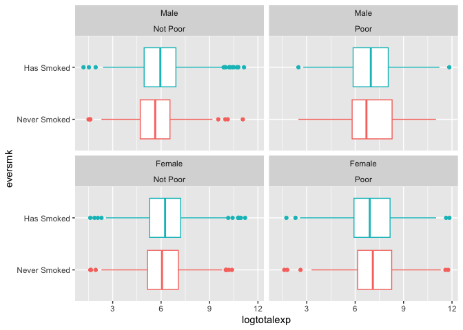<!-- -->


## R notes based Assignment 1-1

### Recoding variables

Since we aren't sure which variables we will be using to make our plots and fit our models later, we want to recode all of the variables of the data set rather than just the variables we will use in our data display.

Remember that this is our codebook:

* `age`: age in years
* `female`: 1=female, 0=male
* `eversmk`: 1=has ever been a smoker, 0=has never been a smoker
* `current`: 1=current smoker, 0=not current smoker (but formerly smoked), NA if eversmk=0
* `former`: 1=former smoker, 0=not former smoker
* `packyears`: reported packs per year of smoking (0 if eversmk = No)
* `yearsince`: years since quitting smoking (0 if eversmk = No)
* `totalexp`: self-reported total medical expenditures for 1987
* `lc5`: 1=lung cancer, laryngeal cancer or COPD, 0=none of these
* `chd5`: 1=coronary heart disease, stroke, and other cancers (oral, esophageal, stomach, kidney and bladder), 0=none of these
* `beltuse`: 1=rare, 2=some, 3=always/almost always
* `educate`: 1=college graduatee, 2=some college, 3=HS grad, 4=other
* `marital`: 1=married, 2=widowed, 3=divorced, 4=separated, 5=never married
* `poor`: 1=poor, 0=not poor

At the beginning of your .Rmd file, you should recode **ALL** of these variables to have meaningful labels.

``` r
nmes_data <- read_csv("module_1/nmesUNPROC.csv")

nmes_data <- nmes_data %>%
  mutate(eversmk = factor(eversmk, 
                          levels = c("0", "1"), 
                          labels = c("Never smoker", "Ever smoker")),
         lc5 = factor(lc5, 
                      levels = c("0", "1"), 
                      labels = c("No LC", "LC")),
         chd5 = factor(chd5, 
                       levels = c("0", "1"), 
                       labels = c("No CHD", "CHD"))
         )

#etc, fill in the rest of appropriate variables here
```

A couple of things to note: 
1. It is easier to read your code if you have one call to mutate, but recode each variable on its own lines.
2. Think about the order of the levels. You may want to ensure that a particular level is the "baseline" for that variable, or order things in a more intuitive way than might happen by default.

### Combining LC and CHD into a single disease variable

If we really want to talk about the risk of **disease** where disease can be either LC or CHD, we want to combine into a single disease category.  This is what we called *major smoking-caused disease*, MSCD, in Public Health Biostatistics.

Here we will create a new variable based on `lc5 == "LC" | chd5 == "CHD"`, which stands for `lc5 == "LC"` OR `chd5 == "CHD"`.  The `|` symbol means that only one of the conditions needs to be true in order for the whole statement to be true.  So basically, if either a person has LC OR a person has CHD, we will designate them as having a diease.


``` r
nmes_data <- nmes_data %>%
  mutate(disease = factor(lc5 == "LC" | chd5 == "CHD", 
                          levels=c(FALSE, TRUE), 
                          labels=c("No disease", "Disease")))


# We can take a look at the combined variable with the two individual variables
nmes_data %>%
  count(disease, lc5, chd5)
```

```
## # A tibble: 3 × 4
##   disease    lc5   chd5       n
##   <fct>      <fct> <fct>  <int>
## 1 No disease No LC No CHD  3801
## 2 Disease    No LC CHD      232
## 3 Disease    LC    No CHD    45
```

Note: You need to refer to the levels of `lc5` and `chd5` as they are coded at the time that this piece of code is run, i.e., whether you have already recoded them or not.

### Filtering tables/graphs and adding value labels

One thing that might enhance some of the bar graphs would be to include the actual proportion values as text on the graph.  You can have more control of what is in your bar graph if you first create a table with the values you want to graph and then graph from this table instead of the entire data set!


``` r
my_table <- nmes_data %>%
  count(eversmk, disease) %>%
  group_by(eversmk) %>%
  mutate(prop = n/sum(n))

my_table
```

```
## # A tibble: 4 × 4
## # Groups:   eversmk [2]
##   eversmk      disease        n   prop
##   <fct>        <fct>      <int>  <dbl>
## 1 Never smoker No disease  1984 0.952 
## 2 Never smoker Disease      100 0.0480
## 3 Ever smoker  No disease  1817 0.911 
## 4 Ever smoker  Disease      177 0.0888
```

Now we've created a table that gives the proportion of those with and without disease in each smoking category.  (Note the proportions add up to 1 within the smoking groups!)

We can now graph this by setting the `y` aesthetic to the `prop` variable in this table and choosing `stat = "identity"` within `geom_bar()` to say we are directly giving the `y` value to be plotted rather than having R calculate either the proportion or count for us.

``` r
ggplot(data = my_table) + 
  geom_bar(aes(x = eversmk, y = prop, fill = disease), stat = "identity", position = "dodge")
```

<!-- -->

Now we can do things like filter out the "No disease" part to leave only the risk of disease and not the risk of no disease on the graph:

``` r
my_table %>%
  filter(disease == "Disease") %>%
  ggplot() + 
  geom_bar(aes(x = eversmk, y = prop, fill = disease), stat = "identity")
```

<!-- -->

And add value labels to the plot using `geom_text()`:

``` r
my_table %>%
  filter(disease == "Disease") %>%
  ggplot() + 
  geom_bar(aes(x = eversmk, y = prop, fill = disease), stat = "identity") + 
  geom_text(aes(x = eversmk, y = prop, label = prop))
```

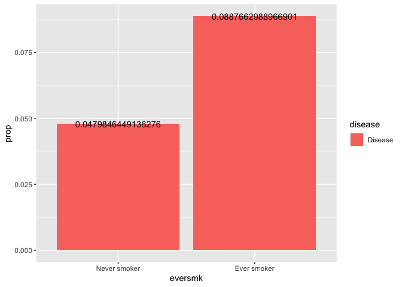<!-- -->

And you can control the display of digits on your graph by controlling the digits in your table:

``` r
my_table <- nmes_data %>%
  count(eversmk, disease) %>%
  group_by(eversmk) %>%
  mutate(percent =round(n/sum(n)*100,1))

my_table
```

```
## # A tibble: 4 × 4
## # Groups:   eversmk [2]
##   eversmk      disease        n percent
##   <fct>        <fct>      <int>   <dbl>
## 1 Never smoker No disease  1984    95.2
## 2 Never smoker Disease      100     4.8
## 3 Ever smoker  No disease  1817    91.1
## 4 Ever smoker  Disease      177     8.9
```

``` r
my_table %>%
  filter(disease == "Disease") %>%
  ggplot() + 
  geom_bar(aes(x = eversmk, y = percent, fill = disease), stat = "identity") + 
  geom_text(aes(x = eversmk, y = percent, label = percent), vjust = -0.8)
```

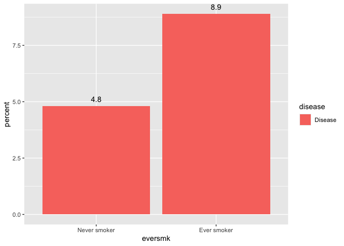<!-- -->


#### Quick aside: including 0's in a table

If you want your table to include the combinations of levels that have no people in them, you need to first group your data, and include the argument `.drop = FALSE` to the call to `group_by`:


``` r
nmes_data %>%
  group_by(eversmk, lc5, chd5, .drop=FALSE) %>%
  count() 
```

```
## # A tibble: 8 × 4
## # Groups:   eversmk, lc5, chd5 [8]
##   eversmk      lc5   chd5       n
##   <fct>        <fct> <fct>  <int>
## 1 Never smoker No LC No CHD  1984
## 2 Never smoker No LC CHD       96
## 3 Never smoker LC    No CHD     4
## 4 Never smoker LC    CHD        0
## 5 Ever smoker  No LC No CHD  1817
## 6 Ever smoker  No LC CHD      136
## 7 Ever smoker  LC    No CHD    41
## 8 Ever smoker  LC    CHD        0
```


### Stratifying your graph by more than one variable

The `facet_wrap()` function allows you to stratify a graph by a single variable and the `facet_grid()` function will allow you to stratify by two variables.  


``` r
ggplot(data = nmes_data) + 
  geom_bar(mapping = aes(x = eversmk, fill = disease), position = "fill") +
  facet_wrap(~beltuse)
```

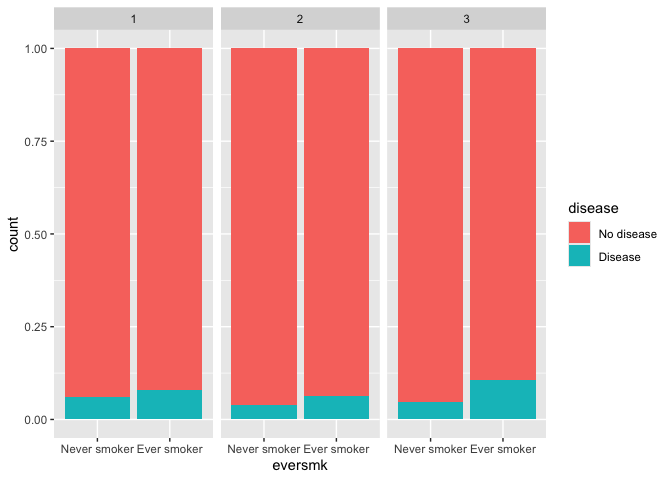<!-- -->

``` r
ggplot(data = nmes_data) + 
  geom_bar(mapping = aes(x = eversmk, fill = disease), position = "fill") +
  facet_grid(marital~beltuse)
```

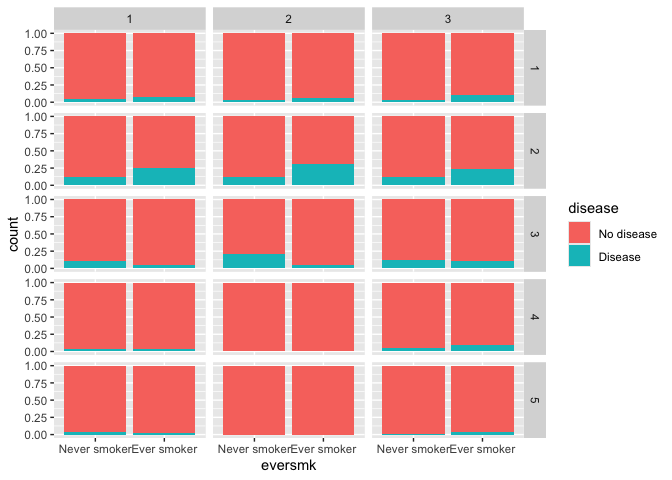<!-- -->

These functions will also work when using the table method to make a bar graph, but it's important to `group_by()` the stratifying variables in your table so that the proportions are taken conditionally on the right group!

Notice here that the proportions add up to 1 within the smoking category:


``` r
my_table <- nmes_data %>%
  count(eversmk, disease) %>%
  group_by(eversmk) %>%
  mutate(prop = n/sum(n))

my_table
```

```
## # A tibble: 4 × 4
## # Groups:   eversmk [2]
##   eversmk      disease        n   prop
##   <fct>        <fct>      <int>  <dbl>
## 1 Never smoker No disease  1984 0.952 
## 2 Never smoker Disease      100 0.0480
## 3 Ever smoker  No disease  1817 0.911 
## 4 Ever smoker  Disease      177 0.0888
```

``` r
ggplot(data = my_table) + 
  geom_bar(aes(x = eversmk, y = prop, fill = disease), stat = "identity", position = "dodge")
```

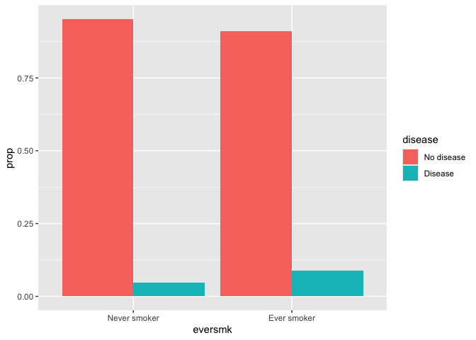<!-- -->

Let's add another variable:


``` r
my_table <- nmes_data %>%
  count(beltuse, eversmk, disease) %>%
  group_by(eversmk) %>%
  mutate(prop = n/sum(n))

my_table
```

```
## # A tibble: 12 × 5
## # Groups:   eversmk [2]
##    beltuse eversmk      disease        n    prop
##      <dbl> <fct>        <fct>      <int>   <dbl>
##  1       1 Never smoker No disease   406 0.195  
##  2       1 Never smoker Disease       26 0.0125 
##  3       1 Ever smoker  No disease   484 0.243  
##  4       1 Ever smoker  Disease       41 0.0206 
##  5       2 Never smoker No disease   382 0.183  
##  6       2 Never smoker Disease       15 0.00720
##  7       2 Ever smoker  No disease   413 0.207  
##  8       2 Ever smoker  Disease       28 0.0140 
##  9       3 Never smoker No disease  1196 0.574  
## 10       3 Never smoker Disease       59 0.0283 
## 11       3 Ever smoker  No disease   920 0.461  
## 12       3 Ever smoker  Disease      108 0.0542
```

``` r
ggplot(data = my_table) + 
  geom_bar(aes(x = eversmk, y = prop, fill = disease), stat = "identity", position = "dodge") +
  facet_wrap(~ beltuse)
```

<!-- -->

Notice how the proportions don't add up properly?  If we are going to graph by the `beltuse` variable, we also need to group by the beltuse variable:


``` r
my_table <- nmes_data %>%
  count(beltuse, eversmk, disease) %>%
  group_by(beltuse, eversmk) %>%
  mutate(prop = n/sum(n))

my_table
```

```
## # A tibble: 12 × 5
## # Groups:   beltuse, eversmk [6]
##    beltuse eversmk      disease        n   prop
##      <dbl> <fct>        <fct>      <int>  <dbl>
##  1       1 Never smoker No disease   406 0.940 
##  2       1 Never smoker Disease       26 0.0602
##  3       1 Ever smoker  No disease   484 0.922 
##  4       1 Ever smoker  Disease       41 0.0781
##  5       2 Never smoker No disease   382 0.962 
##  6       2 Never smoker Disease       15 0.0378
##  7       2 Ever smoker  No disease   413 0.937 
##  8       2 Ever smoker  Disease       28 0.0635
##  9       3 Never smoker No disease  1196 0.953 
## 10       3 Never smoker Disease       59 0.0470
## 11       3 Ever smoker  No disease   920 0.895 
## 12       3 Ever smoker  Disease      108 0.105
```

``` r
ggplot(data = my_table) + 
  geom_bar(aes(x = eversmk, y = prop, fill = disease), stat = "identity", position = "dodge") +
  facet_wrap(~ beltuse)
```

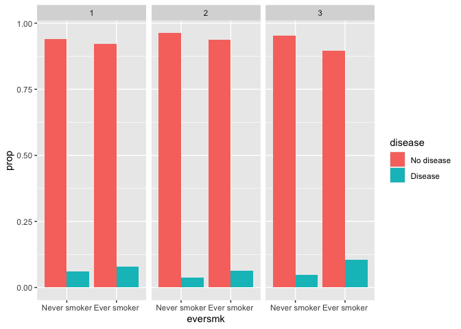<!-- -->

You can extend this idea to two additional variables as well:


``` r
my_table <- nmes_data %>%
  count(marital, beltuse, eversmk, disease) %>%
  group_by(marital, beltuse, eversmk) %>%
  mutate(prop = n/sum(n))

my_table
```

```
## # A tibble: 56 × 6
## # Groups:   marital, beltuse, eversmk [30]
##    marital beltuse eversmk      disease        n   prop
##      <dbl>   <dbl> <fct>        <fct>      <int>  <dbl>
##  1       1       1 Never smoker No disease   195 0.951 
##  2       1       1 Never smoker Disease       10 0.0488
##  3       1       1 Ever smoker  No disease   302 0.924 
##  4       1       1 Ever smoker  Disease       25 0.0765
##  5       1       2 Never smoker No disease   238 0.967 
##  6       1       2 Never smoker Disease        8 0.0325
##  7       1       2 Ever smoker  No disease   270 0.941 
##  8       1       2 Ever smoker  Disease       17 0.0592
##  9       1       3 Never smoker No disease   758 0.963 
## 10       1       3 Never smoker Disease       29 0.0368
## # ℹ 46 more rows
```

``` r
ggplot(data = my_table) + 
  geom_bar(aes(x = eversmk, y = prop, fill = disease), stat = "identity", position = "dodge") +
  facet_wrap(marital ~ beltuse)
```

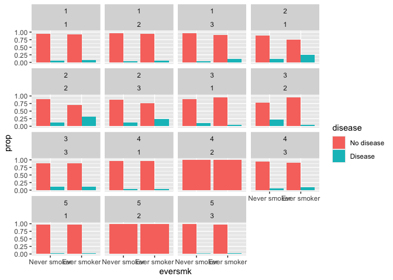<!-- -->

If you want to facet by more than two variables, you have to be more creative.  (You might first think about whether a display with more than two variables is useful to see!)  You could first subset your data by one of the variables and create separate faceted graphs for each subset of data.  For example, first split into male/female groups and then make a faceted plot within each of those groups.

Alternatively, you could create a new variable that combines multiple variables together for plotting purposes. In the code below there's a new variable called `female_poor_smk` that combines the information from the three variables into one.

``` r
nmes_data <- nmes_data %>%
  mutate(poor = factor(poor, levels = c("0", "1"), labels = c("N Poor", "Poor")))

nmes_data <- nmes_data %>%
  mutate(female = factor(female,levels = c("0", "1"), labels = c("M", "F")))

my_table <- nmes_data %>%
   mutate(female_poor = paste(female, poor, sep = " ")) %>%
  mutate(female_poor_smk = paste(female_poor, eversmk, sep = " " )) %>%
  count(lc5, female_poor_smk, educate) %>%
  group_by(female_poor_smk) %>%
  mutate(prop = n/sum(n))

my_table
```

```
## # A tibble: 46 × 5
## # Groups:   female_poor_smk [8]
##    lc5   female_poor_smk       educate     n   prop
##    <fct> <chr>                   <dbl> <int>  <dbl>
##  1 No LC F N Poor Ever smoker        1   109 0.139 
##  2 No LC F N Poor Ever smoker        2   170 0.217 
##  3 No LC F N Poor Ever smoker        3   465 0.593 
##  4 No LC F N Poor Ever smoker        4    38 0.0485
##  5 No LC F N Poor Never smoker       1   214 0.195 
##  6 No LC F N Poor Never smoker       2   249 0.227 
##  7 No LC F N Poor Never smoker       3   523 0.477 
##  8 No LC F N Poor Never smoker       4   110 0.100 
##  9 No LC F Poor Ever smoker          1    13 0.0526
## 10 No LC F Poor Ever smoker          2    32 0.130 
## # ℹ 36 more rows
```

### Splitting a continuous variable into groups

For plotting purposes, you might want to break a countinuous variable, like age or BMI, into groups.  Some of your peers did this for the assignment this week -- see the code for Display 1 for an example of doing this using the `cut()` function.  Here's another example of how this might look:

``` r
nmes_data <- nmes_data %>% 
  mutate(age_cat = cut(age,
                      breaks = c(0,30,60,100),
                      labels = c("Age < 30", "Age 30-60", "Age > 60")))

nmes_data %>% count(age_cat)
```

```
## # A tibble: 3 × 2
##   age_cat       n
##   <fct>     <int>
## 1 Age < 30    971
## 2 Age 30-60  1915
## 3 Age > 60   1192
```

You can also create a new variable using the `case_when()` function:

``` r
nmes_data <- nmes_data %>% 
  mutate(age_cat = case_when(
    age > 0 & age < 30 ~ "Age < 30",
    age >= 30 & age <=60 ~ "Age 30-60",
    age > 60 ~ "Age > 60"
  ))

nmes_data %>% count(age_cat)
```

```
## # A tibble: 3 × 2
##   age_cat       n
##   <chr>     <int>
## 1 Age 30-60  2009
## 2 Age < 30    877
## 3 Age > 60   1192
```

Notice these results are a little bit different, and that's because the `cut()` function will always cut the same way (either including the left-most value or the right-most value) for each group of values, but with `case_when()` I can decide that I want the 30 and 60 to be included in the middle group explicitly.

### Adding labels to figures

We can relabel the axes, title, and legend using `labs()`.


``` r
my_table <- nmes_data %>%
  count(eversmk, disease) %>%
  group_by(eversmk) %>%
  mutate(prop = n/sum(n))

ggplot(data = my_table) + 
  geom_bar(aes(x = eversmk, y = prop, fill = disease), stat = "identity", position = "dodge") +
  labs(y= "Risk of MSCD",
       x= "",
       title= "Risk of MSCD, comparing smokers to non-smokers", 
       fill = "Disease status")
```

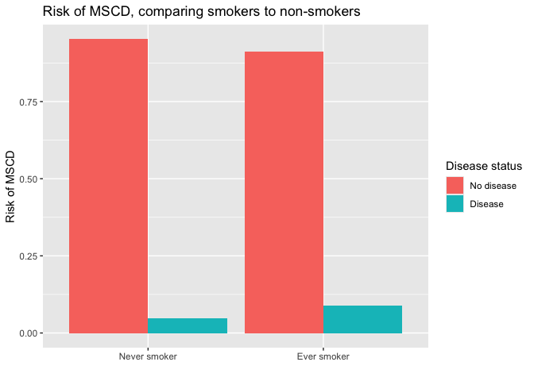<!-- -->

## Starting Assignment 1.2

Do the following to address Question 1.1: How does the risk of disease compare for smokers and otherwise similar non-smokers?

* (Can work on this now!) Improve your data display from last week to answer this question.
* (Will talk about this on Wednesday!) Fit a logistic regression model to answer this question.  Interpret the coefficients and either p-values or confidence intervals from this model to answer the question.  That is, what does this model say about Question 1.1?

* Submit your data display in R Markdown through Github by Sunday (February 2, 2025) at midnight. You can find a link to create this assignment in Github on Canvas.
* Post a screenshot of your improved data display (just the graph or table) **and** your logistic regression model output on Piazza in the "Assignment 1-2 Results" thread.  Add a sentence or two that interprets the logistic regression results to answer the question of interest.  You are welcome to post this anonymously to your classmates. You can also include comments about what you chose to do or questions you had as you were making the display and fitting your model.
* You may work together on this assignment, but you must submit your own assignment; please credit in your assignment anyone with whom you collaborated.
* Next Monday in class we will start with a discussion of your work.
