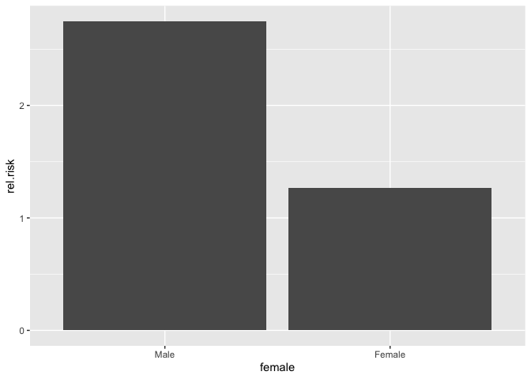
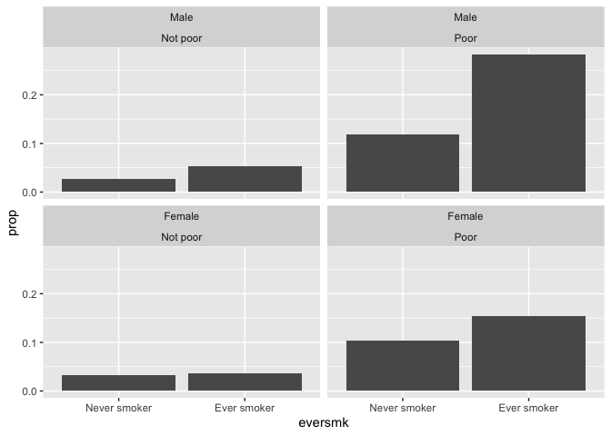
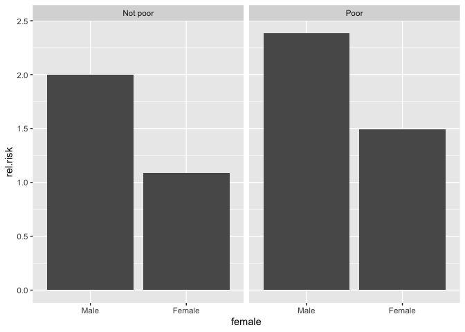
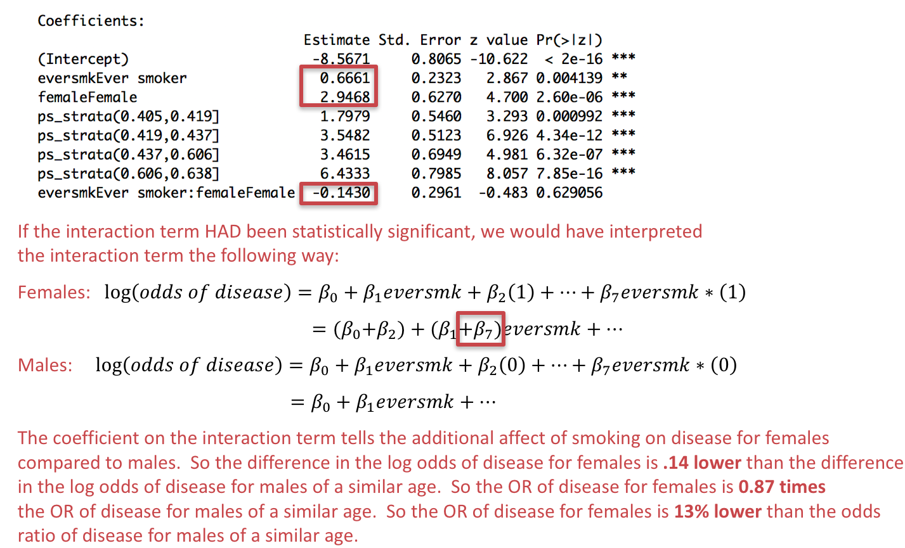

**Note:** Valentine's hearts courtesy of Emily Riederer (https://github.com/emilyriederer/demo-rmd-snow) To turn them off, you can delete the chunk of code below from lines 16 through 47.

<div class="snowflakes" aria-hidden="true">
  <div class="snowflake">
  ♥
  </div>
  <div class="snowflake">
  ♡
  </div>
  <div class="snowflake">
  ♥
  </div>
  <div class="snowflake">
  ♡
  </div>
  <div class="snowflake">
  ♥
  </div>
  <div class="snowflake">
  ♡
  </div>
  <div class="snowflake">
  ♥
  </div>
  <div class="snowflake">
  ♡
  </div>
  <div class="snowflake">
  ♥
  </div>
  <div class="snowflake">
  ♡
  </div>
</div>


<style type="text/css">
/*Source: https://codepen.io/codeconvey/pen/xRzQay*/
  
/* customizable snowflake styling */
.snowflake {
  color: #F55491;
  font-size: 5em;
  font-family: Arial;
  text-shadow: 0 0 1px #000;
}
@-webkit-keyframes snowflakes-fall{0%{top:-10%}100%{top:100%}}
@-webkit-keyframes snowflakes-shake{
    0%{-webkit-transform:translateX(0px);transform:translateX(0px)}
   50%{-webkit-transform:translateX(80px);transform:translateX(80px)}
  100%{-webkit-transform:translateX(0px);transform:translateX(0px)}}
@keyframes snowflakes-fall{
    0%{top:-10%}
  100%{top:100%}}
@keyframes snowflakes-shake{
    0%{transform:translateX(0px)}
   50%{transform:translateX(80px)}
  100%{transform:translateX(0px)}}
.snowflake{
  position:fixed;
  top:-10%;
  z-index:9999;
  -webkit-user-select:none;
  -moz-user-select:none;
  -ms-user-select:none;
  user-select:none;
  cursor:default;
  -webkit-animation-name:snowflakes-fall,snowflakes-shake;
  -webkit-animation-duration:10s,3s;
  -webkit-animation-timing-function:linear,ease-in-out;
  -webkit-animation-iteration-count:infinite,infinite;
  -webkit-animation-play-state:running,running;
  animation-name:snowflakes-fall,snowflakes-shake;
  animation-duration:10s,3s;
  animation-timing-function:linear,ease-in-out;
  animation-iteration-count:infinite,infinite;
  animation-play-state:running,running}
.snowflake:nth-of-type(0){left: 1%;-webkit-animation-delay:  0s,  0s;animation-delay:  0s,  0s}
.snowflake:nth-of-type(1){left:10%;-webkit-animation-delay:  1s,  1s;animation-delay:  1s,  1s}
.snowflake:nth-of-type(2){left:20%;-webkit-animation-delay:  6s,0.5s;animation-delay:  6s,0.5s}
.snowflake:nth-of-type(3){left:30%;-webkit-animation-delay:  4s,  2s;animation-delay:  4s,  2s}
.snowflake:nth-of-type(4){left:40%;-webkit-animation-delay:  2s,  2s;animation-delay:  2s,  2s}
.snowflake:nth-of-type(5){left:50%;-webkit-animation-delay:  8s,  3s;animation-delay:  8s,  3s}
.snowflake:nth-of-type(6){left:60%;-webkit-animation-delay:  6s,  2s;animation-delay:  6s,  2s}
.snowflake:nth-of-type(7){left:70%;-webkit-animation-delay:2.5s,  1s;animation-delay:2.5s,  1s}
.snowflake:nth-of-type(8){left:80%;-webkit-animation-delay:  1s,  0s;animation-delay:  1s,  0s}
.snowflake:nth-of-type(9){left:90%;-webkit-animation-delay:  3s,1.5s;animation-delay:  3s,1.5s}
</style>


## Preliminaries

First load the packages that we will be using in this document:

``` r
library(tidyverse)  # core group of tidyverse packages
library(kableExtra)  # to make nice tables
library(broom)  # for tidy model summaries
```

We also can read in and recode the variables in the NMES data set:

``` r
nmes_data <- read_csv("module_1/nmesUNPROC.csv")

nmes_data <- nmes_data %>%
  mutate(eversmk = factor(eversmk, levels = c("0", "1"), labels = c("Never smoker", "Ever smoker")),
         lc5 = factor(lc5, levels = c("0", "1"), labels = c("No LC", "LC")),
         chd5 = factor(chd5, levels = c("0", "1"), labels = c("No CHD", "CHD")),
         female = factor(female, levels= c("0", "1"), labels = c("Male", "Female")),
         current = factor(current, levels= c("0", "1"), labels = c("Not current smoker", "Current smoker")),
         former = factor(former, levels= c("0", "1"), labels = c("Not former smoker", "Former smoker")),
         beltuse = factor(beltuse, levels= c("1", "2", "3"), labels = c("Rare", "Some", "Almost always")),
         educate = factor(educate, levels= c("1", "2", "3", "4"), labels = c("College grad", "Some college", "HS grad", "Other")),
         marital = factor(marital, levels= c("1", "2", "3", "4", "5"), labels = c("Married", "Widowed", "Divorced", "Separated", "Never married")),
         poor = factor(poor, levels= c("0", "1"), labels = c("Not poor", "Poor"))
         )

nmes_data <- nmes_data %>%
  mutate(disease = factor(lc5 == "LC" | chd5 == "CHD", 
                          levels=c(FALSE,TRUE), 
                          labels=c("No MSCD", "MSCD")))
```

## Module 1: Smoking and the risk of disease

Questions of interest:

* **Question 1.1: ** How does the risk of disease compare for smokers and otherwise similar non-smokers?

<center>
{width=500px}
</center>

* **Queston 1.2: ** Does the contribution of smoking to the risk of disease vary by sex or socio-economic status (SES)?

<center>
{width=500px}
</center>

To address each question we want:

* A data display (graph or table)
* A statistical analysis (with interprepration)

We will answer these questions using data from the National Medical Expenditures Survey (NMES)

## Effect modification

Now we will finally consider **Queston 1.2: ** Does the contribution of smoking to the risk of disease vary by sex or socio-economic status (SES)?

<center>
{width=500px}

</center>

An **effect modification** (or **interaction**) is present when the relationship between a predictor of interest and the outcome varies by the level (subgroup) of another variable.

For example, if we thought the effect of smoking on disease was different (larger or smaller) for males than it is for females, we would want to consider a model that allows sex to *modify* the relationship between smoking and disease.

### Looking for effect modification in a graph or table

How could we investigate whether sex *modifies* the relationship between smoking and disease using a data display?

We can use a similar display to what we've already considered, but stratified by our potential effect modifier:


``` r
my_table <- nmes_data %>%
  count(female, eversmk, disease) %>%
  group_by(female, eversmk) %>%
  mutate(prop = n/sum(n)) %>%
  filter(disease == "MSCD")

my_table %>%
  ggplot() +
  geom_bar(aes(x = eversmk, y = prop), stat = "identity") + 
  facet_wrap(~ female)
```

<!-- -->

What, if anything, does this graph suggest about whether there's a different relationship between smoking and disease for male compared to female individuals?

We can also look at this by graphing the relative risk of disease separately for the male and female individuals:

``` r
my_table <- nmes_data %>%
  count(female, eversmk, disease) %>%
  group_by(female, eversmk) %>%
  mutate(prop = n/sum(n)) %>%
  filter(disease == "MSCD") %>%
  ungroup() %>%
  group_by(female) %>%
  mutate(rel.risk = prop/prop[eversmk == "Never smoker"])
  
my_table
```

```
## # A tibble: 4 × 6
## # Groups:   female [2]
##   female eversmk      disease     n   prop rel.risk
##   <fct>  <fct>        <fct>   <int>  <dbl>    <dbl>
## 1 Male   Never smoker MSCD       26 0.0419     1   
## 2 Male   Ever smoker  MSCD      111 0.115      2.75
## 3 Female Never smoker MSCD       74 0.0505     1   
## 4 Female Ever smoker  MSCD       66 0.0640     1.27
```

``` r
my_table %>%
  filter(eversmk == "Ever smoker") %>%
  ggplot() +
  geom_bar(aes(x = female, y = rel.risk), stat = "identity")
```

<!-- -->

It looks like the relative risk of disease (comparing smokers to non-smokers) is larger for males compared to female individuals.  This could indicate an effect modification!  The question is whether this is statistically significant, and whether it holds once we compare smokers to "otherwise similar" non-smokers:


``` r
my_table <- nmes_data %>%
  count(poor, female, eversmk, disease) %>%
  group_by(poor, female, eversmk) %>%
  mutate(prop = n/sum(n)) %>%
  filter(disease == "MSCD")

my_table %>%
  ggplot() +
  geom_bar(aes(x = eversmk, y = prop), stat = "identity") + 
  facet_wrap(~ female + poor)
```

<!-- -->

``` r
my_table <- nmes_data %>%
  count(poor, female, eversmk, disease) %>%
  group_by(poor, female, eversmk) %>%
  mutate(prop = n/sum(n)) %>%
  filter(disease == "MSCD") %>%
  ungroup() %>%
  group_by(poor, female) %>%
  mutate(rel.risk = prop/prop[eversmk == "Never smoker"])

my_table %>%
  filter(eversmk == "Ever smoker") %>%
  ggplot() +
  geom_bar(aes(x = female, y = rel.risk), stat = "identity") +
  facet_wrap(~ poor)
```

<!-- -->

### Ways to include effect modification

* We could do separate analyses for each subgroup and report the estimate with confidence interval by subgroup.

**OR**

* We could include an interaction between smoking and the indicator of the subgroup in the second step of the propensity score analysis.

What would this look like compared to the analysis we did before where we constructed propensity scores based on age and sex?

### Separate analyses for each subgroup

First, let's do separate analyses for each subgroup of sex.  To do this, we need to create subsets of our data that just contain the males and just contain the females:

``` r
nmes_data_male <- nmes_data %>%
  filter(female=="Male")

nmes_data_female <- nmes_data %>%
  filter(female=="Female")
```

Now we do our propensity score analysis for each subgroup separately, so on the `nmes_data_male` data set instead of the `nmes_data` data set.

We will have to be careful here *not* to include sex when we construct our propensity scores, however, because everyone in each of these subsets of data has the same value of sex.

First we do this for male individuals.  To save myself some copy/paste errors when I do the same for female individuals, I am going to define a generic data set at the top of this code, called `my_data`, so I don't have to change the dataset when I switch to the female subpopulation:

``` r
my_data <- nmes_data_male

# fit propensity score model: trt ~ confounders
prop_model <- glm(eversmk ~ age + female, family = binomial(link="logit"), data=my_data, na.action = na.exclude)
```

```
## Error in `contrasts<-`(`*tmp*`, value = contr.funs[1 + isOF[nn]]): contrasts can be applied only to factors with 2 or more levels
```

Oops!  We shouldn't include `female` in this propensity score model, since all the subjects are male and have the same value of this variable!  Let's try again with just age.


``` r
prop_model <- glm(eversmk ~ age, family = binomial(link="logit"), data=my_data, na.action = na.exclude)

# calculate propensity scores:
my_data <- my_data %>%
  mutate(ps = predict(prop_model, type = "response"))

# calculate propensity score quintiles:
ps_quintiles <- quantile(my_data$ps, probs=c(0, 0.2, 0.4, 0.6, 0.8, 1), na.rm=TRUE)

my_data <- my_data %>%
  mutate(ps_strata = cut(ps, breaks=ps_quintiles, include.lowest=TRUE))

# model log odds of disease from smoking and ps quintiles
model_ps_strata <- glm(disease ~ eversmk + ps_strata, family = binomial(link="logit"), data=my_data)
tidy(model_ps_strata)
```

```
## # A tibble: 6 × 5
##   term                   estimate std.error statistic       p.value
##   <chr>                     <dbl>     <dbl>     <dbl>         <dbl>
## 1 (Intercept)              -6.07      1.01      -6.01 0.00000000181
## 2 eversmkEver smoker        0.691     0.239      2.90 0.00379      
## 3 ps_strata(0.488,0.558]    1.22      1.12       1.09 0.275        
## 4 ps_strata(0.558,0.641]    2.31      1.05       2.20 0.0276       
## 5 ps_strata(0.641,0.731]    3.44      1.02       3.37 0.000747     
## 6 ps_strata(0.731,0.857]    4.59      1.01       4.53 0.00000581
```

``` r
# transform log OR to OR
tidy(model_ps_strata, exponentiate = TRUE)
```

```
## # A tibble: 6 × 5
##   term                   estimate std.error statistic       p.value
##   <chr>                     <dbl>     <dbl>     <dbl>         <dbl>
## 1 (Intercept)             0.00230     1.01      -6.01 0.00000000181
## 2 eversmkEver smoker      2.00        0.239      2.90 0.00379      
## 3 ps_strata(0.488,0.558]  3.40        1.12       1.09 0.275        
## 4 ps_strata(0.558,0.641] 10.1         1.05       2.20 0.0276       
## 5 ps_strata(0.641,0.731] 31.2         1.02       3.37 0.000747     
## 6 ps_strata(0.731,0.857] 98.0         1.01       4.53 0.00000581
```

``` r
# also get confidence intervals of OR
tidy(model_ps_strata, exponentiate = TRUE, conf.int = TRUE )
```

```
## # A tibble: 6 × 7
##   term                   estimate std.error statistic p.value conf.low conf.high
##   <chr>                     <dbl>     <dbl>     <dbl>   <dbl>    <dbl>     <dbl>
## 1 (Intercept)             0.00230     1.01      -6.01 1.81e-9  1.30e-4    0.0105
## 2 eversmkEver smoker      2.00        0.239      2.90 3.79e-3  1.27e+0    3.24  
## 3 ps_strata(0.488,0.558]  3.40        1.12       1.09 2.75e-1  4.98e-1   66.8   
## 4 ps_strata(0.558,0.641] 10.1         1.05       2.20 2.76e-2  1.94e+0  186.    
## 5 ps_strata(0.641,0.731] 31.2         1.02       3.37 7.47e-4  6.62e+0  557.    
## 6 ps_strata(0.731,0.857] 98.0         1.01       4.53 5.81e-6  2.14e+1 1738.
```

**We estimate the odds of disease for male smokers are 2 times the odds for male non-smokers of similar ages (95% CI for OR: 1.27 to 3.24).**

Now we do this again for the female individuals:

``` r
my_data <- nmes_data_female

# fit propensity score model: trt ~ confounders
# we shouldn't include `female` in this propensity score model, since all subjects are male!
prop_model <- glm(eversmk ~ age, family = binomial(link="logit"), data=my_data, na.action = na.exclude)

# calculate propensity scores:
my_data <- my_data %>%
  mutate(ps = predict(prop_model, type = "response"))

# calculate propensity score quintiles:
ps_quintiles <- quantile(my_data$ps, probs=c(0, 0.2, 0.4, 0.6, 0.8, 1), na.rm=TRUE)

my_data <- my_data %>%
  mutate(ps_strata = cut(ps, breaks=ps_quintiles, include.lowest=TRUE))

# model log odds of disease from smoking and ps quintiles
model_ps_strata <- glm(disease ~ eversmk + ps_strata, family = binomial(link="logit"), data=my_data)
tidy(model_ps_strata)
```

```
## # A tibble: 6 × 5
##   term                   estimate std.error statistic  p.value
##   <chr>                     <dbl>     <dbl>     <dbl>    <dbl>
## 1 (Intercept)              -1.82      0.139    -13.1  3.58e-39
## 2 eversmkEver smoker        0.619     0.186      3.32 8.88e- 4
## 3 ps_strata(0.359,0.402]   -0.896     0.203     -4.41 1.06e- 5
## 4 ps_strata(0.402,0.437]   -2.47      0.361     -6.85 7.25e-12
## 5 ps_strata(0.437,0.462]   -3.61      0.594     -6.09 1.13e- 9
## 6 ps_strata(0.462,0.491]   -4.00      0.720     -5.55 2.84e- 8
```

``` r
# transform log OR to OR
tidy(model_ps_strata, exponentiate = TRUE)
```

```
## # A tibble: 6 × 5
##   term                   estimate std.error statistic  p.value
##   <chr>                     <dbl>     <dbl>     <dbl>    <dbl>
## 1 (Intercept)              0.162      0.139    -13.1  3.58e-39
## 2 eversmkEver smoker       1.86       0.186      3.32 8.88e- 4
## 3 ps_strata(0.359,0.402]   0.408      0.203     -4.41 1.06e- 5
## 4 ps_strata(0.402,0.437]   0.0844     0.361     -6.85 7.25e-12
## 5 ps_strata(0.437,0.462]   0.0269     0.594     -6.09 1.13e- 9
## 6 ps_strata(0.462,0.491]   0.0184     0.720     -5.55 2.84e- 8
```

``` r
# also get confidence intervals of OR
tidy(model_ps_strata, exponentiate = TRUE, conf.int = TRUE )
```

```
## # A tibble: 6 × 7
##   term                  estimate std.error statistic  p.value conf.low conf.high
##   <chr>                    <dbl>     <dbl>     <dbl>    <dbl>    <dbl>     <dbl>
## 1 (Intercept)             0.162      0.139    -13.1  3.58e-39  0.122      0.211 
## 2 eversmkEver smoker      1.86       0.186      3.32 8.88e- 4  1.29       2.68  
## 3 ps_strata(0.359,0.40…   0.408      0.203     -4.41 1.06e- 5  0.272      0.605 
## 4 ps_strata(0.402,0.43…   0.0844     0.361     -6.85 7.25e-12  0.0388     0.162 
## 5 ps_strata(0.437,0.46…   0.0269     0.594     -6.09 1.13e- 9  0.00655    0.0730
## 6 ps_strata(0.462,0.49…   0.0184     0.720     -5.55 2.84e- 8  0.00301    0.0589
```

**We estimate the odds of disease for female smokers are 1.86 times the odds for female non-smokers of similar ages (95% CI for OR: 1.29 to 2.68).**

In these subgroups, it doesn't appear there is effect modification, because although the estimated odds ratios are different, the confidence intervals for these odds ratios overlap.

### Including an interaction term

We can consider effect modification directly in our overall model by including an interaction term between our effect modifier and the treatment variable along with propensity adjustment.  

To do this, we first construct propensity scores, **making sure to include the effect modifier in the propensity score calculation**:

``` r
my_data <- nmes_data

# fit propensity score model: trt ~ confounders, making sure to include the effect modifier here!
prop_model <- glm(eversmk ~ age + female, family = binomial(link="logit"), data=my_data, na.action = na.exclude)

# calculate propensity scores:
my_data <- my_data %>%
  mutate(ps = predict(prop_model, type = "response"))

# calculate propensity score quintiles:
ps_quintiles <- quantile(my_data$ps, probs=c(0, 0.2, 0.4, 0.6, 0.8, 1), na.rm=TRUE)

my_data <- my_data %>%
  mutate(ps_strata = cut(ps, breaks=ps_quintiles, include.lowest=TRUE))
```

Then, we can model the log odds of disease based on `eversmk`, `female`, and the interaction between the two:

``` r
# model log odds of disease from smoking and ps quintiles, with an interaction between eversmk*female
model_ps_strata <- glm(disease ~ eversmk*female + ps_strata, family = binomial(link="logit"), data=my_data)
model_ps_strata_tidy <- tidy(model_ps_strata)
model_ps_strata_tidy
```

```
## # A tibble: 8 × 5
##   term                            estimate std.error statistic  p.value
##   <chr>                              <dbl>     <dbl>     <dbl>    <dbl>
## 1 (Intercept)                       -8.57      0.807   -10.6   2.35e-26
## 2 eversmkEver smoker                 0.666     0.232     2.87  4.14e- 3
## 3 femaleFemale                       2.95      0.627     4.70  2.60e- 6
## 4 ps_strata(0.405,0.419]             1.80      0.546     3.29  9.92e- 4
## 5 ps_strata(0.419,0.437]             3.55      0.512     6.93  4.34e-12
## 6 ps_strata(0.437,0.606]             3.46      0.695     4.98  6.32e- 7
## 7 ps_strata(0.606,0.638]             6.43      0.799     8.06  7.85e-16
## 8 eversmkEver smoker:femaleFemale   -0.143     0.296    -0.483 6.29e- 1
```

``` r
# transform log OR to OR
model_ps_strata_tidy_exp <- tidy(model_ps_strata, exponentiate = TRUE)
model_ps_strata_tidy_exp
```

```
## # A tibble: 8 × 5
##   term                              estimate std.error statistic  p.value
##   <chr>                                <dbl>     <dbl>     <dbl>    <dbl>
## 1 (Intercept)                       0.000190     0.807   -10.6   2.35e-26
## 2 eversmkEver smoker                1.95         0.232     2.87  4.14e- 3
## 3 femaleFemale                     19.0          0.627     4.70  2.60e- 6
## 4 ps_strata(0.405,0.419]            6.04         0.546     3.29  9.92e- 4
## 5 ps_strata(0.419,0.437]           34.8          0.512     6.93  4.34e-12
## 6 ps_strata(0.437,0.606]           31.9          0.695     4.98  6.32e- 7
## 7 ps_strata(0.606,0.638]          622.           0.799     8.06  7.85e-16
## 8 eversmkEver smoker:femaleFemale   0.867        0.296    -0.483 6.29e- 1
```

There's no evidence of effect modification (interaction) between sex and smoking status, because the interaction term is not statistically significant (p = 0.63).  So we would not use this interaction model and would instead return to the propensity score model without the interaction.

How **would** we have interpreted the interaction terms **if** the interaction had been statistically significant?

<center>
{width=600px}
</center>

In more detail:

Effect of being an ever-smoker on odds of disease for females: $e^{\beta_1 + \beta_7} = e^{\beta_1} \cdot e^{\beta_7}$

Effect of being an ever-smoker on odds of disease for males: $e^{\beta_1}$

This means the effect for females is $e^{\beta_7}$ *times* the effect for males, or in this case $e^{-0.14} = 0.87$.

### Including an interaction term in a multivariable logistic regression model

You can test for effect modification within a multivariable logistic regression model as well, by including an interaction term between `eversmk` and your potential effect modifier and then including the other adjustment variable(s) directly rather than through propensity score quintiles.

``` r
# model log odds of disease from smoking and ps quintiles, with an interaction between eversmk*female
model_logistic <- glm(disease ~ eversmk*female + age, family = binomial(link="logit"), data=my_data)
tidy(model_logistic)
```

```
## # A tibble: 5 × 5
##   term                            estimate std.error statistic  p.value
##   <chr>                              <dbl>     <dbl>     <dbl>    <dbl>
## 1 (Intercept)                      -7.16     0.373     -19.2   3.57e-82
## 2 eversmkEver smoker                0.844    0.240       3.52  4.30e- 4
## 3 femaleFemale                     -0.250    0.248      -1.00  3.15e- 1
## 4 age                               0.0736   0.00460    16.0   1.20e-57
## 5 eversmkEver smoker:femaleFemale  -0.0850   0.303      -0.280 7.79e- 1
```

``` r
# transform log OR to OR
tidy(model_logistic, exponentiate = TRUE)
```

```
## # A tibble: 5 × 5
##   term                            estimate std.error statistic  p.value
##   <chr>                              <dbl>     <dbl>     <dbl>    <dbl>
## 1 (Intercept)                     0.000774   0.373     -19.2   3.57e-82
## 2 eversmkEver smoker              2.33       0.240       3.52  4.30e- 4
## 3 femaleFemale                    0.779      0.248      -1.00  3.15e- 1
## 4 age                             1.08       0.00460    16.0   1.20e-57
## 5 eversmkEver smoker:femaleFemale 0.918      0.303      -0.280 7.79e- 1
```

``` r
# also get confidence intervals of OR
tidy(model_logistic, exponentiate = TRUE, conf.int = TRUE )
```

```
## # A tibble: 5 × 7
##   term                  estimate std.error statistic  p.value conf.low conf.high
##   <chr>                    <dbl>     <dbl>     <dbl>    <dbl>    <dbl>     <dbl>
## 1 (Intercept)           0.000774   0.373     -19.2   3.57e-82 0.000363   0.00157
## 2 eversmkEver smoker    2.33       0.240       3.52  4.30e- 4 1.48       3.79   
## 3 femaleFemale          0.779      0.248      -1.00  3.15e- 1 0.484      1.29   
## 4 age                   1.08       0.00460    16.0   1.20e-57 1.07       1.09   
## 5 eversmkEver smoker:f… 0.918      0.303      -0.280 7.79e- 1 0.502      1.65
```

The interpretation of the interaction term (effect modification) is similar to the propensity score case, but we are holding the other covariates (age, in this case) constant directly rather than just grouping those with similar propensities as determined by age.

## Assignment 1.4: Final Module 1 Report

Finalize your report for Module 1 to answer Questions 1.1 and 1.2.

* For each question, you should have a data display and a statistical analysis to address the question.
* For Question 1.1, decide whether you want to use a multivariable logistic regression model or a propensity score analysis to answer the question.
* For Question 1.2, choose *either* sex or a variable related to SES and create a graph to investigate whether there is effect modification present.
* For Question 1.2, choose *either* sex or a variable related to SES and include an interaction in either your multivariable logistic regression or your propensity score analysis to formally test whether effect modification exists.
* For each component (visualization, modeling) write a couple sentences explaining in detail what the visualization or model output tells you about the question you are trying to answer. Use numbers to support your statements, including some measure of statistical significance (p-value or CI) for model results.


You should also do the following:

* Make sure your .Rmd file knits correctly and produces a nicely formatted report (no messages about loading libraries or visible code; use the code chunk header options to make sure things are properly hidden)
* Provide a caption for your data displays.
* Write up your results in a few paragraphs to answer both questions.  In your write-up, you should refer to your data displays and your analysis results.  Be numerate!
* Here's a great resource for tables/figures for scientific papers:
[https://mcmassociates.io/textbook/4-htw_guide_table-figures_9-30-08.pdf](https://mcmassociates.io/textbook/4-htw_guide_table-figures_9-30-08.pdf){target="_blank"}
* And here is a great doc some TAs from a previous offering of this course put together for you which also has some awesome tips: [link](https://nam02.safelinks.protection.outlook.com/?url=https%3A%2F%2Fdocs.google.com%2Fdocument%2Fd%2F1kLpNHXcXLg0YFQ_pK759-Ck4rzPq-40-u5DJMZ8Lobo%2Fedit%3Fusp%3Dsharing&data=05%7C01%7Cphbiostats%40jhu.edu%7C52be12aef0534ff578e608db0a18493e%7C9fa4f438b1e6473b803f86f8aedf0dec%7C0%7C0%7C638114871644527850%7CUnknown%7CTWFpbGZsb3d8eyJWIjoiMC4wLjAwMDAiLCJQIjoiV2luMzIiLCJBTiI6Ik1haWwiLCJXVCI6Mn0%3D%7C3000%7C%7C%7C&sdata=bwrB6jfz7Xd8%2Bl5%2FmvfxsxxcqX6xWT0tfW3i9%2BYL2SQ%3D&reserved=0){target="_blank"}

Submit your final project for Module 1 in R Markdown through Github by Monday (February 17, 2025) at midnight.

* You may work together on this assignment, but you must submit your own assignment; please credit in your assignment anyone with whom you collaborated.

* Next week in class we will start Module 2!
