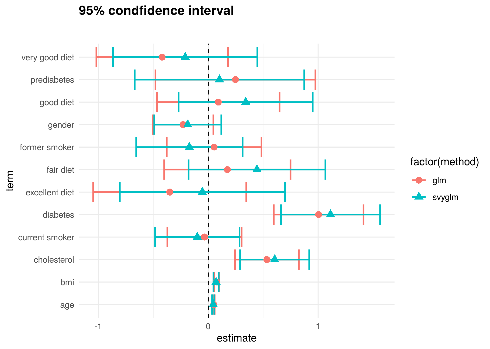

```{r setup, include=FALSE}
knitr::opts_chunk$set(echo = TRUE, message = FALSE, error = TRUE)
```


# Motivating public health problem

Hypertension is one of the most common diseases in the world. It has been associated with myocardial infarction, stroke, renal failure, and death if not detected early and treated appropriately. According to the Center for Disease Control's [Behavioral Risk Factor Surveillance System (BRFSS)](https://www.cdc.gov/brfss/){target="_blank"}, around 75 million American adults (32%) are estimated to have high blood pressure, costing the US around $48.6 billion each year. This total includes the cost of healthcare services, medications to treat high blood pressure, and missed days of work.

In this module, we will explore the relationship between hypertension and a variety of risk factors.

This case study introduces survey methods for logistic regression and compares the results from survey-weighted logistic regression to standard logistic regression. The plot below visualizes the comparison between these two methods; it shows the estimated coefficients (with standard error) from each method for the risk factors under consideration.  Note that both the estimates and their standard errors are different when using [logistic regression](https://en.wikipedia.org/wiki/Logistic_regression){target="_blank"} compared to [survey-weighted logistic regression](https://citeseerx.ist.psu.edu/document?repid=rep1&type=pdf&doi=8dc703bdec2bd009e3bc79ba4d38f28ad1e051a2){target="_blank"}. We will discuss later which model is a better choice for this analysis.

<center>

</center>

Our main questions of interest are:

  * Question 2.1: What factors measured in the NYC HANES survey are associated with having hypertension?
  * Question 2.2: How do our estimates from survey-weighted logistic regression differ from those where we ignore survey weights?
  * Question 2.3: How to we build a "good" model that tells us something about associations with hypertension as seen in this data set?


# What are our pedagogical objectives for Module 2?

Recall that the final part of the class will involve you selecting your own public health question, locating a data set that will be useful in answering this question, and performing a complete data analysis, writing your results into a report. This module will help you build your skills to prepare you for your final projects. It is a bridge between the more instructor-guided module we just completed and the more self-guided module we finish with.

The data science learning objectives for this module include:

  * Understand the components of a data analysis report
  * Gain experience performing data cleaning, and assessing whether you have been successful
  * Practice selecting data visualizations that fit into the context of your statistical analysis
  * Write organized code to systematically explore model selection

The statistical learning objectives for this module include:

  * Gain further experience with logistic regression
  * Understand what a survey-weighted analysis is and how/when we perform one
  * Learn how to select survey weights for unbalanced data
  * Explore different models using tools of model selection like AIC and maybe more general prediction models (work in progress) 

# What are the data?

For this case study, we will use data from the [New York City (NYC) Health and Nutrition Examination Survey (NYC HANES)](http://nychanes.org/){target="_blank"}, modeled on the [National Health and Nutrition Examination Survey (NHANES)](https://wwwn.cdc.gov/nchs/nhanes/default.aspx){target="_blank"}. NHANES is a population-based, cross-sectional study with data collected from a physical examination and laboratory tests, as well as a face-to-face interview and an audio computer-assisted self-interview (ACASI). It is designed to assess the health and nutritional status of adults and children in the United States. NYC HANES is a local version of NHANES, which implies it mainly focuses on the New York area. 

To access the NYC HANES data, go to the [NYC HANES data page](http://nychanes.org/data/){target="_blank"} and  click the **NYC HANES Analytic Datasets SAS File** link; it will download automatically.  (A static link to this data file can be found [here](https://med.nyu.edu/departments-institutes/population-health/divisions-sections-centers/epidemiology/sites/default/files/nyc-hanes-datasets-and-resources-analytic-data-sets-sas-file.sas7bdat){target="_blank"}.)

The data we will be using in this case study was collected from August 2013 to June 2014 and is called the **NYC HANES 2013-14 Blood Pressure Data**.  The survey used a probability sample of non-institutionalized adult New York City residents (ages 20 years or older) to provide representative citywide estimates. For further details, please refer to the [NYC HANES website](http://nychanes.org/){target="_blank"}.

In addition to the datafile, there are other useful resources available on the website including: 

* [Data Documents](https://med.nyu.edu/departments-institutes/population-health/divisions-sections-centers/epidemiology/sites/default/files/nyc-hanes-datasets-and-resources-data-documentation.pdf){target="_blank"}: Provides information on how best to analyze the NYC HANES 2013-14 dataset, given its population-based and clustered sampling scheme.
* [Analytics Guideline](https://med.nyu.edu/departments-institutes/population-health/divisions-sections-centers/epidemiology/sites/default/files/nyc-hanes-datasets-and-resources-analytics-guidelines.pdf){target="_blank"}: Provides overall guidance on the use of the NYC HANES 2013-14 dataset and statistical weights, as well as other analytic issues pertaining to assessing statistical reliability of estimates.
* [Variable Codebook](https://med.nyu.edu/departments-institutes/population-health/divisions-sections-centers/epidemiology/sites/default/files/nyc-hanes-datasets-and-resources-public-dataset-codebook.pdf){target="_blank"}: Defines the variables included in the dataset and describes how values for these variables are coded.
* [Weight Adjustment](https://med.nyu.edu/departments-institutes/population-health/divisions-sections-centers/epidemiology/sites/default/files/nyc-hanes-datasets-and-resources-training-part-ii-weighting-and-age-adjustment.pdf){target="_blank"}: Explains how NYC HANES data are weighted in order to compensate for unequal probability of selection and explains how to choose the correct weight for analysis.
* [Questionnaire](https://wwwn.cdc.gov/nchs/nhanes/continuousnhanes/questionnaires.aspx?BeginYear=2013){target="_blank"}: Provides links to the questionnaires that participants in the study completed. Answers from different questionnaires are combined in the data set you will be working with.

All of these documents enable data analysts to understand the definitions and coding of the variables and then complete the analysis appropriately.

# Learning objectives for this week

Our main question of interest for this module is: Based on the data collected from NYC HANES, which risk factors play a role in development of hypertension?

This week, we will start by learning how to:

* Read in the SAS-formatted data
* Select and rename variables, based on the data dictionary 
* Inspect the data to look for whether data cleaning needs to be performed
* Use a data dictionary to understand patterns you see in the data and adjust your variable recoding appropriately
* Make initial data visualizations to begin to explore the question of interest


# Initial questions for group discussion


Break into your groups and discuss the following questions:

(1) The NYC HANES data file we are working with is a SAS formatted file, which we have not seen before. Spend a few minutes in your groups figuring out ways of reading SAS-formatted files into R.

(2) What variable from the data set do you think you will use as the outcome variable, indicating whether a surveyed individual has hypertension? It might be helpful to refer to the [Variable Codebook](https://med.nyu.edu/departments-institutes/population-health/divisions-sections-centers/epidemiology/sites/default/files/nyc-hanes-datasets-and-resources-public-dataset-codebook.pdf){target="_blank"}.

(3) What are some additional variables you can find in the codebook that you will consider as predictors of hypertension?

