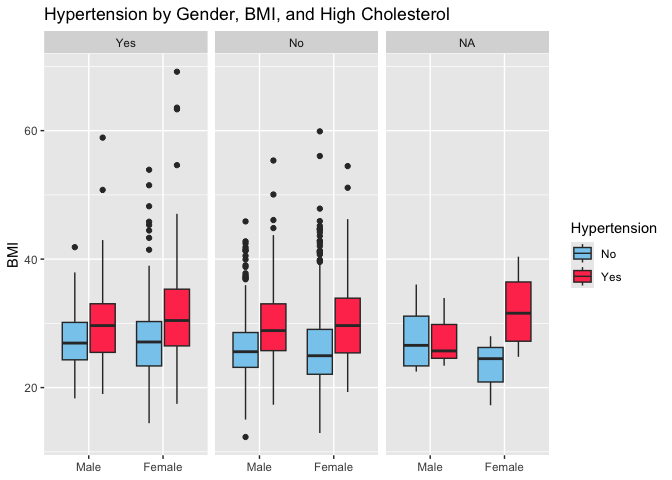
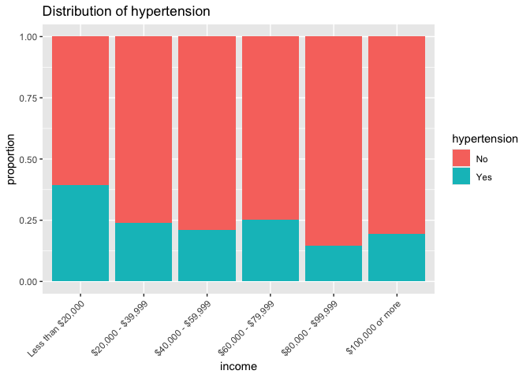
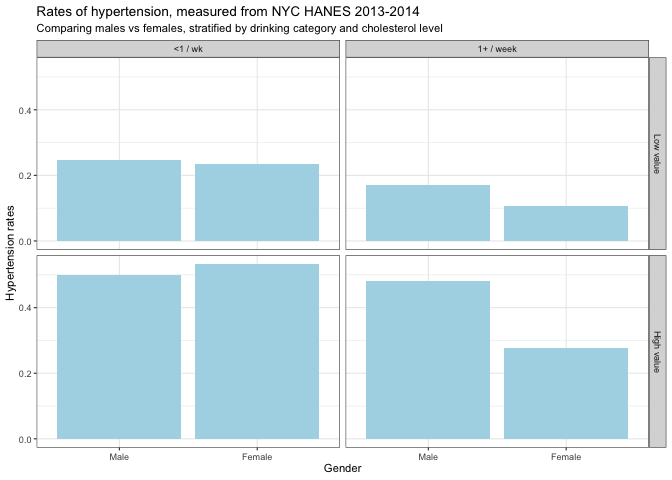
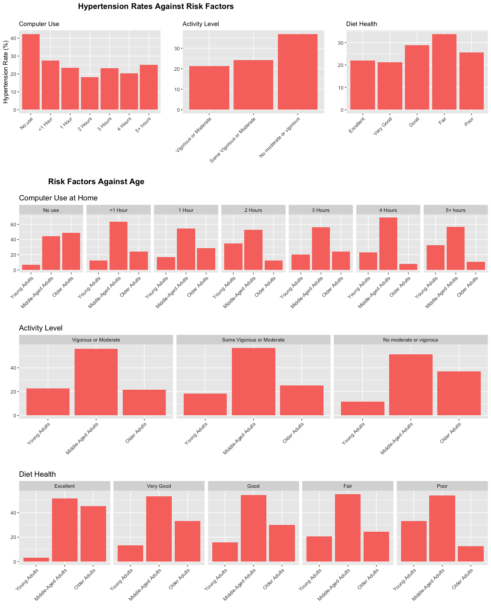
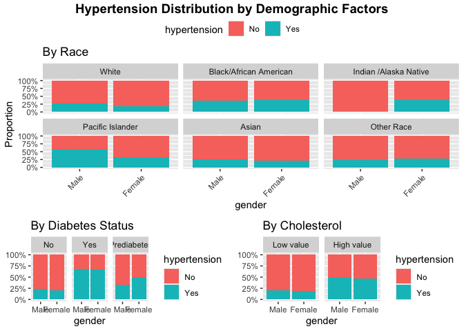

## Module 2: Factors that are associated with development of hypertension

Recall that our main questions of interest are:

  * Question 2.1: What factors measured in the NYC HANES survey are associated with having hypertension?
  * Question 2.2: How do our estimates from survey-weighted logistic regression differ from those where we ignore survey weights?
  * Question 2.3: How to we build a "good" model that tells us something about associations with hypertension as seen in this data set?


The data science learning objectives for this module include:

  * Understand the components of a data analysis report
  * Gain experience performing data cleaning, and assessing whether you have been successful
  * Practice selecting data visualizations that fit into the context of your statistical analysis
  * Write organized code to systematically explore model selection

The statistical learning objectives for this module include:

  * Gain further experience with logistic regression and selecting an appropriate model for your question
  * Understand what a survey-weighted analysis is and how/when we perform one
  * Learn how to select survey weights for unbalanced data
  * Explore different models using tools of model selection like AIC and maybe more general prediction models (work in progress) 

## Reminder: What are the data?

For this case study, we will use data from the [New York City (NYC) Health and Nutrition Examination Survey (NYC HANES)](http://nychanes.org/){target="_blank"}, modeled on the [National Health and Nutrition Examination Survey (NHANES)](https://wwwn.cdc.gov/nchs/nhanes/default.aspx){target="_blank"}. NHANES is a population-based, cross-sectional study with data collected from a physical examination and laboratory tests, as well as a face-to-face interview and an audio computer-assisted self-interview (ACASI). It is designed to assess the health and nutritional status of adults and children in the United States. NYC HANES is a local version of NHANES, which implies it mainly focuses on the New York area. 


## Learning objectives for this week

Our main question of interest for this module is: Based on the data collected from NYC HANES, which risk factors play a role in development of hypertension?

This week, we will continue to work toward answering this by learning how to:

* Discuss our initial data visualizations and how they relate to the question of interest for this module
* Understand why we need to include survey weights in our analysis
* Learn about and see how to use tools designed for working with survey data in R 


## Your data visualizations


### Some points of discussion

In your groups, take 15-20 minutes to discuss the following questions that have come up in our initial examination of the NHANES data set, as it relates to hypertension:


(1) What surprising relationships or patterns did you see in your displays? Were there some counter-intuitive patterns? What might be causing these? How might you investigate this? Find one specific display that shows something unexpected and hypothesize about what could be leading to the unexpected pattern. Devise a plan for investigating whether this is the case.

(2) If anyone chose the income variable, why did you choose the version you did? (Maybe it was just because it was the version used in class.) If you're not sure why I'm asking, take a look back at the [Variable Codebook](https://med.nyu.edu/departments-institutes/population-health/divisions-sections-centers/epidemiology/sites/default/files/nyc-hanes-datasets-and-resources-public-dataset-codebook.pdf){target="_blank"} and see how many different income variables there are.

(3) For each display, can you find one display choice that you would suggest changing to improve the visualization in terms of how it relates to the question of interest? If not, that is OK too!

(4) How would you go about looking for interactions between variables? For example, if you want to see if the difference in hypertension status by race may also be related to income, what plot or table would you make?

(5) There is one variable that I was surprised to see did not show up in all of these visualizations; can you think of what it is?

Start by loading libraries and raw data set.

``` r
library(tidyverse)  # core group of tidyverse packages
library(knitr)  # to make nice tables
library(ggpubr)
library(ggrepel)
library(tidyverse)
library(kableExtra)
library(survey)
library(haven)
library(broom)
library(plotrix)
```


### Example 1


``` r
ggplot(data=dat_rename) +
  geom_boxplot(mapping = aes(x=gender,y=bmi, fill=hypertension)) +
  facet_wrap(~cholesterol) +
  labs(
    title="Hypertension by Gender, BMI, and High Cholesterol",
    y="BMI",
    x=NULL,
    fill = "Hypertension"
  ) +
  scale_fill_manual(values = c("#88CCEE", "#ff3d5a"))
```

```
## Warning: Removed 38 rows containing non-finite outside the scale range
## (`stat_boxplot()`).
```

<!-- -->

My data display is a boxplot that shows us the bmi distributions of groups defined by gender, cholesterol, and hypertension. Regarding our question of interest, my data display shows how respondents with hypertension have a higher mean bmi than those without hypertension regardless of gender and cholesterol. The relationship between BMI and hypertension appears similar for both males and females. The "N/A" cholesterol category doesn't have enough data points to make any assumptions.   


### Example 2


``` r
p6 <- hy_df %>% 
  drop_na(income) %>% 
  ggplot(aes(x = income, fill = hypertension)) + 
  geom_bar(position = "fill") + 
  ggtitle('Distribution of hypertension') + 
  ylab('proportion') +
  theme(axis.text.x = element_text(angle = 45, hjust = 1))
p6
```

<!-- -->

I was interested in seeing how proportion of hypertension differs between individuals of different income levels. Using a stacked barplot and data from this dataset, it appears that a higher proportion of those with an income of less than $20,000 have hypertension compare to all other groups. I'm interested to see whether this difference is significant, which could indicate a relationship between socioeconomic status and the frequency of hypertension.


### Example 3


``` r
my_table <- data4 %>%
  drop_na(gender, drinkcat, cholesterol) %>%
  count(gender, cholesterol, drinkcat, hypertension) %>%
  group_by(gender, cholesterol, drinkcat) %>%
  mutate(prop = n/sum(n))

my_table %>% 
  filter(hypertension == "Yes") %>%
  ggplot() + 
  geom_bar(aes(x = gender, y = prop, fill = hypertension), fill = "lightblue", stat = "identity") +
  # geom_bar(aes(x = gender, fill = hypertension), fill = "lightblue") +
  facet_grid(cholesterol ~ drinkcat) +
  theme_bw(base_size=8.5) +
  labs(
    title = "Rates of hypertension, measured from NYC HANES 2013-2014",
    subtitle = "Comparing males vs females, stratified by drinking category and cholesterol level",
    x = "Gender",
    y = "Hypertension rates") +
  guides(fill="none")
```

<!-- -->

My display shows how the rate of hypertension differs by gender, drinking category, and cholesterol level. It appears that there unsubstantial differences in hypertension rate between males and females who have less than one drink a week, as their bars are at similar heights to each other. However, among people who have at least one drink a week, males seem to have higher rates of hypertension. Additionally, people who have higher values of cholesterol appear to have higher rates of hypertension, regardless of gender and drinking category. Finally, it appears that people who have at least one drink a week have lower rates of hypertension overall. 

### Example 4


``` r
#Three plots of hypertension against a risk factor
#I put the "table" part inside each one mostly because I didn't want this to take up even more space than it already was

compPlot <- finalDataset %>% 
         count(compTime,hypertension) %>%
         group_by(compTime) %>%
         mutate(percent = round(n/sum(n) * 100, 1)) %>%
         filter(hypertension == 'Hypertension') %>%
         ggplot() + 
         geom_bar(aes(x = compTime, y = percent, fill = hypertension), stat = "identity") +
         labs(
              title = "\n",
              subtitle = "Computer Use",
              x = '',
              y = 'Hypertension Rate (%)') + 
         guides(fill = "none") +
         theme(axis.text.x = element_text(angle = 45, hjust = 1))

activityPlot <- finalDataset %>% 
         count(active, hypertension) %>%
         group_by(active) %>%
         mutate(percent = round(n/sum(n) * 100, 1)) %>%
         filter(hypertension == 'Hypertension') %>%
         ggplot() + 
         geom_bar(aes(x = active, y = percent, fill = hypertension), stat = "identity") +
         labs(title = ' ',
              subtitle = 'Activity Level',
              x = '',
              y = '') + 
         guides(fill = "none") +
         theme(axis.text.x = element_text(angle = 45, hjust = 1))

dietPlot <- finalDataset %>% 
         count(dietHealth, hypertension) %>%
         group_by(dietHealth) %>%
         mutate(percent = round(n/sum(n) * 100, 1)) %>%
         filter(hypertension == 'Hypertension') %>%
         ggplot() + 
         geom_bar(aes(x = dietHealth, y = percent, fill = hypertension), stat = "identity") +
         labs(title = ' ',
              subtitle = 'Diet Health',
              x = '',
              y = '') + 
         guides(fill = "none") +
         theme(axis.text.x = element_text(angle = 45, hjust = 1))


#These next three plots are age against each risk factor

ageDiet <- finalDataset %>%
         filter(hypertension == 'Hypertension') %>%
         count(dietHealth, ageGroups, hypertension) %>%
         group_by(dietHealth) %>%
         mutate(percent = round(n/sum(n) * 100, 1)) %>%
         ggplot() + 
         geom_bar(aes(x = ageGroups, y = percent, fill = hypertension), stat = "identity") +
         labs(title = 'Diet Health',
              x = "",
              y = '') + 
         guides(fill = "none") +
         facet_grid( ~ dietHealth)  + 
         theme(axis.text.x = element_text(angle = 45, hjust = 1))


ageActive <- finalDataset %>%
         filter(hypertension == 'Hypertension') %>%
         count(active, ageGroups, hypertension) %>%
         group_by(active) %>%
         mutate(percent = round(n/sum(n) * 100, 1)) %>%
         ggplot() + 
         geom_bar(aes(x = ageGroups, y = percent, fill = hypertension), stat = "identity") +
         labs(title = 'Activity Level',
              x = "",
              y = '') + 
         guides(fill = "none") +
         facet_grid( ~ active) + 
         theme(axis.text.x = element_text(angle = 45, hjust = 1))
ageComp <- finalDataset %>%
         filter(hypertension == 'Hypertension') %>%
         count(compTime, ageGroups, hypertension) %>%
         group_by(compTime) %>%
         mutate(percent = round(n/sum(n) * 100, 1)) %>%
         ggplot() + 
         geom_bar(aes(x = ageGroups, y = percent, fill = hypertension), stat = "identity") +
         labs(title = '\n\nComputer Use at Home',
              x = "",
              y = '') + 
         guides(fill = "none") +
         facet_grid( ~ compTime) + 
         theme(axis.text.x = element_text(angle = 45, hjust = 1))

ggarrange(
  ggarrange(compPlot, activityPlot, dietPlot, ncol = 3, nrow = 1, align = 'h'),
  ggarrange(ageComp, ageActive, ageDiet, ncol = 1, nrow = 3), 
  ncol = 1, nrow = 2, heights = c(1, 2.5), labels = c('Hypertension Rates Against Risk Factors', 'Risk Factors Against Age')
  )
```

<!-- -->

I wanted to explore the rates of hypertension across groups of individuals with different behavioral risk factors. The three risk factors I chose were hours using a computer at home, physical activity level, and how healthy their diets were. The first row of graphs suggests that individuals with no computer use, no vigorous activity, and good/fair diets were at the highest risk of hypertension. Besides this,the rates of hypertension among the other computer use and diet health groups seemed fairly similar. 

However, I suspected that these differences might have been due to the different age structures within these groups. In order to further analyze this, I added plots of each risk factor against different age groups. For each group, the middle aged group remained fairly constant. However, the younger and older adult proportions changed against each other. For all of the risk factors, whichever seemed most predictive was also the group that skewed oldest, besides diet, though the effect of poor diet health on hypertension rates might have been understated because it tends to skew younger.


### Example 5


``` r
### put code to create data display here

plot_subset <- hy_df %>%
      select(hypertension, obese, cholesterol) %>%
      tidyr::drop_na()
# Compute proportions for obesity
prop_table_obese <- plot_subset %>% 
      count(obese, hypertension) %>%
      group_by(obese) %>%
      mutate(prop = n / sum(n)) %>%
      filter(hypertension == "Yes") 

# Compute proportions for cholesterol
prop_table_chol <- plot_subset %>% 
      count(cholesterol, hypertension) %>%
      group_by(cholesterol) %>%
      mutate(prop = n / sum(n)) %>%
      filter(hypertension == "Yes") 

p1 <- ggplot(prop_table_obese, aes(x = obese, y = prop, fill = obese)) +
      geom_bar(stat = "identity") +
      geom_text(aes(label = round(prop, 3)), vjust = -0.5, size = 3) +
      scale_fill_manual(values = c("steelblue", "firebrick")) +  # Customize colors
      labs(x = "Obesity Status", y = "Proportion with Hypertension") +
      ylim(0, max(c(prop_table_obese$prop, prop_table_chol$prop)) + 0.1) +  # Ensure shared scale
      theme_minimal() +
      theme(axis.text.y = element_text(size = 10), legend.position = "none")

p2 <- ggplot(prop_table_chol, aes(x = cholesterol, y = prop, fill = cholesterol)) +
      geom_bar(stat = "identity") +
      geom_text(aes(label = round(prop, 3)), vjust = -0.5, size = 3) +
      scale_fill_manual(values = c("steelblue", "firebrick")) +  # Customize colors
      labs(x = "Cholesterol Status", y = "") +  # No duplicate y-label
      ylim(0, max(c(prop_table_obese$prop, prop_table_chol$prop)) + 0.1) +  # Ensure shared scale
      theme_minimal() +
      theme(axis.text.y = element_blank(), axis.ticks.y = element_blank(), legend.position = "none")  # Remove redundant y-axis

# Combine plots into one figure
final_plot <- cowplot::plot_grid(plotlist = list(p1, p2), ncol = 2)

# Add a single title
annotate_figure(final_plot,
                top = text_grob("Proportion of Hypertension by Health Status", face = "bold", size = 14))
```

<!-- -->

The data for these plots was subsetted to the complete cases. 1427 out of 1527 participants were included. My data display demonstrates the proportion of participants with hypertension, stratified by obesity status and cholesterol status separately. We can see that a higher proportion of people who are obese tend to have hypertension compared to those who are not obese. We can also see that a higher proportion of people who have high cholesterol tend to have hypertension compared to those who have low cholesterol. Next time I will try to make a faceted plot to show the combinations of obesity and cholesterol levels.  

### Example 6


```
##       id                 age             race           gender    
##  Length:1527        Min.   :20.00   Min.   :100.0   Min.   :1.00  
##  Class :character   1st Qu.:30.00   1st Qu.:100.0   1st Qu.:1.00  
##  Mode  :character   Median :42.00   Median :110.0   Median :2.00  
##                     Mean   :44.55   Mean   :136.8   Mean   :1.58  
##                     3rd Qu.:57.00   3rd Qu.:180.0   3rd Qu.:2.00  
##                     Max.   :97.00   Max.   :250.0   Max.   :2.00  
##                                     NA's   :59                    
##       born           diet          income         diabetes          bmi       
##  Min.   :1.00   Min.   :1.00   Min.   :1.000   Min.   :1.000   Min.   :12.31  
##  1st Qu.:1.00   1st Qu.:2.00   1st Qu.:1.000   1st Qu.:2.000   1st Qu.:23.33  
##  Median :1.00   Median :3.00   Median :2.000   Median :2.000   Median :26.52  
##  Mean   :1.44   Mean   :2.92   Mean   :2.985   Mean   :1.923   Mean   :27.73  
##  3rd Qu.:2.00   3rd Qu.:4.00   3rd Qu.:5.000   3rd Qu.:2.000   3rd Qu.:30.71  
##  Max.   :2.00   Max.   :5.00   Max.   :6.000   Max.   :3.000   Max.   :69.17  
##  NA's   :8      NA's   :3      NA's   :161     NA's   :1       NA's   :38     
##   cholesterol      drinkfreq         drinkunit        smoking     
##  Min.   :1.000   Min.   :  0.000   Min.   :1.000   Min.   :1.000  
##  1st Qu.:1.000   1st Qu.:  0.000   1st Qu.:1.000   1st Qu.:1.000  
##  Median :2.000   Median :  2.000   Median :1.000   Median :1.000  
##  Mean   :1.719   Mean   :  5.105   Mean   :1.726   Mean   :1.598  
##  3rd Qu.:2.000   3rd Qu.:  4.000   3rd Qu.:2.000   3rd Qu.:2.000  
##  Max.   :2.000   Max.   :365.000   Max.   :3.000   Max.   :3.000  
##  NA's   :15      NA's   :6         NA's   :412     NA's   :3      
##   hypertension    surveyweight  
##  Min.   :1.000   Min.   :    0  
##  1st Qu.:1.000   1st Qu.: 2882  
##  Median :2.000   Median : 3678  
##  Mean   :1.726   Mean   : 4116  
##  3rd Qu.:2.000   3rd Qu.: 5010  
##  Max.   :2.000   Max.   :16036  
##  NA's   :3
```


``` r
### put code to create data display here

hy_df_clean <- hy_df %>%
  drop_na(
    hypertension,  # Primary variable
    gender,        # Fill variable
    race,          # Facet variable
    diabetes,      # For p5
    cholesterol    # For p6
  )

p4 <- hy_df_clean %>% 
  ggplot(aes(x = gender, fill = hypertension)) + 
  geom_bar(position = "fill") +
  facet_wrap(~race, ncol = 3) +
  scale_y_continuous(labels = scales::percent) +
  ggtitle('By Race') +
  ylab('Proportion') +
  theme(axis.text.x = element_text(angle = 45, hjust = 1))

p5 <- hy_df_clean %>% 
  ggplot(aes(x = gender, fill = hypertension)) + 
  geom_bar(position = "fill") +
  facet_wrap(~diabetes) +
  scale_y_continuous(labels = scales::percent) +
  ggtitle('By Diabetes Status') +
  theme(axis.title.y = element_blank())

p6 <- hy_df_clean %>% 
  ggplot(aes(x = gender, fill = hypertension)) + 
  geom_bar(position = "fill") +
  facet_wrap(~cholesterol) +
  scale_y_continuous(labels = scales::percent) +
  ggtitle('By Cholesterol') +
  theme(axis.title.y = element_blank())

final_plot <- ggarrange(p4, ggarrange(p5, p6, ncol = 2), 
                       nrow = 2, 
                       heights = c(1.5, 1),
                       common.legend = TRUE)

annotate_figure(final_plot,
                top = text_grob("Hypertension Distribution by Demographic Factors",
                                face = "bold", size = 14))
```

<!-- -->

Females have a higher median hypertension level than males in: Black/African American, Pacific Islander, and Other Race groups. Males have a higher median hypertension level than females in: White, Asian, and Indian/Alaska Native groups. Individuals with diabetes and high cholesterol are more likely to have hypertension compared to those without these conditions, as indicated by their higher median hypertension levels relative to the null value.


<details> <summary> A few thoughts for when we return from our groups </summary>


* *IMPORTANT*: You may have noticed something unintuitive about smoking status and hypertension risk. There was a mistake in my code from a previous lecture for how I recoded the `SMOKER3CAT` variable. It has been corrected below to match what is in the [Variable Codebook](https://med.nyu.edu/departments-institutes/population-health/divisions-sections-centers/epidemiology/sites/default/files/nyc-hanes-datasets-and-resources-public-dataset-codebook.pdf){target="_blank"}. If you do use it in the future, you'll want to make sure it is coded correctly!
* The hypertension legend does not need to be displayed on each panel of multi-panel figures. In fact, it does not need to be displayed at all if you only plot risk of hypertension (and not also risk of no-hypertension).
* When plotting multi-panel figures, you may need to specify the figure dimensions in the code chunk header to avoid the plots looking compressed. See Example 4 for an example of how to do this.
* Something to think about for people interested in race or socio-economic status: Age/income/education are all associated with socio-economic status, as is race. You'll want to think about which variables to include to examine the particular relationship you are interested in.

Some limitations/points for discussion regarding race and sex: both are extremely commonly used in epidemiological studies, like the one we are discussing here. Both have limitations in how they are measured and how they are used and understood in a data analysis. We should always strive to do our best in discussing and working with these variables. For example, in our case studies, we include a statement like:

> Note: While gender and sex are not actually binary, the data used in this analysis unfortunately only contains information for groups of individuals who self-reported as male or female. We also acknowledge that unfortunately not all ethnicities or group intersections are represented in the data. More research should be devoted to collecting data about the health of additional groups of people.

Some references about race in biomedical research:

[Examining How Race, Ethnicity, and Ancestry Data Are Used In Biomedical Research](https://www.ncbi.nlm.nih.gov/pmc/articles/PMC6640836/){target="_blank"}

[Race and health page from Wikipedia](https://en.wikipedia.org/wiki/Race_and_health){target="_blank"}


</details>

## Data analysis concerns: model framework and survey weights

Now that we have spent some time cleaning the data and looking at data visualizations, we want to use a statistical model to address our question of interest about which factors are related to the risk of hypertension.

Which model should we use? Since we are looking at whether or not someone develops hypertension, our outcome variable (`hypertension`) is **binary**. A binary outcome means a logistic regression model is a natural choice.  However, think of the nature of our dataset and how it was collected. It is data obtained from a survey, and we have to account for this during the analysis of the data.

In a survey sample, we often end up with "too many" samples in a category, often due to the designed sampling plan.  By "too many", we mean more than would be expected based on the make-up of the population from which we are sampling.  For example, we may have a much higher proportion of women in our sample compared to the population and a much lower proportion of men than in the population. This may happen by design if we purposefully *oversample* a group that isn't well represented in the overall population. Why might we want to do this?

To analyze our survey data and infer back to the population, we can use data weighting to account for the mismatch between the population and sample. If we want the data to reflect the whole population, instead of treating each data point equally, we weight the data so that taken together, our sample does reflect the entire community.

To appropriately analyze our data as a survey, we will use the [package `survey`](https://cran.r-project.org/web/packages/survey/survey.pdf){target="_blank"}, which contains functions for various types of analysis that account for survey design.

## Survey weights 

### What are survey weights?

Suppose that we have 25 students (20 male and 5 female) in our biostatistics class, and we want to talk with 5 of them to gauge their understanding of the content in the class. Although the proportion of female students in the population is small, we are very interested in getting their opinion, so we want to be sure to have some female students in our sample.  By randomly sampling 5 students from the class, it's quite possible we could end up with all male students in our sample, and we wouldn't learn anything about the female perspective in the class. 

Consider the extreme case where we are going to require that 4 of the 5 people we sample are female students, to be sure we get good information about the female perspective.  We sample 4 of the 5 female students and 1 of the 20 male students.   Do we expect this sample to represent the population? Definitely not, since there is a higher proportion of females in the sample than the population. We can correct for this by weighting our samples so that, taken together, they better reflect the composition of the population we want to learn about. 

Let's assume we sampled 4 of the 5 female students and 1 of the 20 male students from our population. Who do you think should get a higher weight in our analysis, males or females? What is your reasoning?


To calculate the survey weights, we could use the following formula:

$$
\begin{aligned}
Weight & = \frac{1}{Prob~of~being~selected~for~sample} \\
       & = \frac{1}{(Number~in~sample)/(Number~in~population)} \\
       & \\
       & =  \frac{Number~in~population}{Number~in~sample}
\end{aligned}
$$

That gives the following sample weights:

$$w_m=Male~Weight = \frac{20}{1} = 20$$

$$w_f=Female~Weight = \frac{5}{4} = 1.25$$

We can interpret these weights by saying that each male student in the sample represents 20 male students in the population and each female student in the sample represents 1.25 female students in the population.  Mathematically, we can see this as:

$$ 1~observed~male* w_m = 20~males $$ 
and 
$$ 4~observed~females * w_f = 5~females$$ 

<center>

</center>

By weighting the observations, we make the sample better represent the population.

For complex survey sampling designs, it can be complicated to calculate the weight for each individual observation. However, for many large survey data sets, such as NHANES, the appropriate weight is calculated by the organization that administers the survey and provided as a variable in the dataset. In our case study, this survey weight is calculated and provided as the `surveyweight` variable and we can simply apply this weight and perform a **survey-weighted logistic regression**.

### Selecting the weights

Because the NYC HANES 2013-2014 data have been collected to address a variety of different questions and using different surveys, the researchers who produced the data have employed a somewhat complex weighting scheme to compensate for unequal probability of selection. Five sets of survey weights have been constructed to correspond to different sets of variables that were collected: CAPI  weight, Physical weight, Blood Lab result weight, Urine Lab results weight and Saliva Lab results weight. **The determination of the most appropriate weight to use for a specific analysis depends upon the variables selected by the data analyst**. 

We will give a table to indicate each variable's origin stream:


| Variable names   |      Component      |
|---------------------------------|---------------------------------|
| age                                   | CAPI                                                                                                                                                                 |
| race                                  | CAPI                                                                                                                                                                 |
| gender                                | CAPI                                                                                                                                                                 |
| diet                                  | CAPI                                                                                                                                                                 |
| income                                | CAPI                                                                                                                                                                 |
| diabetes                               | CAPI                                                                                                                                                               |
| cholesterol                           | CAPI                                                                                                                                                                 |
| drink                                 | CAPI                                                                                                                                                                 |
| smoking                               | CAPI                                                                                                                                                                 |
| hypertension                           | CAPI                                                                                                                                                                |
| bmi                                    | EXAM                                                                                                                                                                |


When an analysis involves variables from different components of the survey, the analyst should decide whether the outcome is inclusive or exclusive, and then choose certain weights. To learn how to use weights for different purposes, refer to the particular [Analytics Guidelines](https://med.nyu.edu/departments-institutes/population-health/divisions-sections-centers/epidemiology/sites/default/files/nyc-hanes-datasets-and-resources-analytics-guidelines.pdf){target="_blank"} for the survey. 

In our case, we choose EXAM weight since our analysis is exclusive, i.e., we plan to restrict the samples included to those who have all of the data we are interested in looking at. Since one of the variables we are looking at is bmi, our dataset is limited to those who received a physical exam test, which means all of our survey participants have a value for the `EXAM_WT` variable. We selected this variable and renamed it as `surveyweight` in the earlier data cleaning part of this analysis. 

## Finite population correction factor

There is one more technical detail that we need to consider when using survey data. Many methods for analysis of survey data make the assumption that **samples were collected using sampling with replacement**, i.e., any time a new participant is drawn, each member in the population has an equal chance of being sampled, even if they have already been sampled. This is not usually how surveys are actually carried out, so an adjustment may be necessary to reflect this difference. This adjustment is called the **finite population correction factor** and it is defined as:

$$FPC = (\frac{N-n}{N-1})^{\frac{1}{2}}$$
 
* `N` = population size
* `n` = sample size

In the case when the assumption above is violated (e.g. if you are sampling a sufficiently large proportion of the population), then you might sample the same person twice. The finite population correction (FPC) is used to reduce the variance when a substantial fraction of the total population of interest has been sampled. We can find the value of `N` and `n` for our survey from the [Analytics Guidelines](https://med.nyu.edu/departments-institutes/population-health/divisions-sections-centers/epidemiology/sites/default/files/nyc-hanes-datasets-and-resources-analytics-guidelines.pdf){target="_blank"}. Next let's calculate the FPC as below:


``` r
N <-  6825749
n <- nrow(dat)
((N-n)/(N-1))^0.5
```

```
## [1] 0.9998882
```

The FPC of our data set is very close to 1 since our sample is quite small compared to the size of the population, and we could simply ignore the FPC. But technically, since the data were collected through sampling without replacement, it is more appropriate to use it.


## Incorporating survey weights into our analysis

We will read in and recode the data, as we did last week. NOTE: We can't remove ANY data points from our set of data this time because we will be using survey weights. We will discuss how to address this below.


``` r
rename <- dat %>% 
  select(id = KEY,
         age = SPAGE,
         race = DMQ_14_1,
         gender = GENDER,
         born = US_BORN,
         diet = DBQ_1,
         income = INC20K,
         diabetes = DIQ_1,
         bmi = BMI,
         cholesterol = BPQ_16,
         drinkfreq = ALQ_1,
         drinkunit = ALQ_1_UNIT,
         smoking = SMOKER3CAT,
         hypertension = BPQ_2,
         surveyweight = EXAM_WT)

rename <- rename %>% 
  mutate(drink_denom = case_when(drinkfreq == 0 | drinkunit == 1 ~ 1,
                                   drinkunit == 2 ~ 52 / 12,
                                   drinkunit == 3 ~ 52),
         drink = drinkfreq / drink_denom)


hy_df <- rename %>% 
  mutate(race = factor(race, 
                       levels = c(100, 110, 120, 140, 180, 250), 
                       labels = c('White', 'Black/African American', 
                                  'Indian /Alaska Native', 
                                  'Pacific Islander', 
                                  'Asian', 'Other Race')),
         gender = factor(gender, 
                         levels = c(1, 2), 
                         labels = c('Male', 'Female')),
         born = factor(born, 
                       levels = c(1, 2),
                       labels = c("US Born", "Non-US Born")),
         diet = factor(diet, 
                       levels = c(5:1), 
                       labels = c('Poor', 'Fair', 'Good', 
                                  'Very good','Excellent')),
         income = factor(income, 
                         levels = c(1:6), 
                         labels = c('Less than $20,000','$20,000 - $39,999',
                                    '$40,000 - $59,999','$60,000 - $79,999',
                                    '$80,000 - $99,999','$100,000 or more')),
         diabetes = factor(diabetes, 
                           levels = c(2, 1, 3), 
                           labels = c('No','Yes','Prediabetes')),
         cholesterol = factor(cholesterol, 
                              levels = c(2, 1), 
                              labels = c('Low value','High value')),
         drinkcat = factor(drink >= 1, 
                        labels = c('<1 / wk', '1+ / week')),
         smoking = factor(smoking, levels=c(1,3,2), 
                         labels=c('Never smoker','Former smoker','Current smoker')),
         hypertension = factor(hypertension, 
                               levels = c(2, 1), 
                               labels = c('No','Yes'))
  ) 


## NOTE: We do not want to drop missing values prior to creating our survey design object
## we will not use this in our survey design object, but will use it for comparisons below
hy_p_df <-
  hy_df %>%
  drop_na()
```

## Specify the survey design

We now need to figure out how to specify the survey design and incorporate the sampling weights in our modeling steps. To help us do this, we use the function `svydesign()` in the [package `survey`](https://cran.r-project.org/web/packages/survey/survey.pdf){target="_blank"}. This function combines a data frame and all the design information needed to specify a survey design. Here is the list of options provided in this function:

* `ids`: Formula used to specify the cluster sampling design. *Cluster sampling* is a multi-stage sampling design where the total population is divided into several clusters and a simple random sample of clusters is selected. Then a sample is taken from the elements of each selected cluster. Use `~0` or `~1` as the formula when there are no clusters.

* `data`: Data frame (or database table name) containing the variables for analysis look up variables in the formula arguments.

* `weights`: Formula or vector specifying the sampling weights. 

* `fpc`: Finite population correction, `~rep(N,n)`  generates a vector of length n where each entry is N (the population size). Default value is 1. The use of fpc indicates a sample without replacement, otherwise the default is a sample with replacement. Since our finite-population correction factor is very close to 1, we omit this argument, i.e., let it take the default value.
 
* `strata`: Specification for stratified sampling.  *Stratified sampling* is a sampling design which divides members of the population into homogeneous subgroups and then samples independently in these subpopulations. It is advantageous when subpopulations within an overall population vary.
 
In our situation, we don't have any clusters or stratified sampling to specify, we just need to include the appropriate survey weights provided with the data.  We will not include a FPC, since our FPC was approximately 1.
 
Here's how we specify the design relative to our dataset, `hy_df`:


``` r
hypertension_design <- svydesign(
  id = ~1,
  weights = ~hy_df$surveyweight,
  data = hy_df
)
```


The arguments are interpreted as the following:

* `ids = ~1` means there is no cluster sampling
* `data = hy_df` tells `svydesign` where to find the variables for analysis
* `weights= ~hy_df$surveyweight` tells it where to find the weight in our data frame

We can use `summary()` to show the results:

``` r
summary(hypertension_design)
```

```
## Independent Sampling design (with replacement)
## svydesign(id = ~1, weights = ~hy_df$surveyweight, data = hy_df)
## Probabilities:
##      Min.   1st Qu.    Median      Mean   3rd Qu.      Max. 
## 6.236e-05 1.996e-04 2.719e-04       Inf 3.470e-04       Inf 
## Data variables:
##  [1] "id"           "age"          "race"         "gender"       "born"        
##  [6] "diet"         "income"       "diabetes"     "bmi"          "cholesterol" 
## [11] "drinkfreq"    "drinkunit"    "smoking"      "hypertension" "surveyweight"
## [16] "drink_denom"  "drink"        "drinkcat"
```

"Independent sampling design" means our sampling design is a simple random sample (SRS). By setting other parameters it is possible to specify different kinds of designs, such as stratified sampling, cluster sampling, or other multi-stage designs.


## Calculate survey-weighted summary statistics

Once we have created our `svydesign` object, we can use the convenient `svy*` functions to calculate summary statistics that account for survey design features.

First, we want to create a clean data set, where we no longer have observations with missing data. We will do this using the `subset` function since the `drop_na()` function does not work on the output of the `svydesign` function, but the `subset` function does. We can use the `complete.cases` function to identify which individuals in our `hy_df` data frame are not missing any of the variables.


``` r
h_design_nona <- subset(hypertension_design, complete.cases(hy_df))

dim(hypertension_design)
```

```
## [1] 1527   18
```

``` r
dim(h_design_nona)
```

```
## [1] 970  18
```


To calculate the mean and its standard error, use the function `svymean()`. The `svymean()` function calculates a weighted estimate for the mean by weighting each observation with its sampling weight. We can compare this result to ignoring the survey weights using the `mean()` and `std.error()` functions in base R.

Here we look at both the weighted and un-weighted mean BMI:


``` r
svymean(~bmi, h_design_nona)
```

```
##       mean     SE
## bmi 27.485 0.2256
```


``` r
mean(hy_p_df$bmi)
```

```
## [1] 27.25795
```

``` r
std.error(hy_p_df$bmi)
```

```
## [1] 0.1983452
```

There is not a very large difference between these two values and their standard errors.  However, the survey-weighted results are "better" because they account for the sampling design of the HANES NYC survey.

To calculate a survey-weighted confidence interval for mean BMI value, we use the function `confint()` directly on the `svymean()` function:


``` r
confint(svymean(~bmi, h_design_nona))
```

```
##        2.5 %   97.5 %
## bmi 27.04289 27.92731
```

Statistics for subgroups are also easy to calculate with the function `svyby()`.  Here we look at mean BMI within groups defined by diet quality.

``` r
svyby(~bmi, by=~diet, design = h_design_nona, 
      FUN = svymean)
```

```
##                diet      bmi        se
## Poor           Poor 29.89315 0.9850217
## Fair           Fair 29.79277 0.6907897
## Good           Good 27.37861 0.3173209
## Very good Very good 25.89348 0.3075714
## Excellent Excellent 25.30150 0.5209891
```

If we are particularly interested in one subgroup of individuals, we can use the `subset()` to define a design for our subgroup of interest.  For example, if we are only interested in learning about the female population:

``` r
h_design_female <- subset(h_design_nona,gender=="Female")
svymean(~bmi, h_design_female)
```

```
##       mean     SE
## bmi 27.511 0.3565
```

We estimate that the mean BMI for females in the population is 28.

Note that if we are limiting our analysis to a subgroup of the data, we **must** use the subset command to define a new survey design that relates to this new subpopulation.  This is because the survey weights need to be updated to reflect how the data represents this new population.  The `subset` command will appropriately update the survey weights so the analysis reflects the survey design of the subsetted data.  We **cannot** simply use a subset of the data with the original survey design. This is why we needed to start with the complete data set, not the one where we had already removed individuals with missing data.

How would we compare our mean and SE of bmi for the weighted and unweighted data?

## Assignment 2.2

Refine your data display from last week with the NYC HANES data to answer Question 2.1: What factors measured in the NYC HANES survey are associated with having hypertension? (Can do now.)

Use the `svydesign()` function to create an appropriate survey-weighted data set to use for your modeling analysis. You will need to be sure to include a variable with the appropriate survey weights in your data set. (Can do now.)

Use the `svyglm()` function to fit a logistic regression model, with hypertension as the outcome, to begin to explore the relationships among the variables in your data set in a modeling framework. You may want to consider the variables you include based on your data visualizations or other reasons. Write a few sentences interpreting the outputs of your model. (If you included many variables, you don't need to write about all of them here.) (Can do after Wednesday's class.)

* Submit your data display and the code for your initial survey-weighted analysis in R Markdown through Github by Sunday (March 2, 2025) at midnight.
* Post a screenshot of your revised data display (just the graph or table) and/or a summary table of your model results on Piazza in the "Assignment 2-2 Results" thread.  Add a sentence or two that describes what you have found so far.  You are welcome to post this anonymously to your classmates. You can also include comments about what your chose to do or questions you had as you were making the display and fitting your model.
* You may work together on this assignment, but you must submit your own data display; please credit in your assignment anyone with whom you collaborated.
* Next week in class we will continue with discussion/critiques of your displays and brainstorm as a class on ideas to improve these displays, discuss the intial outputs of your survey-weighted logistic regression, and start talking about variable selection.

## Bonus content for Module 2

Throughout our courses, we use case-study style analyses to present data science and statistics concepts in the context of public health questions and data collected from real life. For the past couple of years, we have been involved in developing teaching materials in this style as part of the [Open Case Studies](https://www.opencasestudies.org){target="_blank"} project. These case studies are full of useful examples of obtaining data from varied sources, from websites, to pdfs to twitter feeds. They also present steps to create useful and intricate data visualizations as well as in-depth presentations of statistical methods. As you seek inspiration for your own projects later in the course, or aim to expand your own data science skills, you might find them to be a useful resource. We especially recommend the interface [here](https://americanhealth.jhu.edu/open-case-studies){target="_blank"} which provides additional tools for navigating among ten of the case studies. 

One great aspect of these case studies is that all the code is provided for creating some amazing multi-panel data visualizations. In addition to `ggarrange` which we have shown you (and which you can learn more about [here](https://rpkgs.datanovia.com/ggpubr/reference/ggarrange.html){target="_blank"}), the case studies use the `patchwork` package (see [here](https://patchwork.data-imaginist.com){target="_blank"}) as well as `cowplot` (see [here](https://wilkelab.org/cowplot/index.html){target="_blank"}). 
