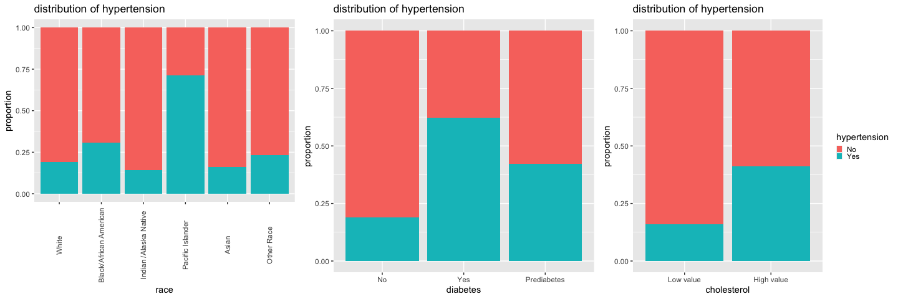
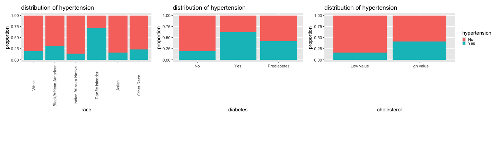

## Module 2: Factors that are associated with development of hypertension

Recall that our main questions of interest are:

  * Question 2.1: What factors measured in the NYC HANES survey are associated with having hypertension?
  * Question 2.2: How do our estimates from survey-weighted logistic regression differ from those where we ignore survey weights?
  * Question 2.3: How to we build a "good" model that tells us something about associations with hypertension as seen in this data set?


The data science learning objectives for this module include:

  * Understand the components of a data analysis report
  * Gain experience performing data cleaning, and assessing whether you have been successful
  * Practice selecting data visualizations that fit into the context of your statistical analysis

The statistical learning objectives for this module include:

  * Gain further experience with logistic regression and selecting an appropriate model for your question
  * Understand what a survey-weighted analysis is and how/when we perform one
  * Learn how to select survey weights for unbalanced data

## Reminder: What are the data?

For this case study, we will use data from the [New York City (NYC) Health and Nutrition Examination Survey (NYC HANES)](http://nychanes.org/){target="_blank"}, modeled on the [National Health and Nutrition Examination Survey (NHANES)](https://wwwn.cdc.gov/nchs/nhanes/default.aspx){target="_blank"}. NHANES is a population-based, cross-sectional study with data collected from a physical examination and laboratory tests, as well as a face-to-face interview and an audio computer-assisted self-interview (ACASI). It is designed to assess the health and nutritional status of adults and children in the United States. NYC HANES is a local version of NHANES, which implies it mainly focuses on the New York area. 

Start by loading libraries and raw data set.

``` r
library(tidyverse)  # core group of tidyverse packages
library(knitr)  # to make nice tables
library(ggpubr)
library(ggrepel)
library(tidyverse)
library(kableExtra)
library(survey)
library(haven)
library(broom)
library(plotrix)
library(patchwork)
library(pander)

dat <- read_sas('./module_2/data/d.sas7bdat')
dim(dat)
```

```
## [1] 1527  725
```


## Learning objectives for this week

Our main question of interest for this module is: Based on the data collected from NYC HANES, which risk factors play a role in development of hypertension?

This week, we will continue to work toward answering this by learning how to:

* Discuss our initial data visualizations and how they relate to the question of interest for this module
* Understand why we need to include survey weights in our analysis
* Learn about and see how to use tools designed for working with survey data in R 

## Quick follow up on comments from Assignment 2-1

### Coding of smoking variable

As I mentioned on Monday, when starting from the `SMOKER3CAT` variable there was a mistake in my code from a previous lecture for recoding this variable. It has been corrected below to match what is in the [Variable Codebook](https://med.nyu.edu/departments-institutes/population-health/divisions-sections-centers/epidemiology/sites/default/files/nyc-hanes-datasets-and-resources-public-dataset-codebook.pdf){target="_blank"}. Not all of you are currently using this variable for your visualizations. But if you do use it in the future, you'll want to make sure it is coded correctly!

### Alternative multi-panel tool: patchwork

The `patchwork` [package](https://patchwork.data-imaginist.com){target="_blank"} gives a little more flexibility in terms of sizing the figure panes to allow for equally sized axes as we discussed on Monday. I have also only included the legend in one plot here by adding `theme(legend.position = "none")` to the first two plots.  Here is an example:


Old version with `ggarrange`:

``` r
ggarrange(p1, p2, p3, ncol=3, nrow=1)
```

<!-- -->

New version with `patchwork`:

``` r
p1+p2+p3+patchwork::plot_layout(ncol=3,heights=c(4,2,2))
```

<!-- -->


## Data analysis concerns: model framework and survey weights

Now that we have spent some time cleaning the data and looking at data visualizations, we want to use a statistical model to address our question of interest about which factors are related to the risk of hypertension.

Which model should we use? Since we are looking at whether or not someone develops hypertension, our outcome variable (`hypertension`) is **binary**. A binary outcome means a logistic regression model is a natural choice.  However, think of the nature of our dataset and how it was collected. It is data obtained from a survey, and we have to account for this during the analysis of the data.

In a survey sample, we often end up with "too many" samples in a category, often due to the designed sampling plan.  By "too many", we mean more than would be expected based on the make-up of the population from which we are sampling.  For example, we may have a much higher proportion of women in our sample compared to the population and a much lower proportion of men than in the population. This may happen by design if we purposefully *oversample* a group that isn't well represented in the overall population. Why might we want to do this?

To analyze our survey data and infer back to the population, we can use data weighting to account for the mismatch between the population and sample. If we want the data to reflect the whole population, instead of treating each data point equally, we weight the data so that taken together, our sample does reflect the entire community.

To appropriately analyze our data as a survey, we will use the [package `survey`](https://cran.r-project.org/web/packages/survey/survey.pdf){target="_blank"}, which contains functions for various types of analysis that account for survey design. Note that there is a newer package that works with more "tidyverse" style of data interaction, called [`srvyr`](http://gdfe.co/srvyr/){target="_blank"}. For our purposes, it is not much easier to use than the `survey` package, but if you are interested in using it instead, feel free. Here is a link to a [short course](https://github.com/szimmer/tidy-survey-aapor-2021){target="_blank"} using this package, and it is also used in this [case study](https://www.opencasestudies.org/ocs-bp-vaping-case-study/){target="_blank"} from the Open Case Studies project, which is an awesome data analysis around vaping behaviors in American youth.

## Survey weights 

### What are survey weights?

Suppose that we have 25 students (20 male and 5 female) in our biostatistics class, and we want to talk with 5 of them to gauge their understanding of the content in the class. Although the proportion of female students in the population is small, we are very interested in getting their opinion, so we want to be sure to have some female students in our sample.  By randomly sampling 5 students from the class, it's quite possible we could end up with all male students in our sample, and we wouldn't learn anything about the female perspective in the class. 

Consider the extreme case where we are going to require that 4 of the 5 people we sample are female students, to be sure we get good information about the female perspective.  We sample 4 of the 5 female students and 1 of the 20 male students.   Do we expect this sample to represent the population? Definitely not, since there is a higher proportion of females in the sample than the population. We can correct for this by weighting our samples so that, taken together, they better reflect the composition of the population we want to learn about. 

Let's assume we sampled 4 of the 5 female students and 1 of the 20 male students from our population. Who do you think should get a higher weight in our analysis, males or females? What is your reasoning?


To calculate the survey weights, we could use the following formula:

$$
\begin{aligned}
Weight & = \frac{1}{Prob~of~being~selected~for~sample} \\
       & = \frac{1}{(Number~in~sample)/(Number~in~population)} \\
       & \\
       & =  \frac{Number~in~population}{Number~in~sample}
\end{aligned}
$$

That gives the following sample weights:

$$w_m=Male~Weight = \frac{20}{1} = 20$$

$$w_f=Female~Weight = \frac{5}{4} = 1.25$$

We can interpret these weights by saying that each male student in the sample represents 20 male students in the population and each female student in the sample represents 1.25 female students in the population.  Mathematically, we can see this as:

$$ 1~observed~male* w_m = 20~males $$ 
and 
$$ 4~observed~females * w_f = 5~females$$ 

<center>

</center>

By weighting the observations, we make the sample better represent the population.

For complex survey sampling designs, it can be complicated to calculate the weight for each individual observation. However, for many large survey data sets, such as NHANES, the appropriate weight is calculated by the organization that administers the survey and provided as a variable in the dataset. In our case study, this survey weight is calculated and provided as the `surveyweight` variable and we can simply apply this weight and perform a **survey-weighted logistic regression**.

### Selecting the weights

Because the NYC HANES 2013-2014 data have been collected to address a variety of different questions and using different surveys, the researchers who produced the data have employed a somewhat complex weighting scheme to compensate for unequal probability of selection. Five sets of survey weights have been constructed to correspond to different sets of variables that were collected: CAPI  weight, Physical weight, Blood Lab result weight, Urine Lab results weight and Saliva Lab results weight. **The determination of the most appropriate weight to use for a specific analysis depends upon the variables selected by the data analyst**. 

We will give a table to indicate each variable's origin stream:


| Variable names   |      Component      |
|---------------------------------|---------------------------------|
| age                                   | CAPI                                                                                                                                                                 |
| race                                  | CAPI                                                                                                                                                                 |
| gender                                | CAPI                                                                                                                                                                 |
| diet                                  | CAPI                                                                                                                                                                 |
| income                                | CAPI                                                                                                                                                                 |
| diabetes                               | CAPI                                                                                                                                                               |
| cholesterol                           | CAPI                                                                                                                                                                 |
| drink                                 | CAPI                                                                                                                                                                 |
| smoking                               | CAPI                                                                                                                                                                 |
| hypertension                           | CAPI                                                                                                                                                                |
| bmi                                    | EXAM                                                                                                                                                                |


When an analysis involves variables from different components of the survey, the analyst should decide whether the outcome is inclusive or exclusive, and then choose certain weights. To learn how to use weights for different purposes, refer to the particular [Analytics Guidelines](https://med.nyu.edu/departments-institutes/population-health/divisions-sections-centers/epidemiology/sites/default/files/nyc-hanes-datasets-and-resources-analytics-guidelines.pdf){target="_blank"} for the survey. 

In our case, we choose EXAM weight since our analysis is exclusive, i.e., we plan to restrict the samples included to those who have all of the data we are interested in looking at. Since one of the variables we are looking at is bmi, our dataset is limited to those who received a physical exam test, which means all of our survey participants have a value for the `EXAM_WT` variable. We selected this variable and renamed it as `surveyweight` in the earlier data cleaning part of this analysis. 

## Finite population correction factor

There is one more technical detail that we need to consider when using survey data. Many methods for analysis of survey data make the assumption that **samples were collected using sampling with replacement**, i.e., any time a new participant is drawn, each member in the population has an equal chance of being sampled, even if they have already been sampled. This is not usually how surveys are actually carried out, so an adjustment may be necessary to reflect this difference. This adjustment is called the **finite population correction factor** and it is defined as:

$$FPC = \left(\frac{N-n}{N-1}\right)^{\frac{1}{2}}$$
 
* `N` = population size
* `n` = sample size

In the case when the assumption above is violated (e.g. if you are sampling a sufficiently large proportion of the population), then you might sample the same persion twice. The finite population correction (FPC) is used to reduce the variance when a substantial fraction of the total population of interest has been sampled. We can find the value of `N` and `n` for our survey from the [Analytics Guidelines](https://med.nyu.edu/departments-institutes/population-health/divisions-sections-centers/epidemiology/sites/default/files/nyc-hanes-datasets-and-resources-analytics-guidelines.pdf){target="_blank"}. Next let's calculate the FPC as below:


``` r
N <-  6825749
n <- nrow(dat)
((N-n)/(N-1))^0.5
```

```
## [1] 0.9998882
```

The FPC of our data set is very close to 1 since our sample is quite small compared to the size of the population, and we can simply ignore the FPC.


## Incorporating survey weights into our analysis

We will read in and recode the data, as we did last week. NOTE: We can't remove ANY data points from our set of data this time because we will be using survey weights. We will discuss how to address this below.


``` r
rename <- dat %>% 
  select(id = KEY,
         age = SPAGE,
         race = DMQ_14_1,
         gender = GENDER,
         born = US_BORN,
         diet = DBQ_1,
         income = INC20K,
         diabetes = DIQ_1,
         bmi = BMI,
         cholesterol = BPQ_16,
         drinkfreq = ALQ_1,
         drinkunit = ALQ_1_UNIT,
         smoking = SMOKER3CAT,
         hypertension = BPQ_2,
         surveyweight = EXAM_WT)

rename <- rename %>% 
  mutate(drink_denom = case_when(drinkfreq == 0 | drinkunit == 1 ~ 1,
                                   drinkunit == 2 ~ 52 / 12,
                                   drinkunit == 3 ~ 52),
         drink = drinkfreq / drink_denom)


hy_df <- rename %>% 
  mutate(race = factor(race, 
                       levels = c(100, 110, 120, 140, 180, 250), 
                       labels = c('White', 'Black/African American', 
                                  'Indian /Alaska Native', 
                                  'Pacific Islander', 
                                  'Asian', 'Other Race')),
         gender = factor(gender, 
                         levels = c(1, 2), 
                         labels = c('Male', 'Female')),
         born = factor(born, 
                       levels = c(1, 2),
                       labels = c("US Born", "Non-US Born")),
         diet = factor(diet, 
                       levels = c(5:1), 
                       labels = c('Poor', 'Fair', 'Good', 
                                  'Very good','Excellent')),
         income = factor(income, 
                         levels = c(1:6), 
                         labels = c('Less than $20,000','$20,000 - $39,999',
                                    '$40,000 - $59,999','$60,000 - $79,999',
                                    '$80,000 - $99,999','$100,000 or more')),
         diabetes = factor(diabetes, 
                           levels = c(2, 1, 3), 
                           labels = c('No','Yes','Prediabetes')),
         cholesterol = factor(cholesterol, 
                              levels = c(2, 1), 
                              labels = c('Low value','High value')),
         drinkcat = factor(drink >= 1, 
                        labels = c('<1 / wk', '1+ / week')),
         smoking = factor(smoking, levels=c(1,3,2), 
                         labels=c('Never smoker','Former smoker','Current smoker')),
         hypertension = factor(hypertension, 
                               levels = c(2, 1), 
                               labels = c('No','Yes'))
  ) 


## we will not use this in our survey design object, but will use it for comparisons below
hy_p_df <-
  hy_df %>%
  drop_na()
```

## Specify the survey design

We now need to figure out how to specify the survey design and incorporate the sampling weights in our modeling steps. To help us do this, we use the function `svydesign()` in the [package `survey`](https://cran.r-project.org/web/packages/survey/survey.pdf). This function combines a data frame and all the design information needed to specify a survey design. Here is the list of options provided in this function:

* `ids`: Formula used to specify the cluster sampling design. *Cluster sampling* is a multi-stage sampling design where the total population is divided into several clusters and a simple random sample of clusters is selected. Then a sample is taken from the elements of each selected cluster. Use `~0` or `~1` as the formula when there are no clusters.

* `data`: Data frame (or database table name) containing the variables for analysis look up variables in the formula arguments.

* `weights`: Formula or vector specifying the sampling weights. 

* `fpc`: Finite population correction, `~rep(N,n)`  generates a vector of length n where each entry is N (the population size). Default value is 1. The use of fpc indicates a sample without replacement, otherwise the default is a sample with replacement. Since our finite-population correction factor is very close to 1, we omit this argument, i.e., let it take the default value.
 
* `strata`: Specification for stratified sampling.  *Stratified sampling* is a sampling design which divides members of the population into homogeneous subgroups and then samples independently in these subpopulations. It is advantageous when subpopulations within an overall population vary.
 
In our situation, we don't have any clusters or stratified sampling to specify, we just need to include the appropriate survey weights provided with the data.  We will not include a FPC, since our FPC was approximately 1.
 
Here's how we specify the design relative to our dataset, `hy_df`:


``` r
hypertension_design <- svydesign(
  ids = ~1,
  weights = ~hy_df$surveyweight,
#  fpc = rep(6825749, nrow(hy_df)),
  data = hy_df
)
```


The arguments are interpreted as the following:

* `ids = ~1` means there is no cluster sampling
* `data = hy_df` tells `svydesign` where to find the variables for analysis
* `weights= ~hy_df$surveyweight` tells it where to find the weight in our data frame

We can use `summary()` to show the results:

``` r
summary(hypertension_design)
```

```
## Independent Sampling design (with replacement)
## svydesign(ids = ~1, weights = ~hy_df$surveyweight, data = hy_df)
## Probabilities:
##      Min.   1st Qu.    Median      Mean   3rd Qu.      Max. 
## 6.236e-05 1.996e-04 2.719e-04       Inf 3.470e-04       Inf 
## Data variables:
##  [1] "id"           "age"          "race"         "gender"       "born"        
##  [6] "diet"         "income"       "diabetes"     "bmi"          "cholesterol" 
## [11] "drinkfreq"    "drinkunit"    "smoking"      "hypertension" "surveyweight"
## [16] "drink_denom"  "drink"        "drinkcat"
```

"Independent sampling design" means our sampling design is a simple random sample (SRS). By setting other parameters it is possible to specify different kinds of designs, such as stratified sampling, cluster sampling, or other multi-stage designs.


## Calculate survey-weighted summary statistics

Once we have created our `svydesign` object, we can use the convenient `svy*` functions to calculate summary statistics that account for survey design features.

First, we want to create a clean data set, where we no longer have observations with missing data. We will do this using the `subset` function since the `drop_na()` function does not work on the output of the `svydesign` function, but the `subset` function does. We can use the `complete.cases` function to identify which individuals in our `hy_df` data frame are not missing any of the variables.


``` r
h_design_nona <- subset(hypertension_design, complete.cases(hy_df))

dim(hypertension_design)
```

```
## [1] 1527   18
```

``` r
dim(h_design_nona)
```

```
## [1] 970  18
```


To calculate the mean and its standard error, use the function `svymean()`. The `svymean()` function calculates a weighted estimate for the mean by weighting each observation with its sampling weight. We can compare this result to ignoring the survey weights using the `mean()` and `std.error()` functions in base R.

Here we look at both the weighted and un-weighted mean BMI:


``` r
svymean(~bmi, h_design_nona)
```

```
##       mean     SE
## bmi 27.485 0.2256
```


``` r
mean(hy_p_df$bmi)
```

```
## [1] 27.25795
```

``` r
std.error(hy_p_df$bmi)
```

```
## [1] 0.1983452
```

There is not a very large difference between these two values and their standard errors.  However, the survey-weighted results are "better" because they account for the sampling design of the HANES NYC survey.

To calculate a survey-weighted confidence interval for mean BMI value, we use the function `confint()` directly on the `svymean()` function:


``` r
confint(svymean(~bmi, h_design_nona))
```

```
##        2.5 %   97.5 %
## bmi 27.04289 27.92731
```

Statistics for subgroups are also easy to calculate with the function `svyby()`.  Here we look at mean BMI within groups defined by diet quality.

``` r
svyby(~bmi, by=~diet, design = h_design_nona, 
      FUN = svymean)
```

```
##                diet      bmi        se
## Poor           Poor 29.89315 0.9850217
## Fair           Fair 29.79277 0.6907897
## Good           Good 27.37861 0.3173209
## Very good Very good 25.89348 0.3075714
## Excellent Excellent 25.30150 0.5209891
```

If we are particularly interested in one subgroup of individuals, we can use the `subset()` to define a design for our subgroup of interest.  For example, if we are only interested in learning about the female population:

``` r
h_design_female <- subset(h_design_nona,gender=="Female")
svymean(~bmi, h_design_female)
```

```
##       mean     SE
## bmi 27.511 0.3565
```

We estimate that the mean BMI for females in the population is 28.

Note that if we are limiting our analysis to a subgroup of the data, we **must** use the `subset` command to define a new survey design that relates to this new subpopulation.  This is because the survey weights need to be updated to reflect how the data represents this new population.  The `subset` command will appropriately update the survey weights so the analysis reflects the survey design of the subsetted data.  We **cannot** simply use a subset of the data with the original survey design. This is why we needed to start with the complete data set, not the one where we had already removed individuals with missing data.

How would we compare our mean and SE of bmi for the weighted and unweighted data?

## Survey-weighted logistic regression

### Fit a simple model

Logistic regression is widely used to when the response variable is binary.  The standard logistic regression equation can be written as:

$logit(p)= log(\frac{p}{1-p})=X^{T}\beta$, where $p=P(Y=1)=E(Y)$ 

As we mentioned above, our data comes from a survey design so we need to take survey weights into account in our analysis.  We can do that with a survey-weighted logistic regression using the `svyglm()` function from the `survey` package.

The `svyglm()` function works similarly to using `glm()` to fit a standard logistic regression model.  The only difference is that instead of using the original data set in the `data` argument within `glm()`, we instead input the survey design object from `svydesign()` in the `design` argument in `svyglm()`.

Now we can fit our survey-weighted logistic regression model and look at the summarized output. We will start with a simple model by choosing one variable, `smoking`, as a predictor:


``` r
g <- svyglm(hypertension ~ smoking, 
    family = binomial(link = 'logit'), design = h_design_nona)
```

```
## Warning in eval(family$initialize): non-integer #successes in a binomial glm!
```

``` r
summary(g)
```

```
## 
## Call:
## svyglm(formula = hypertension ~ smoking, design = h_design_nona, 
##     family = binomial(link = "logit"))
## 
## Survey design:
## subset(hypertension_design, complete.cases(hy_df))
## 
## Coefficients:
##                       Estimate Std. Error t value Pr(>|t|)    
## (Intercept)            -1.2355     0.1146 -10.780   <2e-16 ***
## smokingFormer smoker    0.4440     0.2013   2.205   0.0277 *  
## smokingCurrent smoker  -0.1647     0.2216  -0.743   0.4577    
## ---
## Signif. codes:  0 '***' 0.001 '**' 0.01 '*' 0.05 '.' 0.1 ' ' 1
## 
## (Dispersion parameter for binomial family taken to be 1.001032)
## 
## Number of Fisher Scoring iterations: 4
```

If we allow `warning = TRUE`, a warning would appear as "non-integer #successes in a binomial glm!". But everything is right here! `glm` and `svyglm` are just picky. They warn us if they detect that the no. of trials or successes is non-integral, but they go ahead and fit the model anyway. If you want to suppress the warning (and you're sure it's not a problem), use `family=quasibinomial()` instead.


``` r
g0 <- svyglm(hypertension ~ smoking, 
    family = quasibinomial(link = 'logit'), design = h_design_nona)
summary(g0)
```

```
## 
## Call:
## svyglm(formula = hypertension ~ smoking, design = h_design_nona, 
##     family = quasibinomial(link = "logit"))
## 
## Survey design:
## subset(hypertension_design, complete.cases(hy_df))
## 
## Coefficients:
##                       Estimate Std. Error t value Pr(>|t|)    
## (Intercept)            -1.2355     0.1146 -10.780   <2e-16 ***
## smokingFormer smoker    0.4440     0.2013   2.205   0.0277 *  
## smokingCurrent smoker  -0.1647     0.2216  -0.743   0.4577    
## ---
## Signif. codes:  0 '***' 0.001 '**' 0.01 '*' 0.05 '.' 0.1 ' ' 1
## 
## (Dispersion parameter for quasibinomial family taken to be 1.001032)
## 
## Number of Fisher Scoring iterations: 4
```

<details> <summary> Side note: Likelihood function </summary>


See `5_7_maximum_likelihood_estimation_INKED.pdf` file for derivation of likelihood function for logistic regression. It comes from binomial likelihood function, since we are considering a 0-1 outcome (someone has or does not have hypertension). We assume that conditional on the input variables, we can calculate the probability of a "success" (i.e., having hypertension) as a function of the estimated model coefficients and the values of the input variables, and each "trial" is independent of the others.

</details>

The `tidy()` function in the `broom` package can provide a dataframe representation of the model's output. Now we can see the model output as a nice dataframe!


``` r
g_res <- tidy(g0)
g_res
```

```
## # A tibble: 3 × 5
##   term                  estimate std.error statistic  p.value
##   <chr>                    <dbl>     <dbl>     <dbl>    <dbl>
## 1 (Intercept)             -1.24      0.115   -10.8   1.15e-25
## 2 smokingFormer smoker     0.444     0.201     2.21  2.77e- 2
## 3 smokingCurrent smoker   -0.165     0.222    -0.743 4.58e- 1
```

As in standard logistic regression using `glm()`, we see the coefficient estimate, standard error, test statistic, and p-value for each term in our model.  We can still get survey-weighted confidence intervals with the `confint()` function:

``` r
confint(g0)
```

```
##                             2.5 %     97.5 %
## (Intercept)           -1.46044080 -1.0106197
## smokingFormer smoker   0.04885787  0.8390711
## smokingCurrent smoker -0.59959023  0.2702536
```


What does the model output tell us about the relationship between predictor variables and the chance of getting hypertension? Look at the coefficient table. For the predictor variable `smoking`, the reference category is `Never smoker`. So the coefficient for `Former Smoker`, 0.44, tells us that the log odds of hypertension for a former smoker is 0.44 higher than for a never smoker.  It makes more sense to exponentiate the coefficients and interpret them as odds ratios:

``` r
exp(g0$coefficients)
```

```
##           (Intercept)  smokingFormer smoker smokingCurrent smoker 
##             0.2906806             1.5588751             0.8481750
```

The exponentiated coefficient for `Former smoker` is 1.56, which means that former smokers have  56% increased odds of hypertension compared to never smokers. Similarly, the exponentiated coefficient for `Current smoker` is 0.85, meaning current smokers have a 15% reduction in the odds of hypertension compared to those who have never smoked.  What's more, we can see the p-value for the coefficient of `Former smoker` is 0.028 which is < 0.05, so this difference is statistically significant. However, for `Current smoker`, the p-value is 0.46, which is > 0.05, meaning this difference is not statistically significant.


### Fit a full model

Now we can fit a full model that includes all of our variables of interest: 


``` r
g1 <- svyglm(hypertension ~ 
               age + race + gender + diet + income + 
               diabetes + bmi + cholesterol + drinkcat + smoking,
             family = binomial(link = 'logit'), 
             design = h_design_nona)
```

```
## Warning in eval(family$initialize): non-integer #successes in a binomial glm!
```

``` r
g1_res <- tidy(g1, exponentiate = TRUE)

g1_res %>% select(Variable = term, OR = estimate, `p-value` = p.value) %>% pander(digits = 2)
```


-----------------------------------------------
          Variable              OR     p-value 
---------------------------- -------- ---------
        (Intercept)           0.0072   6.6e-12 

            age                 1      2.1e-10 

 raceBlack/African American    2.3     0.0011  

 raceIndian /Alaska Native     0.25      0.2   

    racePacific Islander        16     0.00093 

         raceAsian             1.4      0.38   

       raceOther Race          1.2      0.55   

        genderFemale           0.67     0.078  

          dietFair             0.78     0.53   

          dietGood              1       0.92   

       dietVery good           0.53     0.11   

       dietExcellent           0.83     0.69   

  income$20,000 - $39,999      0.61     0.063  

  income$40,000 - $59,999      0.38    0.0074  

  income$60,000 - $79,999      0.56     0.083  

  income$80,000 - $99,999      0.32     0.046  

   income$100,000 or more      0.5      0.03   

        diabetesYes            2.9     0.0015  

    diabetesPrediabetes        1.4      0.45   

            bmi                1.1      7e-06  

   cholesterolHigh value       2.2      4e-04  

     drinkcat1+ / week         0.99     0.95   

    smokingFormer smoker       1.2      0.41   

   smokingCurrent smoker       0.69     0.16   
-----------------------------------------------

One interesting thing is that both the coefficients and p-values for the `smoking` variables are different than in our simple model.  Why did this happen? Remember that with other variables in the model, our interpretation of the coefficients for smoking changes.  We now have to interpret them as describing the relationship between smoking and hypertension *while holding the other variables in the model constant.*  If the other variables in the model are also related to `smoking`, then the relationship between smoking and hypertension may be different once we account for the other variables compared to the relationship of smoking on its own.

Now, let's interpret the new output. 

* `smoking`: Holding all other variables constant, former smokers have a 24% increased odds of hypertension compared to those who have never smoked.  Holding all other variables constant, current smokers have 25% reduced odds of hypertension compared to those who have never smoked. However, neither of these differences is statistically significant.

* `bmi`: Holding all other variables constant, a one-unit increase in bmi is associated with a 8% increase in the odds of hypertension.

### Looking ahead to next week: Model selection

Not all of the variables in our full model `g1` are considered statistically significant so we would perhaps like to remove some of them to get a reduced model. Next week we will discuss approaches we can take to address this concern.


## Assignment 2.2

Refine your data display from last week with the NYC HANES data to answer Question 2.1: What factors measured in the NYC HANES survey are associated with having hypertension? (Can do now.)

Use the `svydesign()` function to create an appropriate survey-weighted data set to use for your modeling analysis. You will need to be sure to include a variable with the appropriate survey weights in your data set. (Can do now.)

Use the `svyglm()` function to fit a logistic regression model, with hypertension as the outcome, to begin to explore the relationships among the variables in your data set in a modeling framework. You may want to consider the variables you include based on your data visualizations or other reasons. Write a few sentences interpreting the outputs of your model. (If you included many variables, you don't need to write about all of them here.) (Can do after Wednesday's class.)

* Submit your data display and the code for your initial survey-weighted analysis in R Markdown through Github by Sunday (March 2, 2025) at midnight.
* Post a screenshot of your revised data display (just the graph or table) and/or a summary table of your model results on Piazza in the "Assignment 2-2 Results" thread.  Add a sentence or two that describes what you have found so far.  You are welcome to post this anonymously to your classmates. You can also include comments about what your chose to do or questions you had as you were making the display and fitting your model.
* You may work together on this assignment, but you must submit your own data display; please credit in your assignment anyone with whom you collaborated.
* Next week in class we will continue with discussion/critiques of your displays and brainstorm as a class on ideas to improve these displays, discuss the intial outputs of your survey-weighted logistic regression, and start talking about variable selection.

## Bonus content for Module 2

Throughout our courses, we use case-study style analyses to present data science and statistics concepts in the context of public health questions and data collected from real life. For the past couple of years, we have been involved in developing teaching materials in this style as part of the [Open Case Studies](https://www.opencasestudies.org){target="_blank"} project. These case studies are full of useful examples of obtaining data from varied sources, from websites, to pdfs to twitter feeds. They also present steps to create useful and intricate data visualizations as well as in-depth presentations of statistical methods. As you seek inspiration for your own projects later in the course, or aim to expand your own data science skills, you might find them to be a useful resource. We especially recommend the interface [here](https://americanhealth.jhu.edu/open-case-studies){target="_blank"} which provides additional tools for navigating among ten of the case studies. 

One great aspect of these case studies is that all the code is provided for creating some amazing multi-panel data visualizations. In addition to `ggarrange` which we have shown you (and which you can learn more about [here](https://rpkgs.datanovia.com/ggpubr/reference/ggarrange.html){target="_blank"}), the case studies use the `patchwork` package (see [here](https://patchwork.data-imaginist.com){target="_blank"}) as well as `cowplot` (see [here](https://wilkelab.org/cowplot/index.html){target="_blank"}). As mentioned on Monday, check out the Controlling Guides section [here](https://patchwork.data-imaginist.com/articles/guides/layout.html){target="_blank"} to see how to collect the legends across multiple plots when using patchwork.
