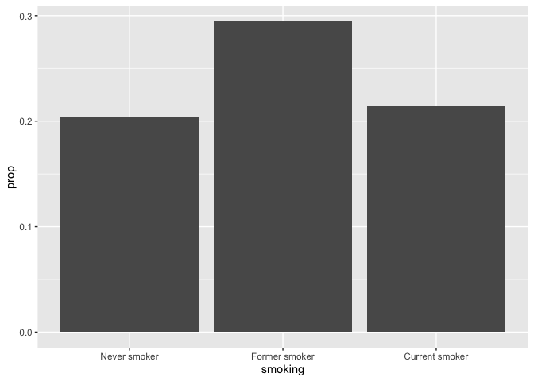
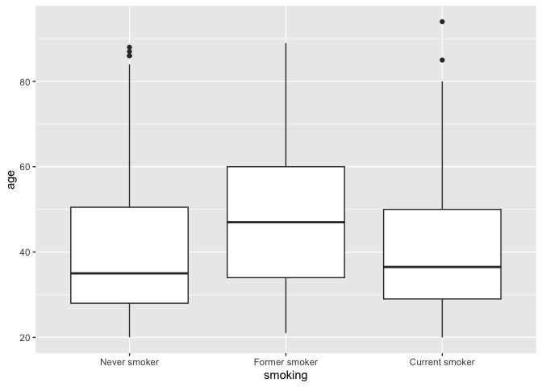
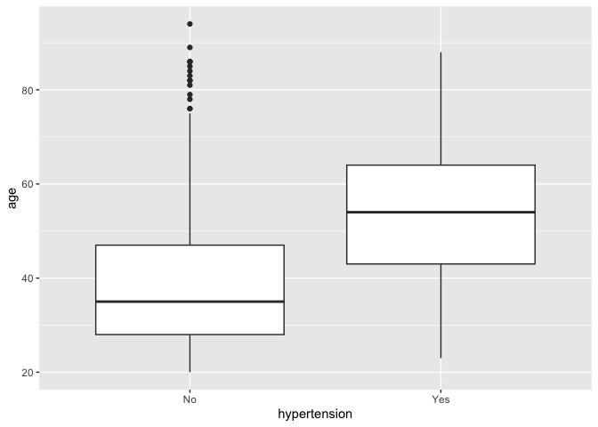
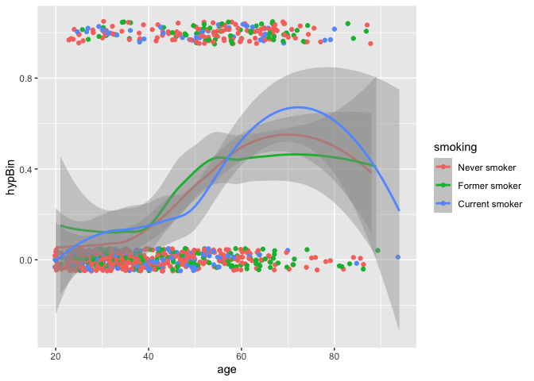
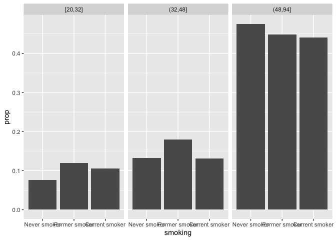

## Module 2: Factors that are associated with development of hypertension

Recall that our main questions of interest are:

  * Question 2.1: What factors measured in the NYC HANES survey are associated with having hypertension?
  * Question 2.2: How do we build a "good" model that tells us something about associations with hypertension as seen in this data set?
  * Question 2.3: How do our estimates from survey-weighted logistic regression differ from those where we ignore survey weights?


The data science learning objectives for this module include:

  * Understand the components of a data analysis report
  * Gain experience performing data cleaning, and assessing whether you have been successful
  * Practice selecting data visualizations that fit into the context of your statistical analysis

The statistical learning objectives for this module include:

  * Gain further experience with logistic regression and selecting an appropriate model for your question
  * Understand what a survey-weighted analysis is and how/when we perform one
  * Learn how to select survey weights for unbalanced data

## Reminder: What are the data?

For this case study, we will use data from the [New York City (NYC) Health and Nutrition Examination Survey (NYC HANES)](http://nychanes.org/){target="_blank"}, modeled on the [National Health and Nutrition Examination Survey (NHANES)](https://wwwn.cdc.gov/nchs/nhanes/default.aspx){target="_blank"}. NHANES is a population-based, cross-sectional study with data collected from a physical examination and laboratory tests, as well as a face-to-face interview and an audio computer-assisted self-interview (ACASI). It is designed to assess the health and nutritional status of adults and children in the United States. NYC HANES is a local version of NHANES, which implies it mainly focuses on the New York area. 


## Learning objectives for this week

Our main question of interest for this module is: Based on the data collected from NYC HANES, which risk factors play a role in development of hypertension?

This week, we will continue to work toward answering this by learning how to:

* Discuss your results and your initial approaches to model selection
* Explore the relationship between smoking and disease risk: why do we see the surprising patterns we see?
* Review survey weighting and how to determine what weight to use for your analysis, as needed
* Learn strategies for approaching model selection: how do you decide what variables to include in your model and how do you compare different models?
* Introduce your final project to get you to start thinking about what you may want to pursue


## Group discussion for today

You'll want to load libraries, read in data, and recode variables that may be of use:

``` r
library(tidyverse)  # core group of tidyverse packages
library(knitr)  # to make nice tables
library(ggpubr)
library(ggrepel)
library(tidyverse)
library(kableExtra)
library(survey)
library(haven)
library(broom)
library(plotrix)

dat <- read_sas('./module_2/data/d.sas7bdat')
dim(dat)
```

```
## [1] 1527  725
```

``` r
rename <- dat %>% 
  select(id = KEY,
         age = SPAGE,
         race = DMQ_14_1,
         gender = GENDER,
         born = US_BORN,
         diet = DBQ_1,
         income = INC20K,
         diabetes = DIQ_1,
         bmi = BMI,
         cholesterol = BPQ_16,
         drinkfreq = ALQ_1,
         drinkunit = ALQ_1_UNIT,
         smoking = SMOKER3CAT,
         hypertension = BPQ_2,
         surveyweight = EXAM_WT)

rename <- rename %>% 
  mutate(drink_denom = case_when(drinkfreq == 0 | drinkunit == 1 ~ 1,
                                   drinkunit == 2 ~ 52 / 12,
                                   drinkunit == 3 ~ 52),
         drink = drinkfreq / drink_denom)


hy_df <- rename %>% 
  mutate(race = factor(race, 
                       levels = c(100, 110, 120, 140, 180, 250), 
                       labels = c('White', 'Black/African American', 
                                  'Indian /Alaska Native', 
                                  'Pacific Islander', 
                                  'Asian', 'Other Race')),
         gender = factor(gender, 
                         levels = c(1, 2), 
                         labels = c('Male', 'Female')),
         born = factor(born, 
                       levels = c(1, 2),
                       labels = c("US Born", "Non-US Born")),
         diet = factor(diet, 
                       levels = c(5:1), 
                       labels = c('Poor', 'Fair', 'Good', 
                                  'Very good','Excellent')),
         income = factor(income, 
                         levels = c(1:6), 
                         labels = c('Less than $20,000','$20,000 - $39,999',
                                    '$40,000 - $59,999','$60,000 - $79,999',
                                    '$80,000 - $99,999','$100,000 or more')),
         diabetes = factor(diabetes, 
                           levels = c(2, 1, 3), 
                           labels = c('No','Yes','Prediabetes')),
         cholesterol = factor(cholesterol, 
                              levels = c(2, 1), 
                              labels = c('Low value','High value')),
         drinkcat = factor(drink >= 1, 
                        labels = c('<1 / wk', '1+ / week')),
         smoking = factor(smoking, levels=c(1,3,2), 
                         labels=c('Never smoker','Former smoker','Current smoker')),
         hypertension = factor(hypertension, 
                               levels = c(2, 1), 
                               labels = c('No','Yes'))
  ) 


hy_p_df <- 
  hy_df %>%
  drop_na()

hypertension_design <- svydesign(
  id = ~1,
  weights = ~hy_df$surveyweight,
  data = hy_df
)
h_design_nona <- subset(hypertension_design, complete.cases(hy_df))
```

### Some points of discussion: your results

Start by talking about your own analyses from this week:

* First, take turns giving brief presentations of your data visualization and model results to your group-mates, to give context for what you chose to look at and investigate this week.

* What surprising relationships did you see in your displays? Were there some counter-intuitive patterns? What might be causing these? How might you investigate this?

* What approach did you take to deciding what variables to include in your model?


### Some points of discussion: smoking and hypertension risk

* First, look at and discuss the following visualizations and model outputs together to further explore the effects of smoking on hypertension risk. Then, there are some additional questions at the end to guide your discussion

The surprise is that we see a counter-intuitive pattern where never smokers have around the same hypertension risk as current smokers:

``` r
hy_p_df %>% 
  count(smoking, hypertension) %>% 
  group_by(smoking) %>% 
  mutate(prop = n/sum(n)) %>% 
  filter(hypertension == "Yes") %>% 
  ggplot() +
  geom_bar(mapping = aes(x = smoking, y =prop), stat = "identity") 
```

<!-- -->

``` r
g_smok <- svyglm(hypertension ~ smoking, 
    family = quasibinomial(link = 'logit'), design = h_design_nona)
summary(g_smok)
```

```
## 
## Call:
## svyglm(formula = hypertension ~ smoking, design = h_design_nona, 
##     family = quasibinomial(link = "logit"))
## 
## Survey design:
## subset(hypertension_design, complete.cases(hy_df))
## 
## Coefficients:
##                       Estimate Std. Error t value Pr(>|t|)    
## (Intercept)            -1.2355     0.1146 -10.780   <2e-16 ***
## smokingFormer smoker    0.4440     0.2013   2.205   0.0277 *  
## smokingCurrent smoker  -0.1647     0.2216  -0.743   0.4577    
## ---
## Signif. codes:  0 '***' 0.001 '**' 0.01 '*' 0.05 '.' 0.1 ' ' 1
## 
## (Dispersion parameter for quasibinomial family taken to be 1.001032)
## 
## Number of Fisher Scoring iterations: 4
```

Why is this happening? To try to answer this question, we can take the approach of using data visualizations and additional logistic regression models to explore what is going on.

Here are a few plots that help tease apart the effect of smoking on hypertension risk. What does each of these plots tell you? 

``` r
hy_p_df %>% 
  ggplot() + 
  geom_boxplot(mapping = aes(x = smoking, y = age))
```

<!-- -->

``` r
hy_p_df %>% 
  ggplot() + 
  geom_boxplot(mapping = aes(x = hypertension, y = age))
```

<!-- -->

``` r
hy_p_df %>% 
  mutate(hypBin = ifelse(hypertension == "Yes", 1, 0)) %>% 
  ggplot() +
  geom_jitter(mapping = aes(x = age, y = hypBin, col = smoking), height = 0.05) +
  geom_smooth(mapping = aes(x = age, y = hypBin, col = smoking))
```

<!-- -->


Rather than using age as a continuous variable, what might be a useful approach to take here?


``` r
hy_p_df %>% 
  mutate(ageCat = cut_number(age, 3)) %>% 
  count(ageCat, smoking, hypertension) %>% 
  group_by(ageCat, smoking) %>% 
  mutate(prop = n/sum(n)) %>% 
  filter(hypertension == "Yes") %>% 
  ggplot() +
  geom_bar(mapping = aes(x = smoking, y =prop), stat = "identity") +
  facet_wrap(~ageCat)
```

<!-- -->


What happens when we fit different models with smoking and age?


``` r
g_smok <- svyglm(hypertension ~ smoking, 
    family = quasibinomial(link = 'logit'), design = h_design_nona)
summary(g_smok)
```

```
## 
## Call:
## svyglm(formula = hypertension ~ smoking, design = h_design_nona, 
##     family = quasibinomial(link = "logit"))
## 
## Survey design:
## subset(hypertension_design, complete.cases(hy_df))
## 
## Coefficients:
##                       Estimate Std. Error t value Pr(>|t|)    
## (Intercept)            -1.2355     0.1146 -10.780   <2e-16 ***
## smokingFormer smoker    0.4440     0.2013   2.205   0.0277 *  
## smokingCurrent smoker  -0.1647     0.2216  -0.743   0.4577    
## ---
## Signif. codes:  0 '***' 0.001 '**' 0.01 '*' 0.05 '.' 0.1 ' ' 1
## 
## (Dispersion parameter for quasibinomial family taken to be 1.001032)
## 
## Number of Fisher Scoring iterations: 4
```

``` r
g_smok_age <- svyglm(hypertension ~ smoking + age, 
    family = quasibinomial(link = 'logit'), design = h_design_nona)
summary(g_smok_age)
```

```
## 
## Call:
## svyglm(formula = hypertension ~ smoking + age, design = h_design_nona, 
##     family = quasibinomial(link = "logit"))
## 
## Survey design:
## subset(hypertension_design, complete.cases(hy_df))
## 
## Coefficients:
##                        Estimate Std. Error t value Pr(>|t|)    
## (Intercept)           -3.625114   0.338538 -10.708  < 2e-16 ***
## smokingFormer smoker   0.062650   0.230249   0.272    0.786    
## smokingCurrent smoker -0.169160   0.239611  -0.706    0.480    
## age                    0.054265   0.006785   7.997 3.62e-15 ***
## ---
## Signif. codes:  0 '***' 0.001 '**' 0.01 '*' 0.05 '.' 0.1 ' ' 1
## 
## (Dispersion parameter for quasibinomial family taken to be 0.9775166)
## 
## Number of Fisher Scoring iterations: 4
```

* Based on what you see in the plots and the model output below, what can we say about the relationship between smoking and hypertension status? If you were investigating the hypothesis of whether smoking increases the risk of hypertension, what would you conclude based on what you see here? Which model do you think does a better job reflecting the effect of smoking on hypertension risk?

* To explore these relationships further, what do you think may be driving the high rate of hypertension among older never smokers? What other hypotheses can you come up with that might explain what we see in the data? How might you test these hypotheses?

* What other variables are important predictors of hypertension status that might be related to smoking? (Income, race?)


### Model selection

You've now fit at least one model using these data. But how do you know if it is a good model for answering our question of interest? There are many approaches to answering this question.

One way you can decide what variables to include in a model is by looking at whether the model coefficients associated with those variables are statistically significantly different from zero. (Many of you took this approach in your assignment for this week.) This tells you whether the value of the outcome (in this case log odds of having hypertension) varies as this particular input variable changes, considering all other variables in your model. So you can look at the t-statistics and p-values associated with this variable to see whether you would reject the null hypothesis that the parameters associated with this variable are zero. 

For example, we can look at these two models that we fit last week:


``` r
g0 <- svyglm(hypertension ~ smoking, 
    family = quasibinomial(link = 'logit'), design = h_design_nona)
summary(g0)
```

```
## 
## Call:
## svyglm(formula = hypertension ~ smoking, design = h_design_nona, 
##     family = quasibinomial(link = "logit"))
## 
## Survey design:
## subset(hypertension_design, complete.cases(hy_df))
## 
## Coefficients:
##                       Estimate Std. Error t value Pr(>|t|)    
## (Intercept)            -1.2355     0.1146 -10.780   <2e-16 ***
## smokingFormer smoker    0.4440     0.2013   2.205   0.0277 *  
## smokingCurrent smoker  -0.1647     0.2216  -0.743   0.4577    
## ---
## Signif. codes:  0 '***' 0.001 '**' 0.01 '*' 0.05 '.' 0.1 ' ' 1
## 
## (Dispersion parameter for quasibinomial family taken to be 1.001032)
## 
## Number of Fisher Scoring iterations: 4
```

``` r
g1 <- svyglm(hypertension ~ 
               age + race + gender + diet + income + 
               diabetes + bmi + cholesterol + drink + smoking,
             family = quasibinomial(link = 'logit'), 
             design = h_design_nona)
summary(g1)
```

```
## 
## Call:
## svyglm(formula = hypertension ~ age + race + gender + diet + 
##     income + diabetes + bmi + cholesterol + drink + smoking, 
##     design = h_design_nona, family = quasibinomial(link = "logit"))
## 
## Survey design:
## subset(hypertension_design, complete.cases(hy_df))
## 
## Coefficients:
##                             Estimate Std. Error t value Pr(>|t|)    
## (Intercept)                -4.982875   0.699984  -7.119 2.16e-12 ***
## age                         0.045142   0.007041   6.412 2.27e-10 ***
## raceBlack/African American  0.848080   0.253774   3.342 0.000865 ***
## raceIndian /Alaska Native  -1.379666   1.081293  -1.276 0.202290    
## racePacific Islander        2.784091   0.841274   3.309 0.000970 ***
## raceAsian                   0.324225   0.362055   0.896 0.370741    
## raceOther Race              0.218323   0.347803   0.628 0.530339    
## genderFemale               -0.389567   0.223722  -1.741 0.081956 .  
## dietFair                   -0.241887   0.396075  -0.611 0.541538    
## dietGood                    0.045917   0.371026   0.124 0.901534    
## dietVery good              -0.637724   0.397602  -1.604 0.109064    
## dietExcellent              -0.190979   0.474693  -0.402 0.687538    
## income$20,000 - $39,999    -0.502370   0.268781  -1.869 0.061922 .  
## income$40,000 - $59,999    -0.980771   0.364094  -2.694 0.007191 ** 
## income$60,000 - $79,999    -0.594823   0.342720  -1.736 0.082961 .  
## income$80,000 - $99,999    -1.138831   0.568169  -2.004 0.045313 *  
## income$100,000 or more     -0.693263   0.317569  -2.183 0.029279 *  
## diabetesYes                 1.062177   0.329529   3.223 0.001310 ** 
## diabetesPrediabetes         0.369814   0.486223   0.761 0.447095    
## bmi                         0.068906   0.015215   4.529 6.69e-06 ***
## cholesterolHigh value       0.771301   0.217562   3.545 0.000412 ***
## drink                       0.009351   0.042856   0.218 0.827314    
## smokingFormer smoker        0.219397   0.271963   0.807 0.420033    
## smokingCurrent smoker      -0.389751   0.264097  -1.476 0.140335    
## ---
## Signif. codes:  0 '***' 0.001 '**' 0.01 '*' 0.05 '.' 0.1 ' ' 1
## 
## (Dispersion parameter for quasibinomial family taken to be 0.9489992)
## 
## Number of Fisher Scoring iterations: 5
```


Not all of the variables in our full model `g1` are considered statistically significant so we would perhaps like to remove some of them to get a reduced model. However, you may want to keep a variable in the model, even if the coefficients are not significantly different from zero, if that variable is important for the question you are trying to answer.

#### Testing single variables: `regTermTest`

However, it also may be useful to have a formal way to test whether including a variable improves how well your model fits the data or explains the variability in the data. For any categorical variables, it is potentially confusing to know how to interpret things when some levels have significantly non-zero coefficients, while others don't. Fortunately, there is a function called `regTermTest`, designed specifically for survey-weighted regression as part of the `survey` package, that can be used to perform such a test.

This test is useful for what we call "nested" models: models where the variables included in one model are a subset of the variables included in the other. For example, looking at the complex model above, supposed we wanted to compare this model to the same model, but without the `diet` variable. This simpler model would be considered "nested" inside the more complex one. In the case of nested models, you can use a test called a "likelihood ratio test": at a high level, it compares the likelihood of the data for the simpler model, to the likelihood of the data using the more complex model, and assesses whether including additional variables is "worth it" in terms of improving model fit.

For example, to test `diet`:


``` r
regTermTest(g1, test.terms = ~ diet,
             df = degf(g1$survey.design),
             method = "Wald")
```

```
## Wald test for diet
##  in svyglm(formula = hypertension ~ age + race + gender + diet + 
##     income + diabetes + bmi + cholesterol + drink + smoking, 
##     design = h_design_nona, family = quasibinomial(link = "logit"))
## F =  1.54681  on  4  and  969  df: p= 0.18653
```

``` r
g1_diet_test <- regTermTest(g1, test.terms = ~ diet,
             df = degf(g1$survey.design),
             method = "Wald")
```

Or to test `race`:


``` r
regTermTest(g1, test.terms = ~ race,
             df = degf(g1$survey.design),
             method = "Wald")
```

```
## Wald test for race
##  in svyglm(formula = hypertension ~ age + race + gender + diet + 
##     income + diabetes + bmi + cholesterol + drink + smoking, 
##     design = h_design_nona, family = quasibinomial(link = "logit"))
## F =  4.598288  on  5  and  969  df: p= 0.00037548
```

``` r
g1_race_test <- regTermTest(g1, test.terms = ~ race,
             df = degf(g1$survey.design),
             method = "Wald")
```


#### Comparing non-nested models: `AIC`


It's also often nice to get a value that summarizes how well your model fits the data. To do this here, we'll use an approach referred to as Akaike's "An Information Criterion," or `AIC()`. We won't discuss too many details here, but the lower an AIC for a model, the better that model fits the data. The AIC incorporates a trade-off between the number of parameters (variables) included in the model and how well the model explains the observed data:

$$ AIC = 2k - 2 \ln{\hat{L}} $$

where $k$ is the number of parameters, and $\hat{L}$ is the *likelihood* of the data, given the fitted model. Higher $k$ means higher (worse) AIC; higher $\hat{L}$ means lower (better) AIC. 

Below, we can see that `g1`, where we include multiple predictors has the lowest AIC value. Looking at this value combined with your model summary output will help you determine which of your models is the best choice for your final analysis.


``` r
AIC(g0, g1)
```

```
##          eff.p       AIC deltabar
## [1,]  2.415686 1062.1266 1.207843
## [2,] 27.987050  868.1347 1.216828
```


#### Some further notes on survey weights

Remember that the weight variable that you use will depend on the set of variables that will be included in your final model. You may need to revisit this choice depending on what your final model is. We may discuss this more in class on Wednesday, depending on what we see when we review your submissions for Assignment 2-2.

## Getting to Question 2.3

Recall Question 2.3: How do our estimates from survey-weighted logistic regression differ from those where we ignore survey weights?

To answer this, use your final model from your survey-weighted analysis and fit a standard (unweighted) logistic regression instead. How might you want to compare the results of these two models? A table? Some kind of visualization?

Take a look at the visualization below. What are things you think it does well in terms of clearly showing the differences between the weighted and unweighted model results and their statistical significance? What things could be improved? What elements do you think are important or necessary to include in any comparison of the two models?

<center>

</center>


## Assignment 2.3

Refine your data display and survey-weighted analysis from last week with the NYC HANES data to answer Question 2.1: What factors measured in the NYC HANES survey are associated with having hypertension?

Think about connecting each table or visualization that you make with your downstream modeling choices. How do your displays point you toward the model you end up fitting? 

Then begin work on your model selection process (Question 2.2). Think about justifying each choice of variable in your model: can you use a visualization to do this? Look at significance of coefficients? Talk about how you are curious about a specific variable and how it influences hypertension? Assess the contribution of a particular variable using the `regTermTest` function? Compare models using AIC to decide on your final model?

Finally, start working on Question 2.3, comparing the survey-weighted results to those from an unweighted logisitic regression. What is an effective way of illustrating how the results compare?

* Submit your data display(s) and the code for your updated survey-weighted analysis in R Markdown through Github by Sunday March 9, 2025 at midnight.
* Post a screenshot of your revised data display (just the graph or table) and/or a summary table of your model results on Piazza in the "Assignment 2-3 Results" thread.  Add a sentence or two that describes what you have found so far.  You are welcome to post this anonymously to your classmates. You can also include comments about what your chose to do or questions you had as you were making the display and fitting your model.
* You may work together on this assignment, but you must submit your own data display; please credit in your assignment anyone with whom you collaborated.
* Next week in class we will continue with discussion/critiques of your model selection and comparisons.

