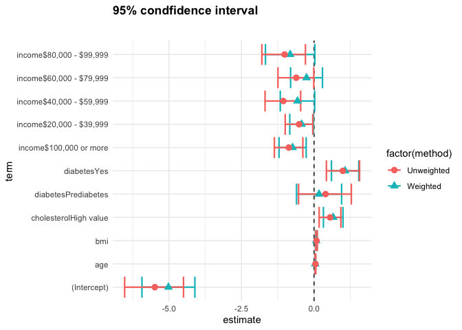

## Module 2: Factors that are associated with development of hypertension

Recall that our main questions of interest are:

  * Question 2.1: What factors measured in the NYC HANES survey are associated with having hypertension?
  * Question 2.2: How do we build a "good" model that tells us something about associations with hypertension as seen in this data set?
  * Question 2.3: How do our estimates from survey-weighted logistic regression differ from those where we ignore survey weights?


The data science learning objectives for this module include:

  * Understand the components of a data analysis report
  * Gain experience performing data cleaning, and assessing whether you have been successful
  * Practice selecting data visualizations that fit into the context of your statistical analysis

The statistical learning objectives for this module include:

  * Gain further experience with logistic regression and selecting an appropriate model for your question
  * Understand what a survey-weighted analysis is and how/when we perform one
  * Learn how to select survey weights for unbalanced data

## Reminder: What are the data?

For this case study, we will use data from the [New York City (NYC) Health and Nutrition Examination Survey (NYC HANES)](http://nychanes.org/){target="_blank"}, modeled on the [National Health and Nutrition Examination Survey (NHANES)](https://wwwn.cdc.gov/nchs/nhanes/default.aspx){target="_blank"}. NHANES is a population-based, cross-sectional study with data collected from a physical examination and laboratory tests, as well as a face-to-face interview and an audio computer-assisted self-interview (ACASI). It is designed to assess the health and nutritional status of adults and children in the United States. NYC HANES is a local version of NHANES, which implies it mainly focuses on the New York area. 


## Learning objectives for this week

Our main question of interest for this module is: Based on the data collected from NYC HANES, which risk factors play a role in development of hypertension?

This week, we will continue to work toward answering this by learning how to:

* Discuss your results and your initial approaches to model selection
* Explore the relationship between smoking and disease risk: why do we see the surprising patterns we see?
* Review survey weighting and how to determine what weight to use for your analysis, as needed
* Learn strategies for approaching model selection: how do you decide what variables to include in your model and how do you compare different models?

## Some odds and ends

#### Example of nicely formatted tables


<table class=" lightable-minimal lightable-striped lightable-hover" style='font-family: "Trebuchet MS", verdana, sans-serif; width: auto !important; float: left; margin-right: 10px;'>
<caption>Weighted logistic regression model examining the effect of race (compared to non-Hispanic white) on risk of hypertension, controlled for diet, activity, age and BMI</caption>
 <thead>
  <tr>
   <th style="text-align:right;"> Race </th>
   <th style="text-align:right;"> Odds Ratio </th>
   <th style="text-align:right;"> p-value </th>
   <th style="text-align:right;"> 95% confidence interval </th>
  </tr>
 </thead>
<tbody>
  <tr>
   <td style="text-align:right;"> N-H Black </td>
   <td style="text-align:right;"> 2.50 </td>
   <td style="text-align:right;"> 0.00 </td>
   <td style="text-align:right;"> (1.63, 3.818) </td>
  </tr>
  <tr>
   <td style="text-align:right;"> Hispanic </td>
   <td style="text-align:right;"> 1.48 </td>
   <td style="text-align:right;"> 0.07 </td>
   <td style="text-align:right;"> (0.97, 2.274) </td>
  </tr>
  <tr>
   <td style="text-align:right;"> Asian </td>
   <td style="text-align:right;"> 1.95 </td>
   <td style="text-align:right;"> 0.01 </td>
   <td style="text-align:right;"> (1.16, 3.286) </td>
  </tr>
  <tr>
   <td style="text-align:right;"> Other race </td>
   <td style="text-align:right;"> 1.27 </td>
   <td style="text-align:right;"> 0.50 </td>
   <td style="text-align:right;"> (0.63, 2.557) </td>
  </tr>
</tbody>
</table>

<table class=" lightable-minimal lightable-striped lightable-hover" style='font-family: "Trebuchet MS", verdana, sans-serif; width: auto !important; margin-right: 0; margin-left: auto'>
<caption>Weighted logistic regression model examining the effect of diet quality (compared to a poor diet) on risk of hypertension, controlled for race, activity, age and BMI</caption>
 <thead>
  <tr>
   <th style="text-align:right;"> Diet quality </th>
   <th style="text-align:right;"> Odds Ratio </th>
   <th style="text-align:right;"> p-value </th>
   <th style="text-align:right;"> 95% confidence interval </th>
  </tr>
 </thead>
<tbody>
  <tr>
   <td style="text-align:right;"> Fair </td>
   <td style="text-align:right;"> 1.26 </td>
   <td style="text-align:right;"> 0.53 </td>
   <td style="text-align:right;"> (0.62, 2.561) </td>
  </tr>
  <tr>
   <td style="text-align:right;"> Good </td>
   <td style="text-align:right;"> 1.23 </td>
   <td style="text-align:right;"> 0.56 </td>
   <td style="text-align:right;"> (0.61, 2.464) </td>
  </tr>
  <tr>
   <td style="text-align:right;"> Very good </td>
   <td style="text-align:right;"> 0.75 </td>
   <td style="text-align:right;"> 0.45 </td>
   <td style="text-align:right;"> (0.35, 1.589) </td>
  </tr>
  <tr>
   <td style="text-align:right;"> Excellent </td>
   <td style="text-align:right;"> 0.83 </td>
   <td style="text-align:right;"> 0.66 </td>
   <td style="text-align:right;"> (0.36, 1.919) </td>
  </tr>
</tbody>
</table>

<table class=" lightable-minimal lightable-striped lightable-hover" style='font-family: "Trebuchet MS", verdana, sans-serif; width: auto !important; margin-left: auto; margin-right: auto;'>
<caption>Weighted logistic regression model examining the effect of exposures on risk of hypertension, controlled for race and diet</caption>
 <thead>
  <tr>
   <th style="text-align:right;"> Exposure </th>
   <th style="text-align:right;"> Odds Ratio </th>
   <th style="text-align:right;"> p-value </th>
   <th style="text-align:right;"> 95% confidence interval </th>
  </tr>
 </thead>
<tbody>
  <tr>
   <td style="text-align:right;"> Vigorous activity </td>
   <td style="text-align:right;"> 1.11 </td>
   <td style="text-align:right;"> 0.53 </td>
   <td style="text-align:right;"> (0.8, 1.557) </td>
  </tr>
  <tr>
   <td style="text-align:right;"> One-year age increase </td>
   <td style="text-align:right;"> 1.06 </td>
   <td style="text-align:right;"> 0.00 </td>
   <td style="text-align:right;"> (1.05, 1.072) </td>
  </tr>
  <tr>
   <td style="text-align:right;"> One-unit BMI increase </td>
   <td style="text-align:right;"> 1.08 </td>
   <td style="text-align:right;"> 0.00 </td>
   <td style="text-align:right;"> (1.05, 1.112) </td>
  </tr>
</tbody>
</table>


### Model selection and prediction

On Monday we talked about three approaches to model selection: testing individual coefficients using individual p-values, testing a whole categorical variable using the `regTermTest` function (which allows us to compare nested models), and comparing non-nested models (fit on the same data set) using the AIC.

Important NOTE: Two AIC values can only be compared if the associated models were fit on the same data set. This means that you can't use AIC to compare the survey-weighted and unweighted model results directly because those two models use different input data because of the weights.

These tools are generally useful if we are building a model to perform "inference": to test specific hypotheses about how different variables relate to our outcome of interest.

Another purpose of statistical modeling is to perform "prediction": develop a model that will do a good job of predicting an outcome on a new data observation with good accuracy.


## Getting to Question 2.3

Recall Question 2.3: How do our estimates from survey-weighted logistic regression differ from those where we ignore survey weights?

To answer this, use your final model from your survey-weighted analysis and fit a standard (unweighted) logistic regression instead. How might you want to compare the results of these two models? A table? Some kind of visualization?

<center>

</center>

What are some aspects of this figure that you would like to change?

I'm including the code for generating a figure like this one here.


``` r
### survey-weighted logistic regression -- not including bmi
g1 <- svyglm(hypertension ~ 
               bmi + age + cholesterol + income + 
               diabetes,
              family = quasibinomial(link = 'logit'), 
             design = hypertension_design)

g1_res <- tidy(g1)
g1_res <- cbind(g1_res, confint(g1))

### unweighted logistic regression
g1_noWt <- glm(hypertension ~ 
               bmi + age + cholesterol + income + 
               diabetes,
              family = quasibinomial(link = 'logit'), data=hy_p_df)

g1_noWt_res <- tidy(g1_noWt)
g1_noWt_res <- cbind(g1_noWt_res, confint(g1_noWt))
```

To plot these results on the same plot, we need to combine these two results into one data frame, with some indicator of which results are which.


``` r
g1_res <- g1_res %>% mutate(method="Weighted")
g1_noWt_res <- g1_noWt_res %>% mutate(method="Unweighted")

g1_both<-rbind(g1_res, g1_noWt_res)
```

Here is an example of combining these results:


``` r
 g1_both %>% ggplot(aes(x = estimate, y = term),
     group_by(g1_both$method)) +
     geom_vline(xintercept = 0, linetype = "dashed") +
     geom_errorbarh(aes(estimate, term, xmin = `2.5 %`, 
     xmax = `97.5 %`, color = factor(method)), linewidth = 0.8)+
     geom_point(aes(color = factor(method),
                    shape = factor(method)),size = 3)+
    theme(axis.title.x = element_blank(),
    axis.title.y = element_blank()) +
    ggtitle(expression(atop(bold("95% condfidence interval"))))+
   theme_minimal()
```

```
## Warning in geom_errorbarh(aes(estimate, term, xmin = `2.5 %`, xmax = `97.5 %`,
## : Ignoring unknown aesthetics: x
```

<!-- -->

Note that this are not finalized -- it is just a suggestion to help get you started!


## Assignment 2.3

Refine your data display and survey-weighted analysis from last week with the NYC HANES data to answer Question 2.1: What factors measured in the NYC HANES survey are associated with having hypertension?

Think about connecting each table or visualization that you make with your downstream modeling choices. How do your displays point you toward the model you end up fitting? 

Then begin work on your model selection process (Question 2.2). Think about justifying each choice of variable in your model: can you use a visualization to do this? Look at significance of coefficients? Talk about how you are curious about a specific variable and how it influences hypertension? Assess the contribution of a particular variable using the `regTermTest` function? Compare models using AIC to decide on your final model?

Finally, start working on Question 2.3, comparing the survey-weighted results to those from an unweighted logisitic regression. What is an effective way of illustrating how the results compare?

* Submit your data display(s) and the code for your updated survey-weighted analysis in R Markdown through Github by Sunday March 9, 2025 at midnight.
* Post a screenshot of your revised data display (just the graph or table) and/or a summary table of your model results on Piazza in the "Assignment 2-3 Results" thread.  Add a sentence or two that describes what you have found so far.  You are welcome to post this anonymously to your classmates. You can also include comments about what your chose to do or questions you had as you were making the display and fitting your model.
* You may work together on this assignment, but you must submit your own data display; please credit in your assignment anyone with whom you collaborated.
* Next week in class we will continue with discussion/critiques of your model selection and comparisons.

## Looking ahead to your final projects


It is time to start thinking about your final projects, which will be the focus of the course after we wrap up Module 2. 

<center>

</center>

<center>

</center>

