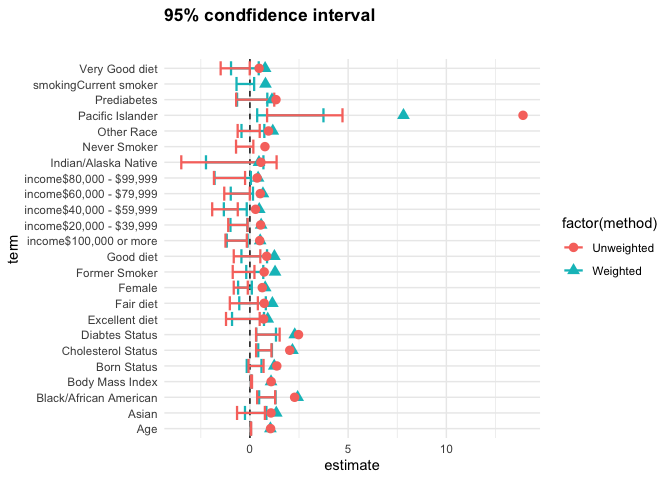
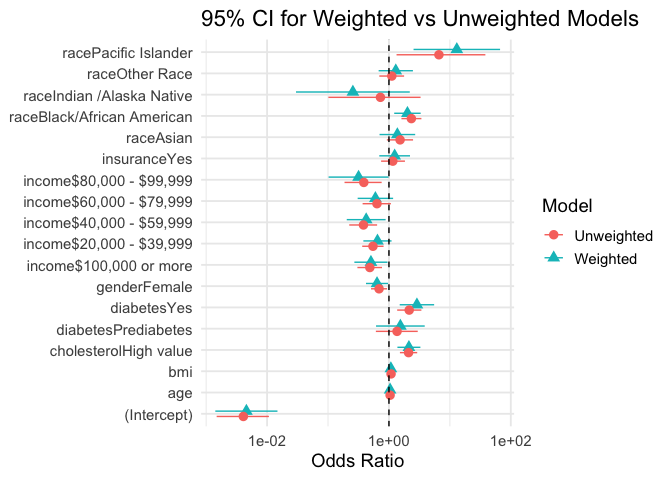
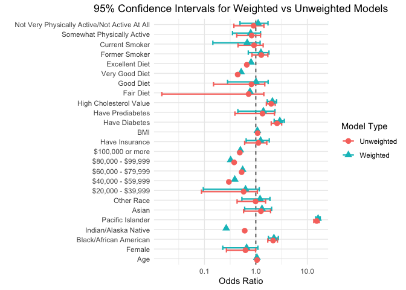
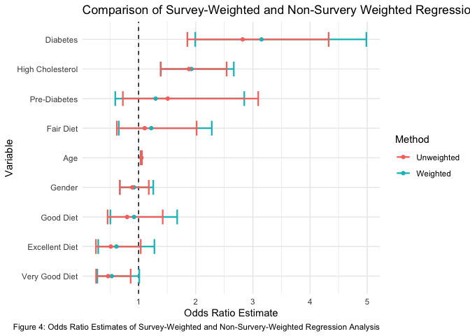
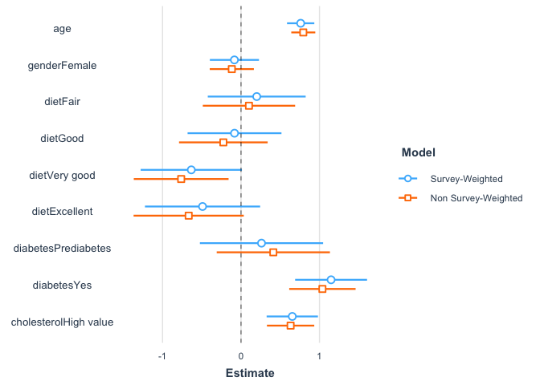
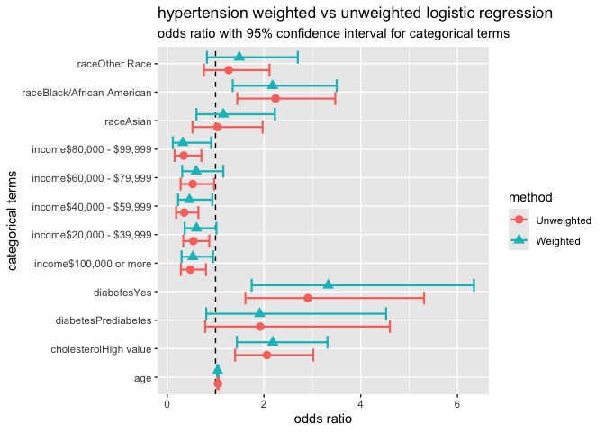
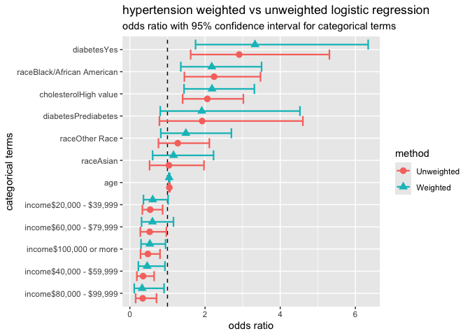
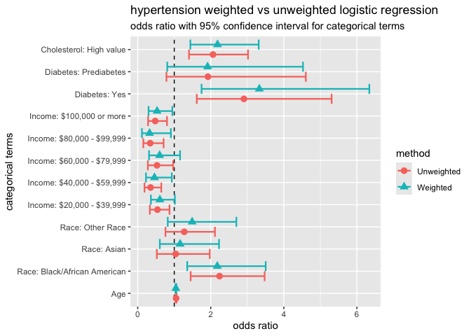

## Module 2: Factors that are associated with development of hypertension

Recall that our main questions of interest are:

  * Question 2.1: What factors measured in the NYC HANES survey are associated with having hypertension?
  * Question 2.2: How do we build a "good" model that tells us something about associations with hypertension as seen in this data set?
  * Question 2.3: How do our estimates from survey-weighted logistic regression differ from those where we ignore survey weights?


The data science learning objectives for this module include:

  * Understand the components of a data analysis report
  * Gain experience performing data cleaning, and assessing whether you have been successful
  * Practice selecting data visualizations that fit into the context of your statistical analysis

The statistical learning objectives for this module include:

  * Gain further experience with logistic regression and selecting an appropriate model for your question
  * Understand what a survey-weighted analysis is and how/when we perform one
  * Learn how to select survey weights for unbalanced data


## Reminder: What are the data?

For this case study, we will use data from the [New York City (NYC) Health and Nutrition Examination Survey (NYC HANES)](http://nychanes.org/){target="_blank"}, modeled on the [National Health and Nutrition Examination Survey (NHANES)](https://wwwn.cdc.gov/nchs/nhanes/default.aspx){target="_blank"}. NHANES is a population-based, cross-sectional study with data collected from a physical examination and laboratory tests, as well as a face-to-face interview and an audio computer-assisted self-interview (ACASI). It is designed to assess the health and nutritional status of adults and children in the United States. NYC HANES is a local version of NHANES, which implies it mainly focuses on the New York area. 


## Learning objectives for this week

Our main question of interest for this module is: Based on the data collected from NYC HANES, which risk factors play a role in development of hypertension?

Today, we will continue to work toward answering this by learning how to:

* Describe what makes an effective comparison of survey-weighted and unweighted model results and share some examples of tables and figures to help inspire you to improve your own visualizations
* Touch base on any questions about model selection and selecting the correct survey weights to use in your analysis.
* Review how to include inline R code and why it is useful.
* Discuss specific best practices for writing statistical results


Start by loading libraries and raw data set.

``` r
library(tidyverse)  
library(knitr)  
library(ggpubr)
library(ggrepel)
library(tidyverse)
library(kableExtra)
library(survey)
library(haven)
library(broom)
library(plotrix)
library(pander)
library(gridExtra)

dat <- read_sas('./module_2/data/d.sas7bdat')
```


## Getting to Question 2.3

Recall Question 2.3: How do our estimates from survey-weighted logistic regression differ from those where we ignore survey weights?

To answer this, use your final model from your survey-weighted analysis and fit a standard (unweighted) logistic regression instead. How might you want to compare the results of these two models? A table? Some kind of visualization?

Some of you posted examples of tables and figures in your work this week on Piazza. We will start with some group discussion of the figures you created as well as some additional examples from previous years.


### Example plots

In your groups, for each plot, discuss things that you like and things that you think could be improved. 


#### Example 1


```
## Warning in geom_errorbarh(aes(estimate, term, xmin = `2.5 %`, xmax = `97.5 %`,
## : Ignoring unknown aesthetics: x
```

<!-- -->

#### Example 2


```
## Warning in eval(family$initialize): non-integer #successes in a binomial glm!
```

<!-- -->

#### Example 3


```
## Warning in transformation$transform(x): NaNs produced
```

```
## Warning in scale_x_log10(): log-10 transformation introduced infinite values.
```

```
## Warning: Removed 15 rows containing missing values or values outside the scale range
## (`geom_errorbarh()`).
```

<!-- -->


#### Example 4

How do you think the variables on this plot are ordered? 

<!-- -->


#### Example 5

This example uses a function from the `jtools` package, which you can read more about [here](https://jtools.jacob-long.com){target="_blank"}. We also need to install the `ggstance` and `broom.mixed` packages to get this to work without an error. This function is powerful, but does sweep some things under the rug, so you might want to be careful using it. Once you have discussed how to improve the plot, see if you can figure out an additional argument to pass to the function to improve it.

<!-- -->


### An alternative: example tables

We know how to create nice tables of the model outputs from each method on its own.


``` r
### survey-weighted logistic regression
g1 <- svyglm(hypertension ~ 
               bmi + age + cholesterol + income + 
               diabetes,
              family = quasibinomial(link = 'logit'), 
             design = h_design_nona)

g1_res <- tidy(g1, exponentiate = TRUE, conf.int = TRUE)
```


``` r
pander(g1_res)
```


------------------------------------------------------------------------
          term             estimate   std.error   statistic    p.value  
------------------------- ---------- ----------- ----------- -----------
       (Intercept)         0.006814    0.4746      -10.51     7.78e-25  

           bmi               1.08      0.01311      5.834     6.862e-09 

           age              1.041     0.005317      7.471     1.477e-13 

  cholesterolHigh value     2.001      0.1754       3.955     8.088e-05 

 income$20,000 - $39,999    0.588      0.2115      -2.511      0.01216  

 income$40,000 - $59,999    0.5231     0.3042       -2.13      0.03333  

 income$60,000 - $79,999    0.6836      0.287      -1.325      0.1853   

 income$80,000 - $99,999    0.4167     0.4379      -1.999      0.04582  

 income$100,000 or more     0.4238     0.2442      -3.515     0.0004555 

   diabetesPrediabetes      1.157      0.3984      0.3654      0.7149   

       diabetesYes           2.61      0.2436       3.938     8.655e-05 
------------------------------------------------------------------------

Table: Table continues below

 
----------------------
 conf.low   conf.high 
---------- -----------
 0.002686    0.01729  

  1.052       1.108   

   1.03       1.051   

  1.418       2.822   

  0.3883     0.8903   

  0.288       0.95    

  0.3893       1.2    

  0.1765     0.9839   

  0.2625     0.6844   

  0.5294      2.527   

  1.618       4.208   
----------------------

We then want to fit the same model using un-weighted logistic regression: 


``` r
### unweighted logistic regression
g1_noWt <- glm(hypertension ~ 
               bmi + age + cholesterol + income + 
               diabetes,
              family = quasibinomial(link = 'logit'), data=hy_p_df)

g1_noWt_res <- tidy(g1_noWt, exponentiate = TRUE, conf.int = TRUE)
pander(g1_noWt_res)
```


------------------------------------------------------------------------
          term             estimate   std.error   statistic    p.value  
------------------------- ---------- ----------- ----------- -----------
       (Intercept)         0.005333    0.4371      -11.97     2.279e-31 

           bmi              1.087      0.0117       7.126     1.739e-12 

           age              1.043     0.004752       8.9      1.899e-18 

  cholesterolHigh value      1.94      0.1596       4.15      3.541e-05 

 income$20,000 - $39,999    0.5378     0.1982      -3.129     0.001793  

 income$40,000 - $59,999    0.4104     0.2559      -3.481     0.000517  

 income$60,000 - $79,999    0.6266     0.2614      -1.788      0.07395  

 income$80,000 - $99,999    0.3928     0.3388      -2.758     0.005895  

 income$100,000 or more     0.422      0.2182      -3.955     8.096e-05 

   diabetesPrediabetes       1.31      0.3811      0.7092      0.4783   

       diabetesYes           2.31      0.2222       3.769     0.0001713 
------------------------------------------------------------------------

Table: Table continues below

 
----------------------
 conf.low   conf.high 
---------- -----------
 0.002221    0.01234  

  1.063       1.113   

  1.034       1.053   

  1.417       2.651   

  0.3635     0.7912   

  0.2456     0.6713   

  0.3717      1.038   

  0.196      0.7446   

  0.2734     0.6438   

  0.6116      2.747   

  1.498       3.584   
----------------------


Now that we have both versions of the results, we can work on combining them in different ways to make some tables.

A couple of you posted an example of a table comparison on Piazza [here](https://piazza.com/class/lrh8j0ur7id7kt/post/42_f2){target="_blank"}, [here](https://piazza.com/class/lrh8j0ur7id7kt/post/42_f8){target="_blank"}  and [here](https://piazza.com/class/lrh8j0ur7id7kt/post/42_f6){target="_blank"}. What are some things that work well or could be improved with this set of tables?

To show the results in the same table, we want to start by joining the results from the two tables.

``` r
g1_join <- inner_join(g1_res, g1_noWt_res, by = "term", suffix = c(".Wt", ".noWt"))
```


This example includes some nice grouped labels for the weighted and unweighted results, using the `add_header_above` function from `kableExtra`:


``` r
tblcap.3 <- "Table 3: Comparison of weighted and unweighted results"
comp_tbl <- g1_join %>%
  select(term, `OR` = `estimate.Wt`,`Std Error` = `std.error.Wt`, `p-value` = `p.value.Wt`, `OR ` = `estimate.noWt`, `Std Error ` = `std.error.noWt`, `p-value ` = `p.value.noWt`) %>% 
  kable(format = "html",
        digits = 2,
        caption = tblcap.3) %>%
  add_header_above(c(" ","Survey Weighted" = 3, "Non-weighted" = 3))%>%
  kable_styling(full_width = TRUE)

comp_tbl
```

<table class="table" style="margin-left: auto; margin-right: auto;">
<caption>Table 3: Comparison of weighted and unweighted results</caption>
 <thead>
<tr>
<th style="empty-cells: hide;border-bottom:hidden;" colspan="1"></th>
<th style="border-bottom:hidden;padding-bottom:0; padding-left:3px;padding-right:3px;text-align: center; " colspan="3"><div style="border-bottom: 1px solid #ddd; padding-bottom: 5px; ">Survey Weighted</div></th>
<th style="border-bottom:hidden;padding-bottom:0; padding-left:3px;padding-right:3px;text-align: center; " colspan="3"><div style="border-bottom: 1px solid #ddd; padding-bottom: 5px; ">Non-weighted</div></th>
</tr>
  <tr>
   <th style="text-align:left;"> term </th>
   <th style="text-align:right;"> OR </th>
   <th style="text-align:right;"> Std Error </th>
   <th style="text-align:right;"> p-value </th>
   <th style="text-align:right;"> OR  </th>
   <th style="text-align:right;"> Std Error  </th>
   <th style="text-align:right;"> p-value  </th>
  </tr>
 </thead>
<tbody>
  <tr>
   <td style="text-align:left;"> (Intercept) </td>
   <td style="text-align:right;"> 0.01 </td>
   <td style="text-align:right;"> 0.47 </td>
   <td style="text-align:right;"> 0.00 </td>
   <td style="text-align:right;"> 0.01 </td>
   <td style="text-align:right;"> 0.44 </td>
   <td style="text-align:right;"> 0.00 </td>
  </tr>
  <tr>
   <td style="text-align:left;"> bmi </td>
   <td style="text-align:right;"> 1.08 </td>
   <td style="text-align:right;"> 0.01 </td>
   <td style="text-align:right;"> 0.00 </td>
   <td style="text-align:right;"> 1.09 </td>
   <td style="text-align:right;"> 0.01 </td>
   <td style="text-align:right;"> 0.00 </td>
  </tr>
  <tr>
   <td style="text-align:left;"> age </td>
   <td style="text-align:right;"> 1.04 </td>
   <td style="text-align:right;"> 0.01 </td>
   <td style="text-align:right;"> 0.00 </td>
   <td style="text-align:right;"> 1.04 </td>
   <td style="text-align:right;"> 0.00 </td>
   <td style="text-align:right;"> 0.00 </td>
  </tr>
  <tr>
   <td style="text-align:left;"> cholesterolHigh value </td>
   <td style="text-align:right;"> 2.00 </td>
   <td style="text-align:right;"> 0.18 </td>
   <td style="text-align:right;"> 0.00 </td>
   <td style="text-align:right;"> 1.94 </td>
   <td style="text-align:right;"> 0.16 </td>
   <td style="text-align:right;"> 0.00 </td>
  </tr>
  <tr>
   <td style="text-align:left;"> income$20,000 - $39,999 </td>
   <td style="text-align:right;"> 0.59 </td>
   <td style="text-align:right;"> 0.21 </td>
   <td style="text-align:right;"> 0.01 </td>
   <td style="text-align:right;"> 0.54 </td>
   <td style="text-align:right;"> 0.20 </td>
   <td style="text-align:right;"> 0.00 </td>
  </tr>
  <tr>
   <td style="text-align:left;"> income$40,000 - $59,999 </td>
   <td style="text-align:right;"> 0.52 </td>
   <td style="text-align:right;"> 0.30 </td>
   <td style="text-align:right;"> 0.03 </td>
   <td style="text-align:right;"> 0.41 </td>
   <td style="text-align:right;"> 0.26 </td>
   <td style="text-align:right;"> 0.00 </td>
  </tr>
  <tr>
   <td style="text-align:left;"> income$60,000 - $79,999 </td>
   <td style="text-align:right;"> 0.68 </td>
   <td style="text-align:right;"> 0.29 </td>
   <td style="text-align:right;"> 0.19 </td>
   <td style="text-align:right;"> 0.63 </td>
   <td style="text-align:right;"> 0.26 </td>
   <td style="text-align:right;"> 0.07 </td>
  </tr>
  <tr>
   <td style="text-align:left;"> income$80,000 - $99,999 </td>
   <td style="text-align:right;"> 0.42 </td>
   <td style="text-align:right;"> 0.44 </td>
   <td style="text-align:right;"> 0.05 </td>
   <td style="text-align:right;"> 0.39 </td>
   <td style="text-align:right;"> 0.34 </td>
   <td style="text-align:right;"> 0.01 </td>
  </tr>
  <tr>
   <td style="text-align:left;"> income$100,000 or more </td>
   <td style="text-align:right;"> 0.42 </td>
   <td style="text-align:right;"> 0.24 </td>
   <td style="text-align:right;"> 0.00 </td>
   <td style="text-align:right;"> 0.42 </td>
   <td style="text-align:right;"> 0.22 </td>
   <td style="text-align:right;"> 0.00 </td>
  </tr>
  <tr>
   <td style="text-align:left;"> diabetesPrediabetes </td>
   <td style="text-align:right;"> 1.16 </td>
   <td style="text-align:right;"> 0.40 </td>
   <td style="text-align:right;"> 0.71 </td>
   <td style="text-align:right;"> 1.31 </td>
   <td style="text-align:right;"> 0.38 </td>
   <td style="text-align:right;"> 0.48 </td>
  </tr>
  <tr>
   <td style="text-align:left;"> diabetesYes </td>
   <td style="text-align:right;"> 2.61 </td>
   <td style="text-align:right;"> 0.24 </td>
   <td style="text-align:right;"> 0.00 </td>
   <td style="text-align:right;"> 2.31 </td>
   <td style="text-align:right;"> 0.22 </td>
   <td style="text-align:right;"> 0.00 </td>
  </tr>
</tbody>
</table>

One thing I would like to improve about this table is the way the p-values are displayed as 0's. There are several approaches to changing this; I am showing one here using the `formatC` function.  You can see some further examples of how to play around with this [here](https://stackoverflow.com/questions/39623636/forcing-r-output-to-be-scientific-notation-with-at-most-two-decimals){target="_blank"}.


``` r
tblcap.3 <- "Table 3: Comparison of weighted and unweighted results"
comp_tbl <- g1_join %>%
  mutate(p.value.Wt = formatC(p.value.Wt, digits = 2, format = "g"), p.value.noWt = formatC(p.value.noWt, digits = 2, format = "g")) %>% 
  select(term, `OR` = `estimate.Wt`,`Std Error` = `std.error.Wt`, `p-value` = `p.value.Wt`, `OR ` = `estimate.noWt`, `Std Error ` = `std.error.noWt`, `p-value ` = `p.value.noWt`) %>% 
  kable(format = "html",
        digits = 2,
        caption = tblcap.3) %>%
  add_header_above(c(" ","Survey Weighted" = 3, "Non-weighted" = 3))%>%
  kable_styling(full_width = TRUE)

comp_tbl
```

<table class="table" style="margin-left: auto; margin-right: auto;">
<caption>Table 3: Comparison of weighted and unweighted results</caption>
 <thead>
<tr>
<th style="empty-cells: hide;border-bottom:hidden;" colspan="1"></th>
<th style="border-bottom:hidden;padding-bottom:0; padding-left:3px;padding-right:3px;text-align: center; " colspan="3"><div style="border-bottom: 1px solid #ddd; padding-bottom: 5px; ">Survey Weighted</div></th>
<th style="border-bottom:hidden;padding-bottom:0; padding-left:3px;padding-right:3px;text-align: center; " colspan="3"><div style="border-bottom: 1px solid #ddd; padding-bottom: 5px; ">Non-weighted</div></th>
</tr>
  <tr>
   <th style="text-align:left;"> term </th>
   <th style="text-align:right;"> OR </th>
   <th style="text-align:right;"> Std Error </th>
   <th style="text-align:left;"> p-value </th>
   <th style="text-align:right;"> OR  </th>
   <th style="text-align:right;"> Std Error  </th>
   <th style="text-align:left;"> p-value  </th>
  </tr>
 </thead>
<tbody>
  <tr>
   <td style="text-align:left;"> (Intercept) </td>
   <td style="text-align:right;"> 0.01 </td>
   <td style="text-align:right;"> 0.47 </td>
   <td style="text-align:left;"> 7.8e-25 </td>
   <td style="text-align:right;"> 0.01 </td>
   <td style="text-align:right;"> 0.44 </td>
   <td style="text-align:left;"> 2.3e-31 </td>
  </tr>
  <tr>
   <td style="text-align:left;"> bmi </td>
   <td style="text-align:right;"> 1.08 </td>
   <td style="text-align:right;"> 0.01 </td>
   <td style="text-align:left;"> 6.9e-09 </td>
   <td style="text-align:right;"> 1.09 </td>
   <td style="text-align:right;"> 0.01 </td>
   <td style="text-align:left;"> 1.7e-12 </td>
  </tr>
  <tr>
   <td style="text-align:left;"> age </td>
   <td style="text-align:right;"> 1.04 </td>
   <td style="text-align:right;"> 0.01 </td>
   <td style="text-align:left;"> 1.5e-13 </td>
   <td style="text-align:right;"> 1.04 </td>
   <td style="text-align:right;"> 0.00 </td>
   <td style="text-align:left;"> 1.9e-18 </td>
  </tr>
  <tr>
   <td style="text-align:left;"> cholesterolHigh value </td>
   <td style="text-align:right;"> 2.00 </td>
   <td style="text-align:right;"> 0.18 </td>
   <td style="text-align:left;"> 8.1e-05 </td>
   <td style="text-align:right;"> 1.94 </td>
   <td style="text-align:right;"> 0.16 </td>
   <td style="text-align:left;"> 3.5e-05 </td>
  </tr>
  <tr>
   <td style="text-align:left;"> income$20,000 - $39,999 </td>
   <td style="text-align:right;"> 0.59 </td>
   <td style="text-align:right;"> 0.21 </td>
   <td style="text-align:left;"> 0.012 </td>
   <td style="text-align:right;"> 0.54 </td>
   <td style="text-align:right;"> 0.20 </td>
   <td style="text-align:left;"> 0.0018 </td>
  </tr>
  <tr>
   <td style="text-align:left;"> income$40,000 - $59,999 </td>
   <td style="text-align:right;"> 0.52 </td>
   <td style="text-align:right;"> 0.30 </td>
   <td style="text-align:left;"> 0.033 </td>
   <td style="text-align:right;"> 0.41 </td>
   <td style="text-align:right;"> 0.26 </td>
   <td style="text-align:left;"> 0.00052 </td>
  </tr>
  <tr>
   <td style="text-align:left;"> income$60,000 - $79,999 </td>
   <td style="text-align:right;"> 0.68 </td>
   <td style="text-align:right;"> 0.29 </td>
   <td style="text-align:left;"> 0.19 </td>
   <td style="text-align:right;"> 0.63 </td>
   <td style="text-align:right;"> 0.26 </td>
   <td style="text-align:left;"> 0.074 </td>
  </tr>
  <tr>
   <td style="text-align:left;"> income$80,000 - $99,999 </td>
   <td style="text-align:right;"> 0.42 </td>
   <td style="text-align:right;"> 0.44 </td>
   <td style="text-align:left;"> 0.046 </td>
   <td style="text-align:right;"> 0.39 </td>
   <td style="text-align:right;"> 0.34 </td>
   <td style="text-align:left;"> 0.0059 </td>
  </tr>
  <tr>
   <td style="text-align:left;"> income$100,000 or more </td>
   <td style="text-align:right;"> 0.42 </td>
   <td style="text-align:right;"> 0.24 </td>
   <td style="text-align:left;"> 0.00046 </td>
   <td style="text-align:right;"> 0.42 </td>
   <td style="text-align:right;"> 0.22 </td>
   <td style="text-align:left;"> 8.1e-05 </td>
  </tr>
  <tr>
   <td style="text-align:left;"> diabetesPrediabetes </td>
   <td style="text-align:right;"> 1.16 </td>
   <td style="text-align:right;"> 0.40 </td>
   <td style="text-align:left;"> 0.71 </td>
   <td style="text-align:right;"> 1.31 </td>
   <td style="text-align:right;"> 0.38 </td>
   <td style="text-align:left;"> 0.48 </td>
  </tr>
  <tr>
   <td style="text-align:left;"> diabetesYes </td>
   <td style="text-align:right;"> 2.61 </td>
   <td style="text-align:right;"> 0.24 </td>
   <td style="text-align:left;"> 8.7e-05 </td>
   <td style="text-align:right;"> 2.31 </td>
   <td style="text-align:right;"> 0.22 </td>
   <td style="text-align:left;"> 0.00017 </td>
  </tr>
</tbody>
</table>

Here is a similar example that also includes a difference in the odds ratios:

<table class="table" style="margin-left: auto; margin-right: auto;">
<caption>Table 3: Comparison of Weighted and Unweighted Modeling Results</caption>
 <thead>
<tr>
<th style="empty-cells: hide;border-bottom:hidden;" colspan="1"></th>
<th style="border-bottom:hidden;padding-bottom:0; padding-left:3px;padding-right:3px;text-align: center; " colspan="3"><div style="border-bottom: 1px solid #ddd; padding-bottom: 5px; ">Survery Weighted</div></th>
<th style="border-bottom:hidden;padding-bottom:0; padding-left:3px;padding-right:3px;text-align: center; " colspan="3"><div style="border-bottom: 1px solid #ddd; padding-bottom: 5px; ">Non-Weighted</div></th>
<th style="empty-cells: hide;border-bottom:hidden;" colspan="1"></th>
</tr>
  <tr>
   <th style="text-align:left;"> Term </th>
   <th style="text-align:right;"> Odds Ratio </th>
   <th style="text-align:left;"> P-Value </th>
   <th style="text-align:left;"> 95% Confidence Interval </th>
   <th style="text-align:right;"> Odds Ratio  </th>
   <th style="text-align:left;"> P-Value  </th>
   <th style="text-align:left;"> 95% Confidence Interval  </th>
   <th style="text-align:right;"> Difference </th>
  </tr>
 </thead>
<tbody>
  <tr>
   <td style="text-align:left;"> Age </td>
   <td style="text-align:right;"> 1.046 </td>
   <td style="text-align:left;"> 2.89e-17 </td>
   <td style="text-align:left;"> (1.04, 1.06) </td>
   <td style="text-align:right;"> 1.049 </td>
   <td style="text-align:left;"> 2.20e-23 </td>
   <td style="text-align:left;"> (1.04, 1.06) </td>
   <td style="text-align:right;"> 0.004 </td>
  </tr>
  <tr>
   <td style="text-align:left;"> Gender </td>
   <td style="text-align:right;"> 0.919 </td>
   <td style="text-align:left;"> 5.98e-01 </td>
   <td style="text-align:left;"> (0.67, 1.26) </td>
   <td style="text-align:right;"> 0.889 </td>
   <td style="text-align:left;"> 4.13e-01 </td>
   <td style="text-align:left;"> (0.67, 1.18) </td>
   <td style="text-align:right;"> 0.030 </td>
  </tr>
  <tr>
   <td style="text-align:left;"> Fair Diet </td>
   <td style="text-align:right;"> 1.221 </td>
   <td style="text-align:left;"> 5.30e-01 </td>
   <td style="text-align:left;"> (0.65, 2.28) </td>
   <td style="text-align:right;"> 1.107 </td>
   <td style="text-align:left;"> 7.36e-01 </td>
   <td style="text-align:left;"> (0.62, 2.02) </td>
   <td style="text-align:right;"> 0.115 </td>
  </tr>
  <tr>
   <td style="text-align:left;"> Good Diet </td>
   <td style="text-align:right;"> 0.921 </td>
   <td style="text-align:left;"> 7.86e-01 </td>
   <td style="text-align:left;"> (0.51, 1.68) </td>
   <td style="text-align:right;"> 0.798 </td>
   <td style="text-align:left;"> 4.35e-01 </td>
   <td style="text-align:left;"> (0.46, 1.42) </td>
   <td style="text-align:right;"> 0.122 </td>
  </tr>
  <tr>
   <td style="text-align:left;"> Very Good Diet </td>
   <td style="text-align:right;"> 0.531 </td>
   <td style="text-align:left;"> 5.45e-02 </td>
   <td style="text-align:left;"> (0.28, 1.01) </td>
   <td style="text-align:right;"> 0.466 </td>
   <td style="text-align:left;"> 1.35e-02 </td>
   <td style="text-align:left;"> (0.26, 0.86) </td>
   <td style="text-align:right;"> 0.064 </td>
  </tr>
  <tr>
   <td style="text-align:left;"> Excellent Diet </td>
   <td style="text-align:right;"> 0.612 </td>
   <td style="text-align:left;"> 1.91e-01 </td>
   <td style="text-align:left;"> (0.29, 1.28) </td>
   <td style="text-align:right;"> 0.513 </td>
   <td style="text-align:left;"> 6.29e-02 </td>
   <td style="text-align:left;"> (0.25, 1.04) </td>
   <td style="text-align:right;"> 0.099 </td>
  </tr>
  <tr>
   <td style="text-align:left;"> Pre-Diabetes </td>
   <td style="text-align:right;"> 1.298 </td>
   <td style="text-align:left;"> 5.15e-01 </td>
   <td style="text-align:left;"> (0.59, 2.85) </td>
   <td style="text-align:right;"> 1.509 </td>
   <td style="text-align:left;"> 2.64e-01 </td>
   <td style="text-align:left;"> (0.72, 3.09) </td>
   <td style="text-align:right;"> 0.211 </td>
  </tr>
  <tr>
   <td style="text-align:left;"> Diabetes </td>
   <td style="text-align:right;"> 3.151 </td>
   <td style="text-align:left;"> 1.04e-06 </td>
   <td style="text-align:left;"> (1.99, 4.99) </td>
   <td style="text-align:right;"> 2.821 </td>
   <td style="text-align:left;"> 1.73e-06 </td>
   <td style="text-align:left;"> (1.85, 4.33) </td>
   <td style="text-align:right;"> 0.330 </td>
  </tr>
  <tr>
   <td style="text-align:left;"> High Cholesterol </td>
   <td style="text-align:right;"> 1.922 </td>
   <td style="text-align:left;"> 9.43e-05 </td>
   <td style="text-align:left;"> (1.39, 2.67) </td>
   <td style="text-align:right;"> 1.881 </td>
   <td style="text-align:left;"> 4.25e-05 </td>
   <td style="text-align:left;"> (1.39, 2.54) </td>
   <td style="text-align:right;"> 0.041 </td>
  </tr>
</tbody>
</table>
 


There is another package that makes really nice looking tables, the package `gtsummary`, with the function `tbl_regression`. It is a little fidgety with the variable names for some reason, but the tables also include the baseline levels of the variables, for example, which is quite useful. There is a tutorial about how to use this package [here](https://cran.r-project.org/web/packages/gtsummary/vignettes/tbl_regression.html){target="_blank"}.


``` r
library(gtsummary)

tbl1<-tbl_regression(g1, exponentiate = TRUE, label = list(age = "age", bmi = "bmi"))%>%
  bold_labels()%>%
  bold_p()


tbl2<-tbl_regression(g1_noWt, exponentiate=TRUE, label = list(age = "age", bmi = "bmi"))%>%
  bold_labels()%>%
  bold_p()

tbl_merged <-
  tbl_merge(
    tbls = list(tbl1, tbl2),
    tab_spanner = c("**Survey Weighted**", "**Unweighted**")
  )

tbl_merged
```

```{=html}
<div id="gouibgpgpg" style="padding-left:0px;padding-right:0px;padding-top:10px;padding-bottom:10px;overflow-x:auto;overflow-y:auto;width:auto;height:auto;">
<style>#gouibgpgpg table {
  font-family: system-ui, 'Segoe UI', Roboto, Helvetica, Arial, sans-serif, 'Apple Color Emoji', 'Segoe UI Emoji', 'Segoe UI Symbol', 'Noto Color Emoji';
  -webkit-font-smoothing: antialiased;
  -moz-osx-font-smoothing: grayscale;
}

#gouibgpgpg thead, #gouibgpgpg tbody, #gouibgpgpg tfoot, #gouibgpgpg tr, #gouibgpgpg td, #gouibgpgpg th {
  border-style: none;
}

#gouibgpgpg p {
  margin: 0;
  padding: 0;
}

#gouibgpgpg .gt_table {
  display: table;
  border-collapse: collapse;
  line-height: normal;
  margin-left: auto;
  margin-right: auto;
  color: #333333;
  font-size: 16px;
  font-weight: normal;
  font-style: normal;
  background-color: #FFFFFF;
  width: auto;
  border-top-style: solid;
  border-top-width: 2px;
  border-top-color: #A8A8A8;
  border-right-style: none;
  border-right-width: 2px;
  border-right-color: #D3D3D3;
  border-bottom-style: solid;
  border-bottom-width: 2px;
  border-bottom-color: #A8A8A8;
  border-left-style: none;
  border-left-width: 2px;
  border-left-color: #D3D3D3;
}

#gouibgpgpg .gt_caption {
  padding-top: 4px;
  padding-bottom: 4px;
}

#gouibgpgpg .gt_title {
  color: #333333;
  font-size: 125%;
  font-weight: initial;
  padding-top: 4px;
  padding-bottom: 4px;
  padding-left: 5px;
  padding-right: 5px;
  border-bottom-color: #FFFFFF;
  border-bottom-width: 0;
}

#gouibgpgpg .gt_subtitle {
  color: #333333;
  font-size: 85%;
  font-weight: initial;
  padding-top: 3px;
  padding-bottom: 5px;
  padding-left: 5px;
  padding-right: 5px;
  border-top-color: #FFFFFF;
  border-top-width: 0;
}

#gouibgpgpg .gt_heading {
  background-color: #FFFFFF;
  text-align: center;
  border-bottom-color: #FFFFFF;
  border-left-style: none;
  border-left-width: 1px;
  border-left-color: #D3D3D3;
  border-right-style: none;
  border-right-width: 1px;
  border-right-color: #D3D3D3;
}

#gouibgpgpg .gt_bottom_border {
  border-bottom-style: solid;
  border-bottom-width: 2px;
  border-bottom-color: #D3D3D3;
}

#gouibgpgpg .gt_col_headings {
  border-top-style: solid;
  border-top-width: 2px;
  border-top-color: #D3D3D3;
  border-bottom-style: solid;
  border-bottom-width: 2px;
  border-bottom-color: #D3D3D3;
  border-left-style: none;
  border-left-width: 1px;
  border-left-color: #D3D3D3;
  border-right-style: none;
  border-right-width: 1px;
  border-right-color: #D3D3D3;
}

#gouibgpgpg .gt_col_heading {
  color: #333333;
  background-color: #FFFFFF;
  font-size: 100%;
  font-weight: normal;
  text-transform: inherit;
  border-left-style: none;
  border-left-width: 1px;
  border-left-color: #D3D3D3;
  border-right-style: none;
  border-right-width: 1px;
  border-right-color: #D3D3D3;
  vertical-align: bottom;
  padding-top: 5px;
  padding-bottom: 6px;
  padding-left: 5px;
  padding-right: 5px;
  overflow-x: hidden;
}

#gouibgpgpg .gt_column_spanner_outer {
  color: #333333;
  background-color: #FFFFFF;
  font-size: 100%;
  font-weight: normal;
  text-transform: inherit;
  padding-top: 0;
  padding-bottom: 0;
  padding-left: 4px;
  padding-right: 4px;
}

#gouibgpgpg .gt_column_spanner_outer:first-child {
  padding-left: 0;
}

#gouibgpgpg .gt_column_spanner_outer:last-child {
  padding-right: 0;
}

#gouibgpgpg .gt_column_spanner {
  border-bottom-style: solid;
  border-bottom-width: 2px;
  border-bottom-color: #D3D3D3;
  vertical-align: bottom;
  padding-top: 5px;
  padding-bottom: 5px;
  overflow-x: hidden;
  display: inline-block;
  width: 100%;
}

#gouibgpgpg .gt_spanner_row {
  border-bottom-style: hidden;
}

#gouibgpgpg .gt_group_heading {
  padding-top: 8px;
  padding-bottom: 8px;
  padding-left: 5px;
  padding-right: 5px;
  color: #333333;
  background-color: #FFFFFF;
  font-size: 100%;
  font-weight: initial;
  text-transform: inherit;
  border-top-style: solid;
  border-top-width: 2px;
  border-top-color: #D3D3D3;
  border-bottom-style: solid;
  border-bottom-width: 2px;
  border-bottom-color: #D3D3D3;
  border-left-style: none;
  border-left-width: 1px;
  border-left-color: #D3D3D3;
  border-right-style: none;
  border-right-width: 1px;
  border-right-color: #D3D3D3;
  vertical-align: middle;
  text-align: left;
}

#gouibgpgpg .gt_empty_group_heading {
  padding: 0.5px;
  color: #333333;
  background-color: #FFFFFF;
  font-size: 100%;
  font-weight: initial;
  border-top-style: solid;
  border-top-width: 2px;
  border-top-color: #D3D3D3;
  border-bottom-style: solid;
  border-bottom-width: 2px;
  border-bottom-color: #D3D3D3;
  vertical-align: middle;
}

#gouibgpgpg .gt_from_md > :first-child {
  margin-top: 0;
}

#gouibgpgpg .gt_from_md > :last-child {
  margin-bottom: 0;
}

#gouibgpgpg .gt_row {
  padding-top: 8px;
  padding-bottom: 8px;
  padding-left: 5px;
  padding-right: 5px;
  margin: 10px;
  border-top-style: solid;
  border-top-width: 1px;
  border-top-color: #D3D3D3;
  border-left-style: none;
  border-left-width: 1px;
  border-left-color: #D3D3D3;
  border-right-style: none;
  border-right-width: 1px;
  border-right-color: #D3D3D3;
  vertical-align: middle;
  overflow-x: hidden;
}

#gouibgpgpg .gt_stub {
  color: #333333;
  background-color: #FFFFFF;
  font-size: 100%;
  font-weight: initial;
  text-transform: inherit;
  border-right-style: solid;
  border-right-width: 2px;
  border-right-color: #D3D3D3;
  padding-left: 5px;
  padding-right: 5px;
}

#gouibgpgpg .gt_stub_row_group {
  color: #333333;
  background-color: #FFFFFF;
  font-size: 100%;
  font-weight: initial;
  text-transform: inherit;
  border-right-style: solid;
  border-right-width: 2px;
  border-right-color: #D3D3D3;
  padding-left: 5px;
  padding-right: 5px;
  vertical-align: top;
}

#gouibgpgpg .gt_row_group_first td {
  border-top-width: 2px;
}

#gouibgpgpg .gt_row_group_first th {
  border-top-width: 2px;
}

#gouibgpgpg .gt_summary_row {
  color: #333333;
  background-color: #FFFFFF;
  text-transform: inherit;
  padding-top: 8px;
  padding-bottom: 8px;
  padding-left: 5px;
  padding-right: 5px;
}

#gouibgpgpg .gt_first_summary_row {
  border-top-style: solid;
  border-top-color: #D3D3D3;
}

#gouibgpgpg .gt_first_summary_row.thick {
  border-top-width: 2px;
}

#gouibgpgpg .gt_last_summary_row {
  padding-top: 8px;
  padding-bottom: 8px;
  padding-left: 5px;
  padding-right: 5px;
  border-bottom-style: solid;
  border-bottom-width: 2px;
  border-bottom-color: #D3D3D3;
}

#gouibgpgpg .gt_grand_summary_row {
  color: #333333;
  background-color: #FFFFFF;
  text-transform: inherit;
  padding-top: 8px;
  padding-bottom: 8px;
  padding-left: 5px;
  padding-right: 5px;
}

#gouibgpgpg .gt_first_grand_summary_row {
  padding-top: 8px;
  padding-bottom: 8px;
  padding-left: 5px;
  padding-right: 5px;
  border-top-style: double;
  border-top-width: 6px;
  border-top-color: #D3D3D3;
}

#gouibgpgpg .gt_last_grand_summary_row_top {
  padding-top: 8px;
  padding-bottom: 8px;
  padding-left: 5px;
  padding-right: 5px;
  border-bottom-style: double;
  border-bottom-width: 6px;
  border-bottom-color: #D3D3D3;
}

#gouibgpgpg .gt_striped {
  background-color: rgba(128, 128, 128, 0.05);
}

#gouibgpgpg .gt_table_body {
  border-top-style: solid;
  border-top-width: 2px;
  border-top-color: #D3D3D3;
  border-bottom-style: solid;
  border-bottom-width: 2px;
  border-bottom-color: #D3D3D3;
}

#gouibgpgpg .gt_footnotes {
  color: #333333;
  background-color: #FFFFFF;
  border-bottom-style: none;
  border-bottom-width: 2px;
  border-bottom-color: #D3D3D3;
  border-left-style: none;
  border-left-width: 2px;
  border-left-color: #D3D3D3;
  border-right-style: none;
  border-right-width: 2px;
  border-right-color: #D3D3D3;
}

#gouibgpgpg .gt_footnote {
  margin: 0px;
  font-size: 90%;
  padding-top: 4px;
  padding-bottom: 4px;
  padding-left: 5px;
  padding-right: 5px;
}

#gouibgpgpg .gt_sourcenotes {
  color: #333333;
  background-color: #FFFFFF;
  border-bottom-style: none;
  border-bottom-width: 2px;
  border-bottom-color: #D3D3D3;
  border-left-style: none;
  border-left-width: 2px;
  border-left-color: #D3D3D3;
  border-right-style: none;
  border-right-width: 2px;
  border-right-color: #D3D3D3;
}

#gouibgpgpg .gt_sourcenote {
  font-size: 90%;
  padding-top: 4px;
  padding-bottom: 4px;
  padding-left: 5px;
  padding-right: 5px;
}

#gouibgpgpg .gt_left {
  text-align: left;
}

#gouibgpgpg .gt_center {
  text-align: center;
}

#gouibgpgpg .gt_right {
  text-align: right;
  font-variant-numeric: tabular-nums;
}

#gouibgpgpg .gt_font_normal {
  font-weight: normal;
}

#gouibgpgpg .gt_font_bold {
  font-weight: bold;
}

#gouibgpgpg .gt_font_italic {
  font-style: italic;
}

#gouibgpgpg .gt_super {
  font-size: 65%;
}

#gouibgpgpg .gt_footnote_marks {
  font-size: 75%;
  vertical-align: 0.4em;
  position: initial;
}

#gouibgpgpg .gt_asterisk {
  font-size: 100%;
  vertical-align: 0;
}

#gouibgpgpg .gt_indent_1 {
  text-indent: 5px;
}

#gouibgpgpg .gt_indent_2 {
  text-indent: 10px;
}

#gouibgpgpg .gt_indent_3 {
  text-indent: 15px;
}

#gouibgpgpg .gt_indent_4 {
  text-indent: 20px;
}

#gouibgpgpg .gt_indent_5 {
  text-indent: 25px;
}

#gouibgpgpg .katex-display {
  display: inline-flex !important;
  margin-bottom: 0.75em !important;
}

#gouibgpgpg div.Reactable > div.rt-table > div.rt-thead > div.rt-tr.rt-tr-group-header > div.rt-th-group:after {
  height: 0px !important;
}
</style>
<table class="gt_table" data-quarto-disable-processing="false" data-quarto-bootstrap="false">
  <thead>
    <tr class="gt_col_headings gt_spanner_row">
      <th class="gt_col_heading gt_columns_bottom_border gt_left" rowspan="2" colspan="1" scope="col" id="label"><span class='gt_from_md'><strong>Characteristic</strong></span></th>
      <th class="gt_center gt_columns_top_border gt_column_spanner_outer" rowspan="1" colspan="3" scope="colgroup" id="level 1; estimate_1">
        <div class="gt_column_spanner"><span class='gt_from_md'><strong>Survey Weighted</strong></span></div>
      </th>
      <th class="gt_center gt_columns_top_border gt_column_spanner_outer" rowspan="1" colspan="3" scope="colgroup" id="level 1; estimate_2">
        <div class="gt_column_spanner"><span class='gt_from_md'><strong>Unweighted</strong></span></div>
      </th>
    </tr>
    <tr class="gt_col_headings">
      <th class="gt_col_heading gt_columns_bottom_border gt_center" rowspan="1" colspan="1" scope="col" id="estimate_1"><span class='gt_from_md'><strong>OR</strong></span></th>
      <th class="gt_col_heading gt_columns_bottom_border gt_center" rowspan="1" colspan="1" scope="col" id="conf.low_1"><span class='gt_from_md'><strong>95% CI</strong></span></th>
      <th class="gt_col_heading gt_columns_bottom_border gt_center" rowspan="1" colspan="1" scope="col" id="p.value_1"><span class='gt_from_md'><strong>p-value</strong></span></th>
      <th class="gt_col_heading gt_columns_bottom_border gt_center" rowspan="1" colspan="1" scope="col" id="estimate_2"><span class='gt_from_md'><strong>OR</strong></span></th>
      <th class="gt_col_heading gt_columns_bottom_border gt_center" rowspan="1" colspan="1" scope="col" id="conf.low_2"><span class='gt_from_md'><strong>95% CI</strong></span></th>
      <th class="gt_col_heading gt_columns_bottom_border gt_center" rowspan="1" colspan="1" scope="col" id="p.value_2"><span class='gt_from_md'><strong>p-value</strong></span></th>
    </tr>
  </thead>
  <tbody class="gt_table_body">
    <tr><td headers="label" class="gt_row gt_left" style="font-weight: bold;">bmi</td>
<td headers="estimate_1" class="gt_row gt_center">1.08</td>
<td headers="conf.low_1" class="gt_row gt_center">1.05, 1.11</td>
<td headers="p.value_1" class="gt_row gt_center" style="font-weight: bold;"><0.001</td>
<td headers="estimate_2" class="gt_row gt_center">1.09</td>
<td headers="conf.low_2" class="gt_row gt_center">1.06, 1.11</td>
<td headers="p.value_2" class="gt_row gt_center" style="font-weight: bold;"><0.001</td></tr>
    <tr><td headers="label" class="gt_row gt_left" style="font-weight: bold;">age</td>
<td headers="estimate_1" class="gt_row gt_center">1.04</td>
<td headers="conf.low_1" class="gt_row gt_center">1.03, 1.05</td>
<td headers="p.value_1" class="gt_row gt_center" style="font-weight: bold;"><0.001</td>
<td headers="estimate_2" class="gt_row gt_center">1.04</td>
<td headers="conf.low_2" class="gt_row gt_center">1.03, 1.05</td>
<td headers="p.value_2" class="gt_row gt_center" style="font-weight: bold;"><0.001</td></tr>
    <tr><td headers="label" class="gt_row gt_left" style="font-weight: bold;">cholesterol</td>
<td headers="estimate_1" class="gt_row gt_center"><br /></td>
<td headers="conf.low_1" class="gt_row gt_center"><br /></td>
<td headers="p.value_1" class="gt_row gt_center"><br /></td>
<td headers="estimate_2" class="gt_row gt_center"><br /></td>
<td headers="conf.low_2" class="gt_row gt_center"><br /></td>
<td headers="p.value_2" class="gt_row gt_center"><br /></td></tr>
    <tr><td headers="label" class="gt_row gt_left">    Low value</td>
<td headers="estimate_1" class="gt_row gt_center">—</td>
<td headers="conf.low_1" class="gt_row gt_center">—</td>
<td headers="p.value_1" class="gt_row gt_center"><br /></td>
<td headers="estimate_2" class="gt_row gt_center">—</td>
<td headers="conf.low_2" class="gt_row gt_center">—</td>
<td headers="p.value_2" class="gt_row gt_center"><br /></td></tr>
    <tr><td headers="label" class="gt_row gt_left">    High value</td>
<td headers="estimate_1" class="gt_row gt_center">2.00</td>
<td headers="conf.low_1" class="gt_row gt_center">1.42, 2.82</td>
<td headers="p.value_1" class="gt_row gt_center" style="font-weight: bold;"><0.001</td>
<td headers="estimate_2" class="gt_row gt_center">1.94</td>
<td headers="conf.low_2" class="gt_row gt_center">1.42, 2.65</td>
<td headers="p.value_2" class="gt_row gt_center" style="font-weight: bold;"><0.001</td></tr>
    <tr><td headers="label" class="gt_row gt_left" style="font-weight: bold;">income</td>
<td headers="estimate_1" class="gt_row gt_center"><br /></td>
<td headers="conf.low_1" class="gt_row gt_center"><br /></td>
<td headers="p.value_1" class="gt_row gt_center"><br /></td>
<td headers="estimate_2" class="gt_row gt_center"><br /></td>
<td headers="conf.low_2" class="gt_row gt_center"><br /></td>
<td headers="p.value_2" class="gt_row gt_center"><br /></td></tr>
    <tr><td headers="label" class="gt_row gt_left">    Less than $20,000</td>
<td headers="estimate_1" class="gt_row gt_center">—</td>
<td headers="conf.low_1" class="gt_row gt_center">—</td>
<td headers="p.value_1" class="gt_row gt_center"><br /></td>
<td headers="estimate_2" class="gt_row gt_center">—</td>
<td headers="conf.low_2" class="gt_row gt_center">—</td>
<td headers="p.value_2" class="gt_row gt_center"><br /></td></tr>
    <tr><td headers="label" class="gt_row gt_left">    $20,000 - $39,999</td>
<td headers="estimate_1" class="gt_row gt_center">0.59</td>
<td headers="conf.low_1" class="gt_row gt_center">0.39, 0.89</td>
<td headers="p.value_1" class="gt_row gt_center" style="font-weight: bold;">0.012</td>
<td headers="estimate_2" class="gt_row gt_center">0.54</td>
<td headers="conf.low_2" class="gt_row gt_center">0.36, 0.79</td>
<td headers="p.value_2" class="gt_row gt_center" style="font-weight: bold;">0.002</td></tr>
    <tr><td headers="label" class="gt_row gt_left">    $40,000 - $59,999</td>
<td headers="estimate_1" class="gt_row gt_center">0.52</td>
<td headers="conf.low_1" class="gt_row gt_center">0.29, 0.95</td>
<td headers="p.value_1" class="gt_row gt_center" style="font-weight: bold;">0.033</td>
<td headers="estimate_2" class="gt_row gt_center">0.41</td>
<td headers="conf.low_2" class="gt_row gt_center">0.25, 0.67</td>
<td headers="p.value_2" class="gt_row gt_center" style="font-weight: bold;"><0.001</td></tr>
    <tr><td headers="label" class="gt_row gt_left">    $60,000 - $79,999</td>
<td headers="estimate_1" class="gt_row gt_center">0.68</td>
<td headers="conf.low_1" class="gt_row gt_center">0.39, 1.20</td>
<td headers="p.value_1" class="gt_row gt_center">0.2</td>
<td headers="estimate_2" class="gt_row gt_center">0.63</td>
<td headers="conf.low_2" class="gt_row gt_center">0.37, 1.04</td>
<td headers="p.value_2" class="gt_row gt_center">0.074</td></tr>
    <tr><td headers="label" class="gt_row gt_left">    $80,000 - $99,999</td>
<td headers="estimate_1" class="gt_row gt_center">0.42</td>
<td headers="conf.low_1" class="gt_row gt_center">0.18, 0.98</td>
<td headers="p.value_1" class="gt_row gt_center" style="font-weight: bold;">0.046</td>
<td headers="estimate_2" class="gt_row gt_center">0.39</td>
<td headers="conf.low_2" class="gt_row gt_center">0.20, 0.74</td>
<td headers="p.value_2" class="gt_row gt_center" style="font-weight: bold;">0.006</td></tr>
    <tr><td headers="label" class="gt_row gt_left">    $100,000 or more</td>
<td headers="estimate_1" class="gt_row gt_center">0.42</td>
<td headers="conf.low_1" class="gt_row gt_center">0.26, 0.68</td>
<td headers="p.value_1" class="gt_row gt_center" style="font-weight: bold;"><0.001</td>
<td headers="estimate_2" class="gt_row gt_center">0.42</td>
<td headers="conf.low_2" class="gt_row gt_center">0.27, 0.64</td>
<td headers="p.value_2" class="gt_row gt_center" style="font-weight: bold;"><0.001</td></tr>
    <tr><td headers="label" class="gt_row gt_left" style="font-weight: bold;">diabetes</td>
<td headers="estimate_1" class="gt_row gt_center"><br /></td>
<td headers="conf.low_1" class="gt_row gt_center"><br /></td>
<td headers="p.value_1" class="gt_row gt_center"><br /></td>
<td headers="estimate_2" class="gt_row gt_center"><br /></td>
<td headers="conf.low_2" class="gt_row gt_center"><br /></td>
<td headers="p.value_2" class="gt_row gt_center"><br /></td></tr>
    <tr><td headers="label" class="gt_row gt_left">    No</td>
<td headers="estimate_1" class="gt_row gt_center">—</td>
<td headers="conf.low_1" class="gt_row gt_center">—</td>
<td headers="p.value_1" class="gt_row gt_center"><br /></td>
<td headers="estimate_2" class="gt_row gt_center">—</td>
<td headers="conf.low_2" class="gt_row gt_center">—</td>
<td headers="p.value_2" class="gt_row gt_center"><br /></td></tr>
    <tr><td headers="label" class="gt_row gt_left">    Prediabetes</td>
<td headers="estimate_1" class="gt_row gt_center">1.16</td>
<td headers="conf.low_1" class="gt_row gt_center">0.53, 2.53</td>
<td headers="p.value_1" class="gt_row gt_center">0.7</td>
<td headers="estimate_2" class="gt_row gt_center">1.31</td>
<td headers="conf.low_2" class="gt_row gt_center">0.61, 2.75</td>
<td headers="p.value_2" class="gt_row gt_center">0.5</td></tr>
    <tr><td headers="label" class="gt_row gt_left">    Yes</td>
<td headers="estimate_1" class="gt_row gt_center">2.61</td>
<td headers="conf.low_1" class="gt_row gt_center">1.62, 4.21</td>
<td headers="p.value_1" class="gt_row gt_center" style="font-weight: bold;"><0.001</td>
<td headers="estimate_2" class="gt_row gt_center">2.31</td>
<td headers="conf.low_2" class="gt_row gt_center">1.50, 3.58</td>
<td headers="p.value_2" class="gt_row gt_center" style="font-weight: bold;"><0.001</td></tr>
  </tbody>
  <tfoot class="gt_sourcenotes">
    <tr>
      <td class="gt_sourcenote" colspan="7"><span class='gt_from_md'>Abbreviations: CI = Confidence Interval, OR = Odds Ratio</span></td>
    </tr>
  </tfoot>
  
</table>
</div>
```

## Example of reordering factor levels


```
## Warning in eval(family$initialize): non-integer #successes in a binomial glm!
```

<!-- --><!-- -->

How do we improve the term labels while making sure the order is what we want it to be?


``` r
g1_both <- g1_both %>% mutate(term = sub("age", "Age", term), 
                              term = sub("race", "Race: ", term),
                              term = sub("income", "Income: ", term),
                              term = sub("diabetes", "Diabetes: ", term),
                              term = sub("cholesterol", "Cholesterol: ", term))

#data visualizations comparing the results separating categorical and continuous variables 
g1_both %>% 
  ggplot(aes(x = odds.ratio, y = factor(term, levels = term, labels = term))) +
     geom_vline(xintercept = 1, linetype = "dashed") +
     geom_errorbarh(aes(xmin = conf.low, 
     xmax = conf.high, color = method), linewidth = 0.8, position="dodge")+
     geom_point(aes(color = method,
                    shape = method), size = 3, position=position_dodge(width=0.9))+
  labs(title = "hypertension weighted vs unweighted logistic regression", 
       subtitle = "odds ratio with 95% confidence interval for categorical terms") + 
  xlab("odds ratio") +
  ylab("categorical terms")
```

<!-- -->

## Scientific writing for your reports

Read the Methods and Results section of one of the two JAMA articles included in the class materials repository today. What do you observe about what is contained in each section? What can we say about the use of numeric support and the way statistical significance is treated?


## Model selection and survey weighting

We have talked about a couple approaches to model selection, including looking at statistical significance of variables and using the AIC. As we are combining our survey-weighting with model comparisons, it is a little tricky, since the weights we use depend on what variables are included in the model. And to use the AIC, we need to be using the same data set, i.e., including the same weights and data observations for any data sets we are comparing. This may require some fiddling to get it right.

Remember that the weight variable that you use will depend on the set of variables that will be included in your final model. You may need to revisit this choice depending on what your final model is.

Are there any questions/comments/concerns about model selection and survey-weighting?


## Another example of using inline R code


``` r
### survey-weighted logistic regression -- not including age
g1 <- svyglm(hypertension ~ 
               bmi + cholesterol + income + 
               diabetes,
              family = quasibinomial(link = 'logit'), 
             design = h_design_nona)

g1_res <- tidy(g1, exponentiate = TRUE, conf.int = TRUE)
pander(g1_res)
```


------------------------------------------------------------------------
          term             estimate   std.error   statistic    p.value  
------------------------- ---------- ----------- ----------- -----------
       (Intercept)         0.04403     0.4322      -7.226     1.015e-12 

           bmi              1.074      0.01477      4.817     1.69e-06  

  cholesterolHigh value     2.922      0.1985       5.401     8.338e-08 

 income$20,000 - $39,999    0.5613      0.251       -2.3       0.02165  

 income$40,000 - $59,999    0.4156     0.3751      -2.341      0.01944  

 income$60,000 - $79,999    0.5226     0.3242      -2.002      0.0456   

 income$80,000 - $99,999    0.3053     0.4526      -2.622     0.008889  

 income$100,000 or more     0.439      0.2697      -3.053     0.002328  

       diabetesYes          4.539      0.3033       4.986     7.295e-07 

   diabetesPrediabetes      1.902      0.4886       1.316      0.1884   
------------------------------------------------------------------------

Table: Table continues below

 
----------------------
 conf.low   conf.high 
---------- -----------
 0.01885     0.1028   

  1.043       1.105   

  1.979       4.313   

  0.343      0.9187   

  0.1991     0.8676   

  0.2766     0.9873   

  0.1256      0.742   

  0.2586     0.7452   

  2.503       8.231   

  0.7293      4.963   
----------------------

Suppose I wanted to write some sentences to summarize what this model output is telling us. I could run the code, look at the numbers, and then type them here:

For example:
Holding all other variables constant, a one-unit increase in BMI is associated with a 7.4% increase in the odds of hypertension (p-value 1.69x10-6, 95% CI 4.3-10.5%). 

Instead of running the code and copying the numbers from the output, you could pull them directly from the R objects using code:
Holding all other variables constant, a one-unit increase in age is associated with  7.4% increase in the odds of hypertension (p-value 1.69e-06, 95% CI 4.3-10.5%). 

Although you can't see it in the knitted document, this second paragraph does not contain the numbers themselves, but R code to generate and format the numbers that should be included in the model write-up. For example, to generate the percent increase, the code is: `round(100*(g1_res %>% filter(term == "bmi") %>% pull(estimate)) - 100,1)`. And to generate the p-value, it is `format(g1_res %>% filter(term=="bmi") %>% pull(p.value), digits=3)`.


Why is this useful? 

* It is not susceptible to typos, i.e., copying and pasting the wrong numbers.
* It is easy to update, for example, if you fit a new model. Suppose you realize that you actually meant to include age as a covariate. 


``` r
### survey-weighted logistic regression -- not including bmi
g1 <- svyglm(hypertension ~ 
               age + bmi + cholesterol + income + 
               diabetes,
              family = quasibinomial(link = 'logit'), 
             design = h_design_nona)

g1_res <- tidy(g1, exponentiate = TRUE, conf.int = TRUE)
pander(g1_res)
```


------------------------------------------------------------------------
          term             estimate   std.error   statistic    p.value  
------------------------- ---------- ----------- ----------- -----------
       (Intercept)         0.006659    0.5448      -9.199     2.199e-19 

           age              1.044      0.00687      6.23      6.983e-10 

           bmi              1.075      0.01529      4.742     2.442e-06 

  cholesterolHigh value     1.862       0.213       2.92      0.003587  

 income$20,000 - $39,999    0.6522     0.2667      -1.602      0.1094   

 income$40,000 - $59,999    0.4574     0.3813      -2.052      0.04046  

 income$60,000 - $79,999    0.5819      0.343      -1.579      0.1147   

 income$80,000 - $99,999    0.336      0.5138      -2.123      0.03402  

 income$100,000 or more     0.4403     0.2833      -2.895     0.003879  

       diabetesYes          3.227      0.3193       3.669     0.0002567 

   diabetesPrediabetes      1.555      0.4842      0.9125      0.3617   
------------------------------------------------------------------------

Table: Table continues below

 
----------------------
 conf.low   conf.high 
---------- -----------
 0.002286    0.0194   

   1.03       1.058   

  1.043       1.108   

  1.226       2.828   

  0.3864      1.101   

  0.2164     0.9665   

  0.2969      1.141   

  0.1226     0.9209   

  0.2525     0.7678   

  1.724       6.038   

  0.6015      4.023   
----------------------

If I had hard-coded numbers into my output summary, I would have to go back and re-write and double check the numbers. But if I have used code, the same code will just give me updated results:

Holding all other variables constant, a one-unit increase in age is associated with  7.5% increase in the odds of hypertension (p-value 2.44e-06, 95% CI 4.3-10.8%). 

A few tips to make things easier:

* You will probably want to save your model output and/or some processed versions in R objects that you can easily refer to in your inline code, like `g1_res` above.
* You should try to use variable names and the tidyverse piping commands as much as possible, rather than indexing into specific rows or columns of your output. For example, if you had written code referring to `age` as the third variable in the model (for example using `g1_res[3, 2]` to access the odds ratio), this would be incorrect in the new model, where `age` is included before `bmi`.

You can create whatever output you want in your R code and refer back to it using inline code:

``` r
foo <- "this is a test"
```

Print this is a test.


## A few general comments as you work toward Module 2 final project

* In general, aim to include more numeric values, both in your summaries of your data visualizations and in your interpretations of your model results. 
* Remember that best practices would be to include only those variables that you will use in your model in the final data set that you include in your analysis. This is in order to reduce the number of observations lost due to missing data. Once you have decided on your final model, I would suggest going back to the beginning and adjusting your code to achieve this. This is also a good time to double check that you are using the appropriate variable for your survey weighting (which most of you are doing at this point).
* Avoid language about hypothesis testing; just state the result and give the p-value.
* Remember to clean things up -- remove any extra text or code, make all code and unformatted R output invisible
* Be sure to reference and describe what you find from each table or figure you include in the report
* Variable names in displays and tables should be nicely "human readable" -- no concatenations of the variable name and level
* Your model results should not include the intercept and should be on the odds ratio (exponentiated) scale
* For comparing the weighted and unweighted results, some indication of agreement or disagreement in statistical significance should be included, either with a p-value or a CI
* When you present results for categorical variables, whether in a visualization or a model output, be sure it is clear to the reader what the baseline level is.


## Assignment 2.4 (final project for Module 2)

Write a complete report investigating the questions of interest from this module. Your report should include:

* Some simple/concise background on the data set and a clear presentation of the question you want to answer;
* An exploratory data analysis, where you use data visualizations (tables and figures) to illustrate relationships between variables in the data set, as they relate to the question you are interested in answering, and then discuss what these visualizations tell you;
* A model selection process. Think about justifying each choice of variable in your model: can you use a visualization to do this? Look at significance of coefficients? Talk about how you are curious about a specific variable and how it influences hypertension? Assess the contribution of a particular variable using the `regTermTest` function? Compare models using AIC to decide on your final model?
* Model results presented in a tidy way, perhaps with a nice table of relevant coefficients and p-values, including a clear discussion of the effects of the variables included in the model;
* A comparison of results from the survey-weighted model to those from a standard glm, and a brief discussion of what you see. What is an effective way of illustrating how the results of the weighted and unweighted approaches compare?

Finally, try to make your report as readable as possible: hide any R code or warning messages, try to make the tables readable, etc. 

* Submit your updated analysis report in R Markdown through Github by Monday March 24, 2025 at midnight.
* Post a screenshot of some aspect of your final project that you think is particularly interesting on Piazza in the "Assignment 2-4 Results" thread.  Add a sentence or two about what you can conclude based on your analysis. You are welcome to post this anonymously to your classmates. You can also include comments about what your chose to do or questions you had as you were making the display and fitting your model.
* You may work together on this assignment, but you must submit your own report; please credit in your assignment anyone with whom you collaborated.
* There is no class next week due to spring break; in class two weeks from now we will continue with discussion of your final project ideas.

