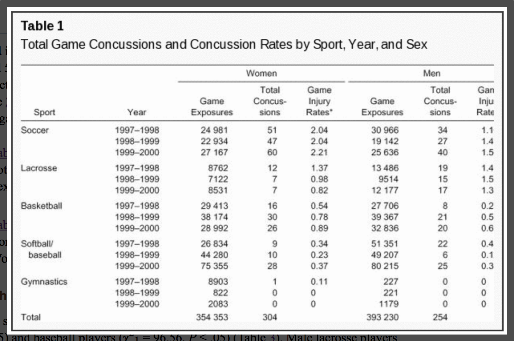

```{r setup, include=FALSE, message = FALSE}
knitr::opts_chunk$set(echo = TRUE)
```

## Today's agenda

* Talk about plans for remainder of course
* Get projects up on Github
* Present your ideas/work
* Questions and work time

## Plan for the remainder of the course

The goal of the rest of the course is to provide you with the support you need to create an excellent final report on a topic of your choice, including all steps of the process, from formulating a question through to getting the answer to it. We will provide you with time in class to work, so you need to plan for that and come prepared with next steps and questions.

We will be interacting with each other on these project topics: supporting each other through feedback and knowledge sharing.

There will be didactic components so support your learning:
* More advanced modeling topics such as Poisson regression, survivial analysis and Cox proportional-hazards models, etc.
* More advanced data presentation topics such as data dashboards (interactive and static), enhanced R-markdown reports
* Whatever other holes you feel you have in your statistical/data science knowledge that you think will come in handy (totally open to suggestions!)


## Your project design

Your final project will have the following pieces:

* Question of interest
* Data set and design
  * Outcome variable
  * Predictor variable(s) of primary interest
  * Potential confounders
  * Potential effect modifiers
* Directed acyclic graph (DAG) showing the hypothesized relationships of interest and including potential confounders and effect modifiers
* A primary analysis to address the question of interest
* Communication of results in tables and figures

### If you need additional inspiration: Open Case Studies

Throughout our courses, we use case-study style analyses to present data science and statistics concepts in the context of public health questions and data collected from real life. For the past couple of years, we have been involved in developing teaching materials in this style as part of the [Open Case Studies](https://www.opencasestudies.org){target="_blank"} project. These case studies are full of useful examples of obtaining data from varied sources, from websites, to pdfs to twitter feeds. They also present steps to create useful and intricate data visualizations as well as in-depth presentations of statistical methods. As you seek inspiration for your own projects later in the course, or aim to expand your own data science skills, you might find them to be a useful resource. We especially recommend the interface [here](https://americanhealth.jhu.edu/open-case-studies){target="_blank"} which provides additional tools for navigating among ten of the case studies. 


## When presenting your work

* Discuss your analysis idea (what's your question?)
* Discuss problems you ran into (and solutions if you have them!)
* Describe
    * Your data
    * Your data cleaning process
    * Results of your exploratory data analysis
* To provide feedback
    * Ask questions
    * Make suggestions for improvement!
    
### Working project document

We have created a working [working Google doc](https://docs.google.com/document/d/14dz0CLhY9J6G-G-gQF8VPvg4xDIhZ4xWyHV9o1VQRW8/edit?usp=sharing){target="_blank"} where you can record your plans. This will help you organize your thoughts, find classmates working on similar questions, and help us keep track of who is working on what. Please keep this document updated as your project changes!

## Types of regression analysis

For your project, your choice of statistical modeling tool will depend on your choice of **outcome** variable.  In this course, we've used **logistic** regression when the outcome variable is **dichotomous**, like whether or not someone has an major smoking-caused disease.  In previous courses, like Public Health Biostatistics, you're seen **linear** regression when the outcome variable is continuous, like medical expenditures.  Another common type of regression method is **Poisson** regression, which is used when the outcome variable is a **count** of events, such as the number of concussions.

To summarize:

* Linear regression -- continuous outcome
* Logistic regression -- dichotomous (binary) outcome
* Poisson regression (sometimes called a log-linear model) -- count outcome

Most of your projects will fit into one of these three types of regression, and you should choose the modeling method that's most appropriate to your outcome of interest.  **Occasionally**, we've had students need a different tool for their analysis, and we will work with you individually to find an appropriate analysis method if that is the case for you.

The following notes will give you a reminder of linear and logistic regression and a brief introduction to Poisson regression.  In each case, there is some information on how to fit these types of regression models in `R` and how to interpret the coefficients from these models.

### Linear regression

In Public Health Biostatistics, we asked the question: 

**Are medical expenditures higher for those with a major smoking-caused disease (MSCD)?**

We can investigate this question using the NMES data we used in Module 1.
```{r}
library(tidyverse)
nmes_data <- read_csv("module_3/data/nmesUNPROC.csv")

nmes_data <- nmes_data %>%
  mutate(eversmk = factor(eversmk, levels = c("0", "1"), labels = c("Never smoker", "Ever smoker")),
         lc5 = factor(lc5, levels = c("0", "1"), labels = c("No LC", "LC")),
         female = factor(female, levels = c("0", "1"), labels = c("Male", "Female")),
         chd5 = factor(chd5, levels = c("0", "1"), labels = c("No CHD", "CHD")),
         poor = factor(poor, levels = c("0", "1"), labels = c("Not Poor", "Poor"))
         )
nmes_data <- nmes_data %>%
  mutate(disease = factor(lc5 == "LC" | chd5 == "CHD", 
                          levels=c(TRUE,FALSE), 
                          labels=c("MSCD", "No MSCD")))
```

We might start by comparing medical expenditures between those with and without a MSCD:
```{r}
nmes_data %>%
  ggplot(aes(x = disease, y = totalexp)) + 
  geom_boxplot()
```

From this graph, it appears that those with a MSCD tend to have higher medical expenditures compared to those without an MSCD.

If we wanted to estimate the difference in mean medical expenditures between these two groups, we could use linear regression to model the relationship between the expected (mean) medical expenditure and the MSCD variable:

$$E[medical \ expenditure] = \beta_0 + \beta_1 \cdot disease$$

$$disease = \left\{
\begin{matrix}
1 & if \ MSCD\\
0 & if \ no \ MSCD
\end{matrix}
\right.$$

We can fit this linear regression in R using the `lm()` function, where the `lm` stands for linear model. We fit the model using the syntax `y ~ x`, where `y` is the outcome variable (`totalexp` in this case) and `x` is the predictor variable (`disease` in this case).

```{r}
model1 <- lm(totalexp ~ disease, data=nmes_data)
summary(model1)
coef(model1)
```

From this output we can interpret the coefficients as follows:

* $-7342.03 = \beta_1 =$ difference in mean medical expenditures, comparing those with MSCD (`disease = 1`) to those without MSCD (`disease = 0`)
* The difference in expected medical expenditures, comparing those with MSCD to those without MSCD is -\$7342.01.
* Those with a major smoking-caused disease spend, on average, \$732 more than those without a major smoking-caused disease.
* $9140.20 = \beta_0 =$ expected (mean) medical expenditure for those without MSCD (`disease = 0`)
* Mean medical expenditures for those without MSCD is \$9140.20.

Note that for linear regression we don't exponentiate the coefficients to get the values that we want.  This is because we don't have a $\log()$ on the left-hand side of our model equation.

What if instead we asked the question:

**How do medical expenditures change with increasing age?**

We can look at a scatterplot of these two variables to investigate:

```{r}
nmes_data %>%
  ggplot(aes(x = age, y = totalexp)) + 
  geom_point() +
  geom_smooth(se = FALSE)
```

It looks like medical expenditures may increase with age.  We can look at this more closely with a linear regression model:

$$E[medical \ expenditure] = \beta_0 + \beta_1 \cdot age$$

From this equation:

* $E[medical \ expenditure | age = 45 \ years] = \beta_0 + \beta_1 \cdot (45)$
* $E[medical \ expenditure | age = 44 \ weeks] = \beta_0 + \beta_1 \cdot (44)$
* Difference:
$$E[medical \ expenditure | age = 45 \ years] - E[medical \ expenditure | age = 44 \ weeks]$$
$$= (\beta_0 + 45\beta_1) - (\beta_0 + 44\beta_1) = \beta_1$$

So $\beta_1$ represents the change in mean medical expenditures associated with a one-year increase in age.  This will be true for any one-year increase in age, so from 44 to 45, but also from 61 to 62, 78 to 79, etc.

When we fit this linear regression in R with `totalexp ~ age` we get this:
```{r}
model2 <- lm(totalexp ~ age, data=nmes_data)
summary(model2)
```

From this output we can interpret as follows:

* $74.73 = \beta_1 =$ difference mean medical expenditures associated with a one-year increase in age.
* An additional year of age is associated with an expected increase of \$75 in medical expenditures.

**How could we account for any possible confounding variables in a linear regression analysis?**

* We could include potential confounding variables as covariates in our analysis using multivariable logistic regression:

$$E[medical \ expenditure] = \beta_0 + \beta_1 \cdot MSCD+ \beta_2 \cdot age + \beta_3 \cdot poor$$

* We interpret the regression coefficients in a multivariable model as **ceteris paribus** -- holding all other things equal
* $\beta_1 =$ expected difference in medical expenditures between those with and without a MCSD, **holding age and poverty status constant**
* $\beta_2 =$ expected change in medical expenditures for a one-year increase in age, **holding MSCD status and poverty status constant**
* $\beta_3 =$ expected difference in medical expenditures comparing those below the poverty line to those above the poverty line, **holding age and MSCD status constant**

### Logistic regression

In Public Health Biostatistics, we asked the question: 

**Is the infant mortality risk (or odds) higher for twins than singleton births?**

We could answer this question using a 2x2 table:

|         | Singleton| Twin| Total|
|:--------|---------:|----:|-----:|
|Survived |      8899|  187|  9086|
|Died     |       526|   71|   597|
|Total    |      9425|  258|  9683|

In this case:

* Odds of death for twins: 71/187 = 0.38
* Odds of death for singletons: 526/8899 = 0.059
* Odds ratio of death for twins as compared to singletons: $$OR = \frac{odds \ for \ twins}{odds \ for \ singletons} = \frac{71/187}{526/8899} = 6.42$$
* Log odds ratio: $log_e(OR) = log(6.42) = 1.86$

We could also answer this question using logistic regression:

$$log(odds \ of \ death) = \beta_0 + \beta_1 \cdot twin$$

$$twin = \left\{
\begin{matrix}
1 & if \ twin\\
0 & if \ not \ twin
\end{matrix}
\right.$$

We can fit this logistic regression in R using the `glm()` function.  First we read in the data (`nepalData2019.csv`) and then fit the model using the syntax `y ~ x`, where `y` is the outcome variable (`death` in this case) and `x` is the predictor variable (`twins` in this case).

```{r}
nepal_data <- read_csv("module_3/data/nepalData2019.csv")
model1 <- glm(death ~ twins, family=binomial(link="logit"), data=nepal_data)
summary(model1)
exp(coef(model1))
```

From this output we can interpret as follows:

* $1.86 = \beta_1 = \log(OR)$
* The log odds of death, comparing twins to singleton births, is 1.86.
* $6.41 = e^{1.86} = e^{\beta_1} = OR$
* The odds of death for twins is 6.42 times the odds of death for singleton births.
* The odds of death is 542% higher for twins than for singleton births.

We also asked: 

**Does the odds of death increase with increasing gestational age?**

$$\log(odds \ of \ death) = \beta_0 + \beta_1 \cdot (gestational \ age)$$

From this equation:

* $\log(odds \ of \ death | ga = 41 \ weeks) = \beta_0 + \beta_1 \cdot (41)$
* $\log(odds \ of \ death | ga = 40 \ weeks) = \beta_0 + \beta_1 \cdot (40)$
* Difference:
$$\log(odds \ of \ death | ga = 41 \ weeks) - \log(odds \ of \ death | ga = 40 \ weeks)$$
$$= (\beta_0 + 41\beta_1) - (\beta_0 + 40\beta_1) = \beta_1$$
* Log odds ratio:
$$\log(OR) = \log(\frac{odds|ga=41}{odds|ga=40})$$
$$= \log(odds \ of \ death | ga = 41 \ weeks) - \log(odds \ of \ death | ga = 40 \ weeks) = \beta_1$$
* Odds ratio: $OR = e^{\log(OR)} = e^{\beta_1}$

When we fit this logistic regression in R with `death ~ gestage` we get this:
```{r}
model2 <- glm(death ~ gestage, family=binomial(link="logit"), data=nepal_data)
summary(model2)

exp(coef(model2))
```

From this output we can interpret as follows:

* $-0.1367 = \beta_1 = \log(OR)$
* An additional week of gestational age is associated with a decrease of 0.14 in the log odds of death.
* $0.87 = e^{-0.1367} = e^{\beta_1} = OR$
* An additional week of gestational age is associated with a 13% decrease in the odds of infant death.

**How could we account for any possible confounding variables in a logistic regression analysis?**

* We could include potential confounding variables as covariates in our analysis using multivariable logistic regression:

$$\log(odds \ of \ death) = \beta_0 + \beta_1 \cdot (gestational \ age) + \beta_2 \cdot twin + \beta_3 \cdot male$$

* We interpret the regression coefficients in a multivariable model as **ceteris paribus** -- holding all other things equal
* $\beta_1=\log(OR)$ for a one-unit change in gestational age, **holding twin status and sex constant**
* $\beta_2=\log(OR)$ comparing twins to singleton births, **holding gestational age and sex constant**
* $\beta_3=\log(OR)$ comparing male infants to female infants, **holding gestational age and twin status constant**

### Poisson regression (log-linear regression)

Poisson regression is a useful modeling tool when the outcome variable, $Y$, is a count, or number of events. It's appropriate when $Y$ has a Poisson distribution, which is often an appropriate distributional assumption for count variables.

These notes will give you a rough idea of how Poisson regression works and how to fit the Poisson regression model using `R`.

#### Model equation

We write the model equation for Poisson regression as:
$$
\log (Y) = \beta_0 + \beta_1 \cdot X_1 + \beta_2 \cdot X_2 + ... + \beta_p\cdot X_p
$$
Because we model the $\log$ of the outcome variable, this is sometimes also called a *log-linear* model. **Note:** As in logistic regression, this is the *natural log* function not the log base 10 function.

#### Interpreting coefficients

How would we interpret the coefficients in a Poisson regression model?  

* $\beta_0$ represents the $log(Y)$ when all the $X$ variables are 0.
* $\beta_1$ represents the change in $log(Y)$ associated with a one-unit increase in $X_1$, holding the other $X$ variables constant.
* $\beta_2$ represents the change in $log(Y)$ associated with a one-unit increase in $X_2$, holding the other $X$ variables constant.
* Etc

Just like in logistic regression, we can exponentiate these coefficients to get them off the log scale:

* $e^{\beta_0}$ represents the $Y$ when all the $X$ variables are 0.  So the *count* of events when all the $X$ variables are 0.
* $e^{\beta_1}$ represents the ratio of $Y$ values associated with a one-unit increase in $X_1$, holding the other $X$ variables constant.  So the ratio of *counts* associated with a one-unit increase in $X_1$, holding the other $X$ variables constant.
* $e^{\beta_2}$ represents the ratio of $Y$ values associated with a one-unit increase in $X_2$, holding the other $X$ variables constant. So the ratio of *counts* associated with a one-unit increase in $X_2$, holding the other $X$ variables constant.
* Etc

Why do we get ratios of $Y$ values here?  Just like in logistic regression, when we take a difference in logs, this becomes a log of a ratio:
$$
\beta_1 = \log(Y | X_1 = x + 1) - \log(Y | X_1 = x) = log\left( \frac{Y | X_1 = x+1}{Y | X_1 = x} \right)
$$
So when we exponentiate we get:
$$
e^{\beta_1} = \frac{Y | X_1 = x+1}{Y | X_1 = x}
$$

#### Working with rates instead of counts

Often when our outcome variable is a count (number of events), we aren't really interested in the *number* of events but are really interested in the *rate* of events.  For example, if we are interested in comparing infant deaths across mother's racial groups in the US, we don't want to compare the *count* of deaths for white mothers to the *count* of infant deaths for Asian mothers, because there are more infants born to white mothers in the US than born to asian mothers in the US.  We would rather compare the *rate* of deaths for white mothers to the *rate* of infant deaths for asian mothers.  To do this, we need to account for the denominator in the rate calculation.  This denominator represents the *number of people* or the *person-time* at risk for the event to happen.  This is often the size of the population of the group where the events are counted.

To model *rates* instead of *counts*, we include an **offset** term in our model equation:
$$
\log (Y) = \log(N) + \beta_0 + \beta_1 \cdot X_1 + \beta_2 \cdot X_2 + ... + \beta_p\cdot X_p
$$
This $\log(N)$ term is called the offset, where $N$ is either the number at risk of the person-time at risk.  When we include the offset in the equation, we can rearrange the equation to get:
$$
\begin{eqnarray}
\log (number \ of \ events) &=& \log(N) + \beta_0 + \beta_1 \cdot X_1 + \beta_2 \cdot X_2 + ... + \beta_p\cdot X_p \\
\log (Y) &=& \log(N) + \beta_0 + \beta_1 \cdot X_1 + \beta_2 \cdot X_2 + ... + \beta_p\cdot X_p \\
\log (Y) - \log(N) &=& \beta_0 + \beta_1 \cdot X_1 + \beta_2 \cdot X_2 + ... + \beta_p\cdot X_p \\
\log \left(\frac{Y}{N} \right) &=& \beta_0 + \beta_1 \cdot X_1 + \beta_2 \cdot X_2 + ... + \beta_p\cdot X_p \\
\log (rate \ of \ events) &=& \beta_0 + \beta_1 \cdot X_1 + \beta_2 \cdot X_2 + ... + \beta_p\cdot X_p \\
\end{eqnarray}
$$
Now that the left-hand side of the equation is the $\log (rate \ of \ events)$, we can interpret the coefficients as follows:

* $\beta_0$ represents the $log(rate)$ when all the $X$ variables are 0.
* $\beta_1$ represents the change in $log(rate)$ associated with a one-unit increase in $X_1$, holding the other $X$ variables constant.
* $\beta_2$ represents the change in $log(rate)$ associated with a one-unit increase in $X_2$, holding the other $X$ variables constant.
* Etc

Now when we exponentiate these coefficients to get them off the log scale we get:

* $e^{\beta_0}$ represents the *rate* of events when all the $X$ variables are 0.
* $e^{\beta_1}$ represents the *rate ratio* associated with a one-unit increase in $X_1$, holding the other $X$ variables constant.
* $e^{\beta_2}$ represents the *rate ratio* associated with a one-unit increase in $X_2$, holding the other $X$ variables constant.
* Etc

We can interpret these *rate ratios* like we do the *odds ratios* we get from logistic regression.  For example, if the rate ratio (exponentiated coefficient) for a variable age, in years, is 1.8 we say: The rate of events is 80% higher for each additional year of age.  

#### Example: Concussions by sex and sport

**Are there differences in concussion rates between male and female college athletes?** We will investigate this question using data from *T. Covassin, C.B. Swanik, M.L. Sachs (2003). "Sex Differences and the Incidence of Concussions Among Collegiate Athletes", Journal of Athletic Training, Vol. (38)3, pp 238-244*.

The following table shows the data from this paper:



We see from this table that for each sport and for each sex, we have a count of the number of concussions (*Total concussions* column).  But we wouldn't want to directly compare the number of concussions between lacrosse and soccer because there were many more game exposures (*Game Exposures* column) played in soccer than in lacrosse.  So we need to actually model the *rate* of concussions by including an offset for the game exposures.

##### Data

First load the `tidyverse` and read in the data:
```{r}
conc_data <- read_csv("module_3/data/concussions.csv")
```

Let's take a look at the structure of the data:
```{r}
conc_data %>% as.data.frame()
```

I'm going to recode the `female` variable to be named `sex` and have levels of `Male` and `Female` instead of 0 and 1:
```{r}
# Create new sex variable
conc_data <- conc_data %>%
  mutate(sex = factor(female, levels=c(0,1), labels=c("Male", "Female")))

# Check that recoding worked
xtabs(~ sex + female, data = conc_data)

# Drop old female variable
conc_data <- conc_data %>%
  select(-female)
```

##### Exploratory graphs

We might want to make a bar graph showing the concussion rate by sex.  To do this, we will have to collapse the counts of concussions and game exposures across the different sports and years:

```{r}
# Get total # concussions and total # game exposures by sex
conc_data %>%
  group_by(sex) %>%
  summarize(conc_total = sum(conc),
            exp_total = sum(gameexp))

# Get rate of exposures by sex per 10,000 game exposures
conc_data %>%
  group_by(sex) %>%
  summarize(conc_total = sum(conc),
            exp_total = sum(gameexp)) %>%
  mutate(conc_rate = conc_total/exp_total * 10000)

# Save this new data in a table so we can make a graph
conc_by_sex <- conc_data %>%
  group_by(sex) %>%
  summarize(conc_total = sum(conc),
            exp_total = sum(gameexp)) %>%
  mutate(conc_rate = conc_total/exp_total * 10000)

conc_by_sex %>%
  ggplot(aes(x = sex, y = conc_rate)) +
  geom_bar(stat = "identity", fill = "blue") + 
  labs(title = "Concussion rates per 10,000 game exposures", x = "Sex", y = "Concussion rate per 10,000 game exposures")
```

We could make a similar plot of concussion rates by sport:
```{r}
conc_by_sport <- conc_data %>%
  group_by(sport) %>%
  summarize(conc_total = sum(conc),
            exp_total = sum(gameexp)) %>%
  mutate(conc_rate = conc_total/exp_total * 10000)

conc_by_sport %>%
  ggplot(aes(x = sport, y = conc_rate)) +
  geom_bar(stat = "identity", fill = "blue") + 
  labs(title = "Concussion rates per 10,000 game exposures", x = "Sport", y = "Concussion rate per 10,000 game exposures")
```

And we could make this plot by both sex and sport:
```{r}
conc_by_sex_sport <- conc_data %>%
  group_by(sex, sport) %>%
  summarize(conc_total = sum(conc),
            exp_total = sum(gameexp)) %>%
  mutate(conc_rate = conc_total/exp_total * 10000)

conc_by_sex_sport %>%
  ggplot(aes(x = sport, y = conc_rate)) +
  geom_bar(stat = "identity", fill = "blue") + 
  facet_wrap(~ sex) +
  labs(title = "Concussion rates per 10,000 game exposures", x = "Sport", y = "Concussion rate per 10,000 game exposures")
```

##### Fitting Poisson model

Like logistic regression, we fit a Poisson model using the `glm` function but we have to specify a `poisson` family and a `log` link.  We also give the `offset` value that we want to use as the denominator in our rate of events.  In our case, we will set the offset to be `log(gameexp)`.

Let's start with a model that just looks at the rate of concussions by sex:

```{r}
model_1 <- glm(conc ~ sex, data=conc_data, offset=log(gameexp), family=poisson(link="log"))
summary(model_1)
exp(model_1$coefficients)
exp(confint.default(model_1))
```

The coefficient for `sex` in this model is 0.284.  The exponentiated coefficient for `sex` is 1.33 with a 95% confidence interval of (1.12, 1.57).  We would say that female athletes have a 33% higher *rate* of concussions compared to male athletes.  And we are 95% confident their rate of concussions is between 12% and 57% higher.

Now let's look at a model to see whether concussion rates are different across sports:
```{r}
model_2 = glm(conc ~ sport, data=conc_data, offset=log(gameexp), family=poisson(link="log"))
summary(model_2)
exp(model_2$coefficients)
exp(confint.default(model_2))
```

Note that basketball is the reference category for our sport variable.  This means that all of the coefficients are comparing to basketball.  So we would say:

* The rate of concussions is 88% lower in gymnastics compared to basketball.  
* The rate of concussions in lacross is about twice the rate of concussions in basketball.
* The rate of concussions in soccer is 2.8 times the rate of concussions in basketball.
* The rate of concussions in softball/baseball is about half the rate of concussions in basketball.

If we wanted instead to compare all sports to soccer, which has the highest concussion rate, we could switch the reference category for the `sport` variable:
```{r}
conc_data <- conc_data %>%
  mutate(sport = relevel(as_factor(sport), ref="Soccer"))
```

Now when we fit the model we can interpret the rate ratios (exponentiated coefficients) all with respect to soccer.  Notice that they are all less than 1 now, since the rate of concussions is decreased for all sports relative to soccer.
```{r}
model_2 <- glm(conc ~ sport, data=conc_data, offset=log(gameexp), family=poisson(link="log"))
summary(model_2)
exp(model_2$coefficients)
exp(confint.default(model_2))
```

We could also consider the model with both `sex` and `sport` included:

```{r}
model_3 <- glm(conc ~ sex + sport, data=conc_data, offset=log(gameexp), family=poisson(link="log"))
summary(model_3)
exp(model_3$coefficients)
exp(confint.default(model_3))
```

Now we would say that the rate of concussion is 32% higher in females compared to males, *after adjusting for type of sport*.  We could also say that the rate of concussions for lacrosse players is 23% lower than for soccer players *of the same sex*.  And so on.

#### Other resources

This document is meant to give a brief introduction to Poisson regression.  It doesn't cover all the details, such as how to check the assumptions for a Poisson model to assess whether such a model is an appropriate choice for your data.

If you are interested in more information, here are a few links:

* https://en.wikipedia.org/wiki/Poisson_regression
* https://stats.idre.ucla.edu/r/dae/poisson-regression/ (only models the counts, not the rates)
* https://bookdown.org/roback/bookdown-bysh/ch-poissonreg.html#introduction-to-poisson-regression

## Assignment 3.1

* Write a short introduction to your question of interest:
    * Question
    * Data source
    * Outcome variable
    * Primary predictor variable(s)
* Add your data to your Github project and read your data into RStudio Cloud
* Examine and explore your data:
    * Wrangle your data:
        * Read it into R, select the relevant variables
        * Ensure the data set is "tidy": one data observation per row, one variable per column
    * Recode from numbers to factors
        * 1 -> "poor"", 0 -> "not poor", etc
    * Summaries of your variables of interest
        * Is there missing data?  Anything unusual or concerning?
    * Make a few basic exploratory plots to answer your question
* What type of regression analysis could you use to address your question?

As we have with all assignments in the past:

* Submit your assignment in R markdown through Github **by Sunday (March 30, 2025) at midnight**.  You can find a link to create your final project repository in Github on Blackboard.
* Share some information about your work so far on Piazza in the "Final Project Week 1" thread. This could be a **screenshot of a figure or table**, **some interpretation**, **a question** about how to do something, or **a problem** you would like help with. You are welcome to post this anonymously to your classmates, but remember that your project topic may be unique and so it may be hard to remain anonymous in these posts. 
* In your Piazza post, **give a little background on your project** (question of interest, variables, etc) so that classmates have a context with which to look at your post.


## Important dates for final project

Below you can find important dates for this final project.  **Each of you will work at your own pace through this project**, so the items listed for each week are suggested benchmarks to keep you on track for these last 5 weeks of class.  

**Each week you will submit your current work in R markdown through Github by Sunday at midnight.**  This includes your .Rmd file and either your dataset or your knit .html file if you are not sharing your data on the cloud.  **Each week you will also make a post on Piazza sharing something about your work in progress.**

When you submit your work each week, include specific questions you have or places where you are stuck.  Be prepared to present (talk about) your work in class on the following Monday.

**If you are struggling with any part of the project or want to talk through your code please come to office hours or reach out to us over email.**

* **Week of March 24:**
    * Identification of a question of interest and appropriate data set for answering the question.  
    * Set up Github repository with data; read data into RStudio in Posit cloud
    * Initial summaries, recoding, and possibly exploratory plots of the variables in your dataset
    * Submit your work (and questions for us) through Github and post on Piazza Week 1 thread by Sunday (3/30) at midnight; be prepared to discuss your work in class on Monday (3/31)
* **Week of March 31:**
    * Finish recoding and cleaning of your data
    * Finish exploratory analysis of your variables
    * Create a rough initial data display (figure/table) that addresses your question of interest
    * Submit your work (and questions for us) through Github and post on Piazza Week 2 thread by Sunday (4/6) at midnight; be prepared to discuss your work in class on Monday (4/6)
* **Week of April 7:**
    * Finalize your data display to answer your question of interest
    * Create some initial regression models that answer your question of interest
    * Submit your work (and questions for us) through Github and post on Piazza Week 3 thread by Sunday (4/13) at midnight; be prepared to discuss your work in class on Monday (4/14)
* **Week of April 14:**
    * Finalize your regression models for answering your question of interest
    * Begin writing up your interpretation of your results for your final project report
    * Submit your work (and questions for us) through Github by Sunday (4/20) at midnight
* **Week of April 21:**
    * Create a presentation (~ 4 slides, see below) to present your work to the class
    * Continue writing up your interpretation of your results for your final project report. 
    * Possible extension: Create a data dashboard, interactive Shiny or Rmd interface (for example with tabs)
    * Submit your work (and questions for us) through Github by Sunday (4/27) at midnight
    * Submit your presentation slides through Github by Sunday (4/27) at midnight and be prepared to give your presentation in class on Monday (4/28)
* **April 28 (Monday): Class presentations**
    * Each person will present their results to the class.  You should present your results as far as they are at that time.
    * You will have 5 minutes to talk about your project.  
    * You should prepare ~ 4 slides to aid in your presentation:
        * Slide 1 will have your question, information about your data set, and your design (outcome, predictors, confounders, etc)
        * Slide 2 should have a DAG showing your proposed relationship with confounders/modifiers included
        * Slide 3 should show a data display that addresses your question of interest
        * Slide 4 should show the results of a statistical analysis to answer your question
        * You should submit these slides Sunday night through your project Github repository before coming to class; label the PPT file with your last name
* **May 8 (Thursday): Final report due**
    * Your written report for your project is due at midnight through Github.
    * Include an introduction section to give some context for why your question is interesting.
    * Include a brief description of the data and variables you used for your project.
    * Include a directed acyclic graph (DAG) that shows how you think your variables relate to each other.  Note: You do not need to try to make this DAG in R.  Make it in Powerpoint and then take a screen shot.  You can then upload the image file to RStudio cloud and insert it into your R Markdown document like [this](https://www.earthdatascience.org/courses/earth-analytics/document-your-science/add-images-to-rmarkdown-report/). 
    * For each question of interest, you should have a data display and a statistical analysis to address the question.  
    * For each question of interest, give a few brief sentences to describe the methods (regression techniques) you used to answer the question.
    * Write up your results in a few paragraphs to answer your questions.  In your write-up, you should refer to your data display(s) and your analysis results.  Be numerate!
    * You will submit a .Rmd file that will knit into the final report that you are submitting, i.e., all code is provided and runnable to produce the report.


